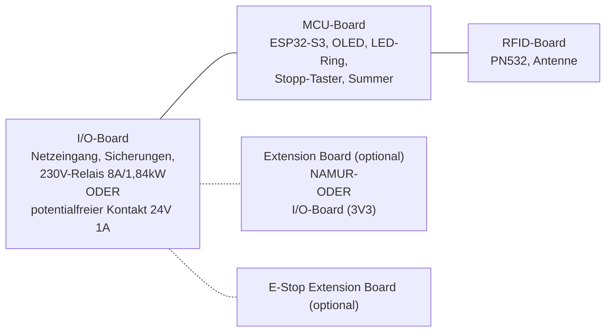

# Machine Node / RFID_BOX – Anforderungen

**Dokumentrevision: 1.1**

Arbeitsplanung für den kompakten Machine Node. Dieses Dokument ist die
Anforderungsbasis, aus der Schaltplan, PCB-Stack, Gehäuse und erste
Bestellung abgeleitet werden. Die konkrete technische Auslegung
(Architekturentscheidung, Blockdiagramm, Teileliste, Schnittstellen,
Layout-Regeln, Firmware-Zustände, Abnahmetests) steht in
[README.md](README.md).

## Changelog

- **1.1** – Boards auf MCU/I/O/RFID umbenannt, UI-Peripherie (OLED, LED-Ring,
  Summer, Stopp-Taster) vom RFID- auf das MCU-Board verlagert; I/O-Board in
  zwei exklusive Bestückvarianten (230V-Direktschaltung / potentialfrei 24V
  für externes Schütz) aufgeteilt; NAMUR-I/O als Bestückvariante eines neuen,
  generischen Extension Boards ausgelagert; Sicherungen auf gesockelte,
  werkzeuglos tauschbare Bauform umgestellt. Neues, eigenständiges **E-Stop
  Extension Board** (optional) ergänzt: einfaches Relais zur Bremsversorgung
  für Maschinen, deren Bremse dauerhaft Strom zum Lösen braucht
  (power-to-release, fail-safe stromlos = Bremse aktiv); trotz des Namens
  kein zertifiziertes Not-Aus-/Not-Halt-Bauteil und unabhängig vom
  generischen Extension Board (NAMUR/Digital-I/O). Q1 (Bestückvariante 230V)
  als elektromechanisches **Relais** festgelegt statt SMD-Schalter. Neues
  Übersichts-Blockdiagramm am Anfang von "Anforderungen aus Blackbox-Sicht"
  ergänzt (Boards mit groben Inhalten, gestrichelte Linien zu den optionalen
  Erweiterungsboards). Zielschutzart von IP34 auf **IP64** angehoben: Gehäuse
  muss staubdicht sein (nicht nur Schutz gegen Fremdkörper ab 2,5 mm), da der
  Einsatzort eine Holzwerkstatt mit Sägemehl ist; U6 präzisiert, dass der
  Kartenkanal mechanisch vom staubdichten Innenraum getrennt ist (RFID-
  Erkennung ist berührungslos) und eindringender Staub nach unten ausgeführt
  statt in den Elektronikraum geleitet wird. Ausserdem "beide FKS" auf "FKS"
  korrigiert, da nur eine Maschine dieses Typs vorhanden ist. **Sicherheits-
  relevante Korrektur der Stopp-Reihenfolge:** Das E-Stop Extension Board
  (K3) unterbricht bei Stopp/Kartenentzug immer sofort die Notaus-/
  Interlock-Schleife der Maschine, unabhängig vom Nachlaufprofil — die
  Hauptversorgung (Q1/K2 auf dem I/O-Board) wird dagegen **nie** hart und
  sofort getrennt, sondern immer erst nach Ablauf der konfigurierten
  Nachlaufzeit abgeschaltet, auch nicht durch den Stopp-Taster. Die vorherige
  Fassung beschrieb das genau umgekehrt (harter Stopp-Taster öffnet die
  Versorgung sofort); dieses Verhalten hat in der Praxis bereits zu einem
  Maschinenschaden geführt, weil der Maschine dann die Energie für ihre
  eigene kontrollierte Bremsung fehlte. E6, B3, B7, Nachlaufprofile, BR2/BR3,
  Blockdiagramm, Teileliste, Layout-Regeln, Schnittstellentabelle und
  Abnahmetests (T3, T20, T21) entsprechend korrigiert. K3-Relais des E-Stop
  Extension Boards mit **24 V DC / 1 A** Kontaktbelastung spezifiziert.
  Programmierweg präzisiert: laufende Firmware-Updates primär per OTA über
  WLAN, der interne USB-C-Anschluss J4 dient nur der Erstprogrammierung und
  dem Debug/Service.
- **1.0** – Erste Fassung: kompakter Machine Node mit PCB-A (Controller),
  PCB-B (Power, inkl. 230V-Ausgang, potentialfreiem Kontakt und NAMUR-I/O)
  und PCB-C (RFID/UI) als gemeinsamem Stack.

## Ziel

Eine kompakte Box aus einem bis drei direkt übereinander montierten PCBs
(plus optionalen Erweiterungsboards), die eine Maschine per RFID freischaltet
und den Zustand der Last an die easyVerwaltung meldet.

- RFID-Anmeldung am PN532
- WLAN-Kommunikation; Firmware-Programmierung primär per OTA über WLAN, nur
  die Erstprogrammierung erfolgt über den internen USB-C-Anschluss (J4)
- sichere Freigabe einer 230-V-Last oder eines potentialfreien 24-V-Signals
  für ein externes Schütz
- Erkennung, ob die Maschine tatsächlich läuft
- definierter Aus-Zustand bei Reset oder Firmware-Fehler; Verhalten bei
  Kommunikationsverlust ist pro Maschinenprofil festgelegt
- durchgehend SMD-bestückte Funktionsboards
- keine interne Handverkabelung und keine handverlöteten Module
- einheitliche Board-to-Board-Stecker zwischen den Boards
- gemeinsamer Grundaufbau (I/O-Board) für zwei exklusive Schaltvarianten
  sowie ein optionales, generisches Extension Board für zusätzliche I/O

## Anforderungen aus Blackbox-Sicht

Die folgenden Anforderungen beschreiben das Verhalten und die Eigenschaften
des fertigen Geräts. Interne PCB-Aufteilung und konkrete Bauteile sind keine
Anforderungen, sondern daraus abgeleitete Designentscheidungen. Zur groben
Orientierung vorab die Boards, auf die sich die Anforderungen unten beziehen:

### 1. Energie und Schalten

Das I/O-Board wird in **zwei exklusiven Bestückvarianten** gefertigt: pro
Gerät wird entweder die Variante **230V** oder die Variante **24V
potentialfrei** bestückt, nie beide gleichzeitig. Beide Varianten teilen sich
dasselbe PCB-Layout und dieselben Basisbauteile (Versorgung, Sicherungen,
Feldterminals); nur der eigentliche Schaltpfad unterscheidet sich.

| ID | Muss-Anforderung | Abnahmekriterium |
|---|---|---|
| E1 | Das Gerät wird mit 230 V AC versorgt. | Das Gerät hat einen eindeutig beschrifteten Netz-Eingang und startet nach dem Einschalten definiert. Gilt für beide Bestückvarianten, auch wenn nur die Variante 230V die Netzspannung weiterschaltet. |
| E2 | **Variante 230V:** Das Gerät schaltet einen 230-V-Ausgang aus derselben Versorgung. | Nach Start, Reset und Fehlerzustand ist der Ausgang AUS. Bei Kommunikationsverlust gilt das konfigurierte Maschinenprofil. |
| E3 | **Variante 230V:** Der 230-V-Ausgang ist für eine definierte Last abgesichert. | Die aktuelle Auslegung zielt auf 8 A Dauerlast; Sicherung, Lastrelais, Leiterbahnen, Klemmen und Thermik werden gemeinsam am Prototyp geprüft. |
| E4 | **Variante 24V potentialfrei:** Das Gerät besitzt einen potentialfreien Schaltausgang **C / NO / NC** für **24 V DC / 1 A**. | Ein extern eingespeistes 24-V-Signal kann mit maximal 1 A geschaltet werden, ohne elektrische Verbindung zum Netz oder zur internen Kleinspannung. Der Kontakt erzeugt selbst keine 24-V-Versorgung. |
| E5 | Es gibt keinen Not-Aus- oder Not-Halt-Schalter am Machine Node. | Der vorhandene Stopp-Taster wird in UI, Firmware und Dokumentation eindeutig als normaler Stopp bezeichnet. |
| E6 | Ein normaler Stopp beendet die Arbeitsfreigabe und startet bei Bedarf eine Nachlaufsequenz. | Der Stopp wird sofort als `STOPPED` angezeigt und löst, falls ein E-Stop Extension Board bestückt ist, sofort dessen Notaus-Kontakt aus. Die eigentliche Versorgung (Schaltausgang des I/O-Boards) wird **nicht** hart und sofort getrennt, sondern erst nach Ablauf der je Maschinenprofil konfigurierten Nachlaufzeit abgeschaltet — auch nicht durch den Stopp-Taster. Beispiele: Laser-Abluft 60 Sekunden, Bremse 10 Sekunden für FKS. Ein vorzeitiges hartes Abschalten der Versorgung kann die Maschine an einer eigenen kontrollierten Bremsung hindern und zu Schäden führen. |
| E7 | Kommunikationsverlust hat ein definiertes, konfigurierbares Verhalten. | Eine laufende Freigabe darf je nach Maschinenprofil und Timeout weiterlaufen; eine neue Freigabe ohne Serverbestätigung ist nie möglich. |

Die früheren NAMUR-Ausgänge (vormals E8) sind kein Bestandteil des I/O-Boards
mehr; sie sind eine Bestückvariante des optionalen **Extension Board**, siehe
Abschnitt "Extension Board (optional)".

### Lastklasse der Variante 230V

Für den direkten 230-V-Ausgang wird **8 A Dauerlast bei 230 V AC** als
Auslegungsziel festgelegt. Das entspricht ungefähr 1,84 kW. 16 A ist die
übliche Nennklasse einer Schuko-Versorgung, wird für diesen kompakten Node aber
nicht als direkte Dauerlast zugesagt: Motoren können beim Einschalten ein
Mehrfaches ihres Nennstroms ziehen.

| Beispiel-Last | Typischer Betriebsbereich | Bewertung der aktuellen Auslegung |
|---|---:|---|
| 3D-Drucker | ca. 0,5-2 A | Direkt geeignet |
| Desktop-CNC | ca. 2-6 A | Direkt geeignet, Anlaufstrom prüfen |
| Standfräse, ca. 800 W | ca. 3,5 A Nennstrom, höherer Anlaufstrom | Zielanwendung, Anlaufstrom und Dauerbetrieb prüfen |
| Kleine Drehmaschine, ca. 800 W | ca. 3,5 A Nennstrom, höherer Anlaufstrom | Zielanwendung, Anlaufstrom und Dauerbetrieb prüfen |
| Kleine Bandsäge | ca. 4-8 A Nennstrom, deutlich höherer Anlaufstrom | Nur nach Prüfung, besser externes Schütz (Variante 24V potentialfrei) |
| Kleine Kreissäge | ca. 6-10 A Nennstrom, hoher Anlaufstrom | Nicht direkt zusagen, Variante 24V potentialfrei mit externem Schütz bevorzugt |

Die konkrete Lastklasse muss mit Typenschild, Einschaltstrom und thermischer
Prüfung des fertigen I/O-Boards bestätigt werden. Standfräsen und kleine
Drehmaschinen bis etwa 800 W sind ausdrücklich als direkte Zielanwendungen
der Variante 230V vorgesehen, sofern ihr Anlaufstrom innerhalb der geprüften
Schaltgrenze liegt. Für Lasten bis 16 A oder für Motoren mit höherem
Anlaufstrom wird die Variante 24V potentialfrei bestückt: der Node schaltet
dann nur das Steuersignal eines externen, passend dimensionierten Schützes.

### 2. Authentifizierung und Bedienung

| ID | Muss-Anforderung | Abnahmekriterium |
|---|---|---|
| B1 | Nutzer können sich per RFID authentifizieren. | Eine gültige Karte kann lokal gelesen und eine ungültige Karte abgewiesen werden. |
| B2 | Die Freigabe wird gegen ein konfiguriertes Backend bestätigt. | Während der Übergangsphase darf das Gerät gegen easyVerwaltung oder das Legacy-System validieren. Ohne gültige Antwort des konfigurierten Systems wird keine Lastfreigabe erteilt. |
| B3 | Der Stopp-Taster ist von aussen erreichbar. | Der Taster kann ohne Gehäuseöffnung betätigt werden, beendet die Arbeitsfreigabe sofort (inkl. sofortigem Notaus-Kontakt, falls E-Stop Extension Board bestückt) und löst die konfigurierte Nachlaufsequenz aus, bevor die Versorgung tatsächlich getrennt wird. |
| B4 | Das Gerät reagiert lokal auch bei Netzwerklast. | RFID, Stopp und lokale Rückmeldung bleiben bedienbar; der Stopp hat Vorrang vor Netzwerkverarbeitung. |
| B5 | Während der Freigabe wird der Name des verantwortlichen Nutzers angezeigt. | Nach erfolgreicher Authentifizierung erscheint der Klarname, zum Beispiel „Max Mustermann“, auf dem OLED und bleibt bis zum Ende der Freigabe beziehungsweise des Nachlaufs sichtbar. |
| B6 | Das Gerät besitzt einen Always-on-Modus für eingesteckte RFID-Karten. | In diesem Modus bleibt die Maschine freigegeben, solange die autorisierte Karte im geschützten Kartenfach erkannt wird. |
| B7 | Die Kartenpräsenz wird ohne mechanischen Präsenzschalter verifiziert. | Das Gerät prüft die Karte zyklisch über den RFID-Leser; eine entfernte oder nicht mehr gültige Karte beendet die Freigabe nach der definierten Reaktionszeit und folgt derselben Sequenz wie ein Stopp (sofortiger Notaus-Kontakt, Versorgungstrennung erst nach Nachlaufzeit). |

### 3. Anzeige und Rückmeldung

| ID | Muss-Anforderung | Abnahmekriterium |
|---|---|---|
| A1 | Das Gerät besitzt einen LED-Ring mit 12 adressierbaren RGB-LEDs. | Betriebs-, Authentifizierungs-, Freigabe-, Fehler- und Stoppzustände sind am Ring unterscheidbar. |
| A2 | Das Gerät besitzt ein OLED. | Versorgung, Netzwerk, Authentifizierung, Freigabe, Stopp und Fehler können lokal angezeigt werden; die Darstellung bleibt für die montierte Orientierung lesbar. |
| A3 | Das Gerät besitzt einen Summer. | Erfolg, Warnung, Fehler und Stopp erzeugen unterscheidbare akustische Rückmeldungen. |
| A4 | Die lokale Rückmeldung ist responsiv. | Anzeige und Summer reagieren innerhalb von 100 ms auf lokale Ereignisse. |
| A5 | Die Anzeige macht die Verantwortlichkeit sichtbar. | Im aktiven Freigabezustand ist der Klarname des verantwortlichen Nutzers eindeutig und lesbar dargestellt. |
| A6 | Der Always-on-Modus zeigt eine aktive Kartenprüfung. | Der LED-Ring zeigt ein dynamisches, wiederkehrendes Muster, solange die Karte zyklisch gelesen und akzeptiert wird; ein statisches Freigabe-Licht allein ist nicht ausreichend. Das OLED zeigt zusätzlich den Always-on-Zustand und den verantwortlichen Klarnamen. |

### Nachlaufprofile

Nach dem Stopp darf ein Gerät nur dann weiterlaufen, wenn dies als Nachlauf
für das Maschinenprofil vorgesehen ist. Die eigentliche Arbeitsfreigabe ist
bereits beendet.

| Anwendung | Nachlauf | Systemanforderung |
|---|---:|---|
| Laser-Abluft | 60 Sekunden | Abluft muss unabhängig von der Laserfreigabe geschaltet werden können. |
| Bremse, FKS | 10 Sekunden | Bremsfunktion muss über den vorgesehenen Schaltkanal kontrolliert nachlaufen. |

Bei nur einem gemeinsamen Schaltausgang (230V oder potentialfrei) bleiben
alle daran angeschlossenen Verbraucher während des Nachlaufs gemeinsam
eingeschaltet. Unabhängiger Nachlauf von Abluft, Bremse und Maschine
erfordert zusätzliche Schaltkanäle oder ein externes Nachlaufrelais.

> **Wichtig, Reihenfolge bei Stopp/Kartenentzug (z.B. FKS):** Erst wird —
> falls ein E-Stop Extension Board bestückt ist — sofort und hardwareseitig
> dessen Notaus-Kontakt geöffnet, der in die Notaus-/Interlock-Schleife der
> Maschine eingeschleift ist. Die Maschine leitet dadurch ihre eigene
> kontrollierte Bremsung ein. Die eigentliche Versorgung (Schaltausgang des
> I/O-Boards, z.B. der potentialfreie Kontakt zum externen 400-V-Schütz bei
> der FKS) bleibt dabei bestehen und wird erst **nach Ablauf der
> Nachlaufzeit** abgeschaltet. Diese Reihenfolge gilt sowohl bei Betätigung
> des Stopp-Tasters als auch bei Kartenentzug im Always-on-Modus. Ein zu
> frühes, hartes Trennen der Versorgung hat in der Vergangenheit zu einem
> Maschinenschaden geführt, weil der Maschine dann die Energie für ihre
> eigene kontrollierte Bremsung fehlte.

### 4. Anschlüsse und optionale Lastmessung

| ID | Muss-Anforderung | Abnahmekriterium |
|---|---|---|
| I1 | Netz-Eingang und der jeweils bestückte Schaltausgang (230-V-Ausgang oder potentialfreier Kontakt) besitzen definierte Kabeldurchführungen. | Kabel können durch die geschützten Durchführungen in das Gehäuse geführt werden; die eigentlichen Terminals sind erst nach dem Öffnen erreichbar. |
| I2 | Federklemmen sind der bevorzugte Feldanschluss. | Betätigbare Push-in-Klemmen können mit vorgesehenen Leitern ohne Spezialwerkzeug angeschlossen werden. |
| I3 | Schraubklemmen sind als zweite Anschlussvariante möglich. | Die Alternative passt in dasselbe Anschluss- und Gehäusekonzept. |
| I4 | Eine einfache Lastmessung ist optional vorgesehen. | Ein galvanisch getrennter Sensor erkennt `LAST_AKTIV` und `LAST_AUS`, ohne Energieabrechnung zu versprechen. Nur relevant für die Variante 230V. |

Die früheren NAMUR-Anforderungen (vormals I5/I6) sind Teil des Extension
Boards, siehe folgender Abschnitt.

### Extension Board (optional)

Zusätzliche galvanisch getrennte I/O wird nicht auf jedem Node vorgehalten,
sondern über ein **generisches, optionales Extension Board** nachgerüstet,
das per Board-to-Board-Stecker auf das I/O-Board gesteckt wird. Ein Node
trägt höchstens ein Extension Board. I/O-Board und Extension Board sind
unabhängig voneinander bestellbar und bestückbar.

| ID | Muss-Anforderung | Abnahmekriterium |
|---|---|---|
| X1 | Das Extension Board ist ein steckbares Zusatzboard mit mehreren möglichen Bestückvarianten. | Mechanisch identischer Formfaktor und Board-to-Board-Stecker für alle Varianten; ein unbestücktes I/O-Board funktioniert ohne Extension Board vollständig gemäß Abschnitt 1-4. |
| X2 | **Bestückvariante NAMUR:** Das Extension Board besitzt zwei zusätzliche galvanisch optoisolierte NAMUR-Ausgänge und einen galvanisch getrennten NAMUR-Eingang. | Jeder Ausgang arbeitet als 24-V-DC-/4-mA-Schnittstelle für sonstige Zwecke; beide Ausgänge sind voneinander und von der Gerätesteuerung galvanisch getrennt. `OUT_A+/-` und `OUT_B+/-` liefern die 24-V-DC-/4-mA-Schnittstelle; `IN_NAMUR+/-` verarbeitet ein potentialfreies externes Signal als 24-V-NAMUR-kompatible Schnittstelle. |
| X3 | **Bestückvariante Digital-I/O:** Das Extension Board kann alternativ mit einfachen digitalen Ein-/Ausgängen ohne NAMUR-Anforderung bestückt werden. | Konkrete Beschaltung, Kanalzahl und Pegel werden vor dem Schaltplan dieser Variante festgelegt; hier zunächst nur als benannte, noch nicht spezifizierte zweite Bestückoption geführt. |

Die NAMUR-Variante wird für schätzungsweise 2 von 20 Nodes benötigt und ist
deshalb bewusst nicht Teil des Standard-I/O-Boards.

### E-Stop Extension Board (optional)

Manche Maschinen (z.B. FKS) haben eine eigene Notaus-/Interlock-Schleife,
die sofort unterbrochen werden muss, damit die Maschine ihre eigene
kontrollierte Bremsung einleitet — sowie oft eine elektromagnetisch gelöste
Bremse, die dauerhaft Strom braucht, um gelöst zu bleiben ("power-to-release
Bremse"): fällt die Spannung weg, fällt die Bremse fail-safe ein. Dafür gibt
es ein **eigenständiges, optionales E-Stop Extension Board** mit einem
einfachen Relais, dessen Kontakt in die Notaus-/Interlock-Schleife der
Maschine eingeschleift wird. Es steckt unabhängig vom generischen Extension
Board (NAMUR/Digital-I/O) über einen eigenen Board-to-Board-Stecker auf den
Stack.

**Wichtig:** Das E-Stop Extension Board unterbricht bei Stopp oder
Kartenentzug immer **sofort** die Notaus-Schleife — unabhängig vom
Nachlaufprofil. Die eigentliche Versorgung der Maschine (Schaltausgang des
I/O-Boards) ist davon getrennt zu betrachten und wird immer erst **nach**
Ablauf der Nachlaufzeit abgeschaltet, siehe Warnhinweis unter
"Nachlaufprofile". Diese Trennung ist zentral: nur so hat die Maschine
während ihrer eigenen kontrollierten Bremsung noch Energie zur Verfügung.

> **Hinweis zur Namensgebung:** Trotz des Namens "E-Stop" ist dieses Modul
> **kein** zertifiziertes Not-Aus- oder Not-Halt-Bauteil im Sinne von E5. Es
> unterbricht ausschliesslich die Notaus-/Interlock-Schleife bzw. die
> Bremsversorgung der externen Maschine, nicht die Hauptversorgung selbst.

| ID | Muss-Anforderung | Abnahmekriterium |
|---|---|---|
| BR1 | Das E-Stop Extension Board schaltet ein einfaches Relais mit **24 V DC / 1 A** Kontaktbelastung, dessen Kontakt in die Notaus-/Interlock-Schleife bzw. Bremsversorgung der externen Maschine eingeschleift wird. | Ein extern eingespeister 24-V-DC-Stromkreis kann mit maximal 1 A über das Relais durchgeschaltet werden, galvanisch getrennt von Netz und Gerätesteuerung. |
| BR2 | Die Schaltlogik ist fail-safe: stromlos = Notaus-Schleife unterbrochen / Bremse aktiv. | Das Relais ist im Ruhezustand (Coil stromlos) offen; die Notaus-Schleife ist dann unterbrochen bzw. die Bremse fällt ein. Erst ein aktives Freigabesignal der Steuerung schliesst das Relais. |
| BR3 | Das Relais öffnet bei Stopp oder Kartenentzug immer sofort, unabhängig vom Nachlaufprofil. | Bei Stopp-Taster **und** bei Kartenentzug im Always-on-Modus öffnet das Relais hardwareseitig sofort (<100 ms), unabhängig von der konfigurierten Nachlaufzeit. Die Versorgung der Maschine (I/O-Board-Ausgang) folgt **nicht** diesem sofortigen Öffnen, sondern bleibt bis zum Ende der Nachlaufzeit bestehen. |
| BR4 | Das Modul ist klar als Nicht-Not-Aus-Bauteil gekennzeichnet. | Beschriftung und Dokumentation verweisen eindeutig darauf, dass dieses Relais kein Personenschutz- oder Not-Halt-Bauteil ist. |

### 5. Umwelt und Montage

| ID | Muss-Anforderung | Abnahmekriterium |
|---|---|---|
| U1 | Das Gerät ist staubdicht und bietet Schutz gegen Berührung und Spritzwasser. | Zielgehäuse IP64: vollständig staubdicht (kein Eindringen von Staub, relevant für den Einsatz in der Holzwerkstatt) und Schutz gegen Spritzwasser aus allen Richtungen. Das Gehäuse ist nicht für Strahlwasser ausgelegt. |
| U2 | Das Gerät kann aufrecht, liegend oder in einem beliebigen Winkel dazwischen montiert werden. | Die Elektronik arbeitet in jeder vorgesehenen Einbaulage; die OLED-Anzeige wird über das Montageprofil so ausgerichtet, dass Texte lesbar bleiben. |
| U3 | Das Gerät ist kompakt und besteht aus einem bis vier PCBs (I/O-Board, MCU-Board, RFID-Board, optional Extension Board). | Die Standardbauweise bleibt als Stack realisierbar; MCU und RFID dürfen für eine kompakte Variante zu einem Board zusammengelegt werden. |
| U4 | Die interne Montage ist weitgehend schraubenlos. | Ausser den äusseren Gehäuseschrauben werden PCBs, Frontfenster und Führungen gesteckt oder geklipst. |
| U5 | Das Gehäuse trägt eindeutige Sicherheitshinweise und elektrische Kennwerte. | Die Hinweise sind dauerhaft lesbar, von aussen sichtbar und ohne Gehäuseöffnung verständlich. |
| U6 | Der Kartenkanal für eingesteckte RFID-Karten ist mechanisch vom staubdichten Geräteinnenraum getrennt. | Da die RFID-Erkennung berührungslos erfolgt, muss der Kartenkanal nicht selbst staubdicht sein: Staub/Sägemehl darf in den Kanal eindringen, wird aber nach unten ausgeführt (Drainage) statt sich anzusammeln oder in den Elektronikraum vorzudringen. Die Karte kann eingeführt und entnommen werden, ohne einen offenen Taster oder eine Öffnung in den staubdichten Innenraum zu benötigen. |
| U7 | Das Gehäuse muss von allen Seiten ausser der Display-Front befestigbar sein. | Je nach Einbausituation ist eine Verschraubung von hinten, seitlich, unten oder oben möglich, ohne den PCB-Stack zu verändern oder die Display-Front zu verdecken. |

### 6. Service und Fertigung

| ID | Muss-Anforderung | Abnahmekriterium |
|---|---|---|
| S1 | Die Feldterminals sind nach dem Öffnen mit normalem Werkzeug erreichbar. | Nach dem Lösen der äusseren Gehäuseschrauben sind die Terminals sichtbar und bedienbar, ohne den Stack zu zerlegen. |
| S2 | Die interne Verdrahtung ist minimal. | Keine losen Litzen, keine Handverkabelung und keine handverlöteten Module im Serienaufbau. |
| S3 | Die Schaltfunktion des I/O-Boards ist wartbar. | Das I/O-Board kann ohne Löten getauscht werden; alternativ ist sein kompletter Austausch wirtschaftlich vorgesehen. |
| S4 | Die Baugruppe ist für SMD-Fertigung geeignet. | Bestückung, elektrische Prüfung und Service sind mit geringem Handarbeitsanteil möglich. |
| S5 | Die Sicherungen sind gesockelt und ohne Löten tauschbar. | F1, F2 und F3 stecken in Sicherungshaltern statt fest verlötet zu sein; nach dem Öffnen des Gehäuses lässt sich jede Sicherung mit normalem Werkzeug aus dem Sockel entnehmen und ersetzen. |

### Verbindliche Gehäusebeschriftung

Die Beschriftung muss dauerhaft, kontrastreich und abriebfest ausgeführt werden.
Sie darf nicht nur auf einem abnehmbaren Deckel stehen, wenn dadurch die
elektrischen Grenzwerte am Gerät fehlen. Die Beschriftung richtet sich nach
der tatsächlich bestückten I/O-Board-Variante und danach, ob ein Extension
Board bestückt ist.

Mindestens erforderlich:

- **„Bedienung nur nach Einweisung“**
- **„Achtung: 230 V AC“**
- **Variante 230V:** „Direkter 230-V-Ausgang: max. 8 A Dauerlast / ca. 1,84 kW“
  und „Motoren und hohe Einschaltströme nur nach Prüfung oder über externes
  Schütz“
- **Variante 24V potentialfrei:** „Potentialfreier Kontakt: max. 24 V DC / 1 A“
- **Nur wenn Extension Board Variante NAMUR bestückt ist:**
  „OUT_A+/- / OUT_B+/-: je 24 V DC / 4 mA, optoisolierte NAMUR-Ausgänge“ und
  „IN_NAMUR+/-: galvanisch getrennter 24-V-NAMUR-Eingang“
- **Nur wenn E-Stop Extension Board bestückt ist:** „J18: max. 24 V DC / 1 A,
  kein Not-Aus/Not-Halt-Bauteil, unterbricht sofort die Notaus-/Interlock-
  Schleife bzw. Bremsversorgung der Maschine; die Hauptversorgung trennt
  erst nach der konfigurierten Nachlaufzeit“
- eindeutige Kennzeichnung von **Netz-Eingang** und der tatsächlich bestückten
  Anschlüsse (**230-V-Ausgang** oder **C / NO / NC**, ggf. **OUT_A**, **OUT_B**,
  **IN_NAMUR** und/oder **J18 Bremsrelais** bei bestückten Erweiterungsboards)
- Hinweis, dass der Stopp-Taster **kein Not-Aus und kein Not-Halt** ist

Die Kennzeichnung wird zusätzlich in der Montage- und Bedienungsdokumentation
übernommen. Angaben zu Spannung, Leistung und Stromstärke müssen auch bei
montiertem Gerät lesbar bleiben.

Es gibt am Machine Node ausdrücklich **keinen Not-Aus- oder Not-Halt-Schalter**.
Der Stopp-Taster ist eine normale Bedienfunktion zum Beenden der Freigabe und
kein Personenschutz. Anforderungen an einen Not-Halt der angeschlossenen
Maschine liegen ausserhalb dieses Geräts und müssen separat gelöst werden.

> **Sicherheit:** Netzspannung darf nur von qualifizierten Personen geplant,
> aufgebaut, gemessen und in Betrieb genommen werden. Für Motoren,
> Frequenzumrichter oder Drehstrom ist eine externe Schütz-/Sensorlösung
> vorzusehen (Variante 24V potentialfrei). Das Lastrelais auf der Platine
> ist kein universeller Motorschalter und keine Personenschutzfunktion.
