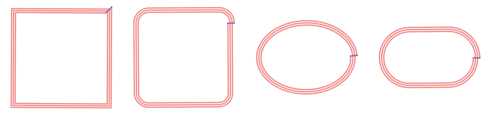

# Antennen-Footprints RFID-Board

Kandidaten für die 13,56-MHz-Leseschleife, erzeugt mit
[KiCoil](https://jaseg.de/projects/kicoil). `./generate.sh` baut alle vier neu.

## Varianten

Alle mit denselben Wicklungsparametern: **3 Windungen, 1,0 mm Leiterbreite,
0,5 mm Abstand, einlagig, 3 mm Keepout-Rand**.

| Footprint | Kontur | Induktivität |
|---|---|---:|
| `NFC_Loop_78x78_3T` | Rechteck 78 × 78, scharfe Ecken | 1,175 µH |
| `NFC_Loop_rr` | Rechteck 78 × 78, Eckradius 12 | 1,134 µH |
| `NFC_Loop_el` | Ellipse 78 × 58 | 0,756 µH |
| `NFC_Loop_st` | Racetrack 78 × 48 | 0,579 µH |

Die Induktivität rechnet KiCoil selbst und schreibt sie in die
Footprint-Beschreibung. Alle vier liegen im brauchbaren Fenster für den
PN5321 (etwa 0,5 bis 3 µH). Es sind Rechenwerte — sie gelten für die freie
Platine, nicht für den fertigen Stack.

Das Außenmaß von 78 mm folgt der Karte, nicht dem Gehäuse: eine ID-1-Karte
(85,6 × 54 mm) trägt ihre Spule rund 78 × 46 mm innerhalb des Kartenrands.

## Anschlüsse

Jeder Footprint hat drei Pads:

| Pad | Art | Bedeutung |
|---|---|---|
| `1` | SMD auf F.Cu | äußeres Ende der Schleife |
| `2` | SMD auf B.Cu, **gleiche Koordinate wie Pad 1** | inneres Ende, über die Rückseite herausgeführt |
| `NC` | Durchkontaktierung | Übergang der innersten Windung auf die Rückseite |

Die Spirale läuft auf F.Cu von außen nach innen, fällt über die
Durchkontaktierung auf B.Cu und kehrt dort auf kurzem, schrägem Weg zum
Einspeisepunkt zurück. Dieser Rückweg ist das einzige Kupfer unter der
Schleife und quert die äußeren Windungen rechtwinklig.

Für das Matching heißt das: ein Zweig kommt von vorn an Pad 1, der andere von
hinten an Pad 2. Beide liegen übereinander in derselben Ecke.

## Was das Werkzeug nicht kann

KiCoils SVG-Import liest nur das erste `<path>` und versteht darin
ausschließlich `M x y L x y … Z` — keine Bögen, keine `H`/`V`-Kurzformen,
keine Kommas als Koordinatentrenner. Runde Konturen müssen vorher in
Strecken aufgelöst werden; das macht `shape_svg.py` mit einer Pfeilhöhe von
0,03 mm. `rounded-rect`, `ellipse` und `stadium` sind dort angelegt, weitere
Konturen kommen als Funktion dazu.

Die Warnung „Polygon looks not centered" beim Lauf ist ein Fehler in KiCoils
Prüfung der Bounding-Box (sie vergleicht x- mit y-Grenzen). Der berechnete
Schwerpunkt ist (0, 0), es wird nichts verschoben.

## Umgebung

KiCoil fordert Python ≥ 3.13; KiCads mitgelieferter Interpreter ist 3.9.
`generate.sh` legt deshalb beim ersten Aufruf eine eigene Umgebung unter
`~/.cache/kicoil-venv` an. Das Plugin in KiCad bleibt davon unberührt — es
erscheint erst, wenn der API-Interpreter in den Einstellungen auf
`/opt/homebrew/bin/python3.13` zeigt.

## Offen

- Abstimmung gilt erst am vollständigen Stack: das MCU-Board unter der
  Antenne verstimmt sie und entzieht ihr Energie.
- Matching nach NXP AN1445 aus gemessenem L und R, nicht aus diesen
  Rechenwerten.
- Kondensatoren als bestückbare Bank vorsehen, damit nach der ersten Messung
  umbestückt statt neu gefertigt wird.
