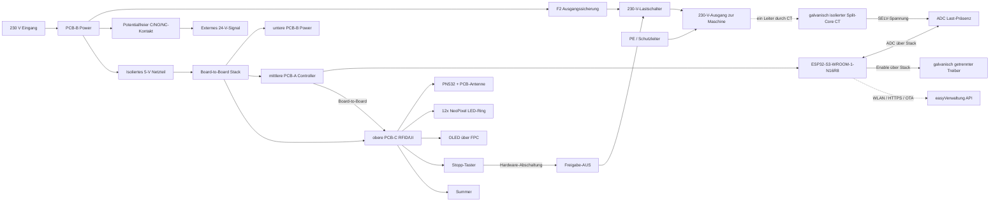

# Machine Node / RFID_BOX

**Dokumentrevision: 1.0**

Arbeitsplanung für den kompakten Machine Node. Dieses Dokument ist die
technische Ausgangsbasis für Schaltplan, PCB-Stack, Gehäuse und erste
Bestellung. Teilenummern sind für die aktuelle Auslegung gedacht und müssen
vor Netzspannungsbetrieb gegen Datenblatt, Verfügbarkeit und die geforderte
Zulassung geprüft werden.

## Ziel

Eine kompakte Box aus einem bis drei direkt übereinander montierten PCBs, die
eine Maschine per RFID freischaltet und den Zustand der Last an die
easyVerwaltung meldet.

- RFID-Anmeldung am PN532
- WLAN-Kommunikation und OTA-Updates
- sichere Freigabe einer 230-V-Last
- Erkennung, ob die Maschine tatsächlich läuft
- definierter Aus-Zustand bei Reset oder Firmware-Fehler; Verhalten bei
  Kommunikationsverlust ist pro Maschinenprofil festgelegt
- durchgehend SMD-bestückte Funktionsboards
- keine interne Handverkabelung und keine handverlöteten Module
- einheitliche Board-to-Board-Stecker zwischen den Boards

## Anforderungen aus Blackbox-Sicht

Die folgenden Anforderungen beschreiben das Verhalten und die Eigenschaften
des fertigen Geräts. Interne PCB-Aufteilung und konkrete Bauteile sind keine
Anforderungen, sondern daraus abgeleitete Designentscheidungen.

### 1. Energie und Schalten

| ID | Muss-Anforderung | Abnahmekriterium |
|---|---|---|
| E1 | Das Gerät wird mit 230 V AC versorgt. | Das Gerät hat einen eindeutig beschrifteten Netz-Eingang und startet nach dem Einschalten definiert. |
| E2 | Das Gerät schaltet einen 230-V-Ausgang aus derselben Versorgung. | Nach Start, Reset und Fehlerzustand ist der Ausgang AUS. Bei Kommunikationsverlust gilt das konfigurierte Maschinenprofil. |
| E3 | Der 230-V-Ausgang ist für eine definierte Last abgesichert. | Die aktuelle Auslegung zielt auf 8 A Dauerlast; Sicherung, Lastschalter, Leiterbahnen, Klemmen und Thermik werden gemeinsam am Prototyp geprüft. |
| E4 | Das Gerät besitzt einen zweiten potentialfreien Schaltausgang **C / NO / NC** für **24 V DC / 1 A**. | Ein extern eingespeistes 24-V-Signal kann mit maximal 1 A geschaltet werden, ohne elektrische Verbindung zum Netz oder zur internen Kleinspannung. Der Kontakt erzeugt selbst keine 24-V-Versorgung. |
| E5 | Es gibt keinen Not-Aus- oder Not-Halt-Schalter am Machine Node. | Der vorhandene Stopp-Taster wird in UI, Firmware und Dokumentation eindeutig als normaler Stopp bezeichnet. |
| E6 | Ein normaler Stopp beendet die Arbeitsfreigabe und startet bei Bedarf eine Nachlaufsequenz. | Der Stopp wird sofort als `STOPPED` angezeigt. Je Maschinenprofil können Ausgänge kontrolliert nachlaufen, bevor sie abgeschaltet werden. Beispiele: Laser-Abluft 60 Sekunden, Bremse 10 Sekunden für beide FKS. |
| E7 | Kommunikationsverlust hat ein definiertes, konfigurierbares Verhalten. | Eine laufende Freigabe darf je nach Maschinenprofil und Timeout weiterlaufen; eine neue Freigabe ohne Serverbestätigung ist nie möglich. |
| E8 | Das Gerät besitzt zwei zusätzliche galvanisch optoisolierte NAMUR-Ausgänge. | Jeder Ausgang arbeitet als 24-V-DC-/4-mA-Schnittstelle für sonstige Zwecke; beide Ausgänge sind voneinander und von der Gerätesteuerung galvanisch getrennt. |

### Lastklasse der aktuellen Auslegung

Für den direkten 230-V-Ausgang wird **8 A Dauerlast bei 230 V AC** als
Auslegungsziel festgelegt. Das entspricht ungefähr 1,84 kW. 16 A ist die
übliche Nennklasse einer Schuko-Versorgung, wird für diesen kompakten Node aber
nicht als direkte Dauerlast zugesagt: Motoren können beim Einschalten ein
Mehrfaches ihres Nennstroms ziehen.

| Beispiel-Last | Typischer Betriebsbereich | Bewertung der aktuellen Auslegung |
|---|---:|---|
| 3D-Drucker | ca. 0,5-2 A | Direkt geeignet |
| Desktop-CNC | ca. 2-6 A | Direkt geeignet, Anlaufstrom prüfen |
| Standfräse, ca. 800 W | ca. 3,5 A Nennstrom, höherer Anlaufstrom | Zielanwendung, Anlaufstrom und Dauerbetrieb prüfen |
| Kleine Drehmaschine, ca. 800 W | ca. 3,5 A Nennstrom, höherer Anlaufstrom | Zielanwendung, Anlaufstrom und Dauerbetrieb prüfen |
| Kleine Bandsäge | ca. 4-8 A Nennstrom, deutlich höherer Anlaufstrom | Nur nach Prüfung, besser externes Schütz |
| Kleine Kreissäge | ca. 6-10 A Nennstrom, hoher Anlaufstrom | Nicht direkt zusagen, externes Schütz bevorzugt |

Die konkrete Lastklasse muss mit Typenschild, Einschaltstrom und thermischer
Prüfung des fertigen Power-Boards bestätigt werden. Standfräsen und kleine
Drehmaschinen bis etwa 800 W sind ausdrücklich als direkte Zielanwendungen
vorgesehen, sofern ihr Anlaufstrom innerhalb der geprüften Schaltgrenze liegt.
Für Lasten bis 16 A oder für Motoren mit höherem Anlaufstrom schaltet der Node
vorzugsweise ein externes, passend
dimensioniertes Schütz; der Node führt dann nur dessen Steuersignal.

### 2. Authentifizierung und Bedienung

| ID | Muss-Anforderung | Abnahmekriterium |
|---|---|---|
| B1 | Nutzer können sich per RFID authentifizieren. | Eine gültige Karte kann lokal gelesen und eine ungültige Karte abgewiesen werden. |
| B2 | Die Freigabe wird gegen ein konfiguriertes Backend bestätigt. | Während der Übergangsphase darf das Gerät gegen easyVerwaltung oder das Legacy-System validieren. Ohne gültige Antwort des konfigurierten Systems wird keine Lastfreigabe erteilt. |
| B3 | Der Stopp-Taster ist von aussen erreichbar. | Der Taster kann ohne Gehäuseöffnung betätigt werden, beendet die Arbeitsfreigabe sofort und löst die konfigurierte Nachlaufsequenz aus. |
| B4 | Das Gerät reagiert lokal auch bei Netzwerklast. | RFID, Stopp und lokale Rückmeldung bleiben bedienbar; der Stopp hat Vorrang vor Netzwerkverarbeitung. |
| B5 | Während der Freigabe wird der Name des verantwortlichen Nutzers angezeigt. | Nach erfolgreicher Authentifizierung erscheint der Klarname, zum Beispiel „Max Mustermann“, auf dem OLED und bleibt bis zum Ende der Freigabe beziehungsweise des Nachlaufs sichtbar. |
| B6 | Das Gerät besitzt einen Always-on-Modus für eingesteckte RFID-Karten. | In diesem Modus bleibt die Maschine freigegeben, solange die autorisierte Karte im geschützten Kartenfach erkannt wird. |
| B7 | Die Kartenpräsenz wird ohne mechanischen Präsenzschalter verifiziert. | Das Gerät prüft die Karte zyklisch über den RFID-Leser; eine entfernte oder nicht mehr gültige Karte beendet die Freigabe nach der definierten Reaktionszeit. |

### 3. Anzeige und Rückmeldung

| ID | Muss-Anforderung | Abnahmekriterium |
|---|---|---|
| A1 | Das Gerät besitzt einen LED-Ring mit 12 adressierbaren RGB-LEDs. | Betriebs-, Authentifizierungs-, Freigabe-, Fehler- und Stoppzustände sind am Ring unterscheidbar. |
| A2 | Das Gerät besitzt ein OLED. | Versorgung, Netzwerk, Authentifizierung, Freigabe, Stopp und Fehler können lokal angezeigt werden; die Darstellung bleibt für die montierte Orientierung lesbar. |
| A3 | Das Gerät besitzt einen Summer. | Erfolg, Warnung, Fehler und Stopp erzeugen unterscheidbare akustische Rückmeldungen. |
| A4 | Die lokale Rückmeldung ist responsiv. | Anzeige und Summer reagieren innerhalb von 100 ms auf lokale Ereignisse. |
| A5 | Die Anzeige macht die Verantwortlichkeit sichtbar. | Im aktiven Freigabezustand ist der Klarname des verantwortlichen Nutzers eindeutig und lesbar dargestellt. |
| A6 | Der Always-on-Modus zeigt eine aktive Kartenprüfung. | Der LED-Ring zeigt ein dynamisches, wiederkehrendes Muster, solange die Karte zyklisch gelesen und akzeptiert wird; ein statisches Freigabe-Licht allein ist nicht ausreichend. Das OLED zeigt zusätzlich den Always-on-Zustand und den verantwortlichen Klarnamen. |

### Nachlaufprofile

Nach dem Stopp darf ein Gerät nur dann weiterlaufen, wenn dies als Nachlauf
für das Maschinenprofil vorgesehen ist. Die eigentliche Arbeitsfreigabe ist
bereits beendet.

| Anwendung | Nachlauf | Systemanforderung |
|---|---:|---|
| Laser-Abluft | 60 Sekunden | Abluft muss unabhängig von der Laserfreigabe geschaltet werden können. |
| Bremse, beide FKS | 10 Sekunden | Bremsfunktion muss über den vorgesehenen Schaltkanal kontrolliert nachlaufen. |

Bei nur einem gemeinsamen 230-V-Ausgang bleiben alle daran angeschlossenen
Verbraucher während des Nachlaufs gemeinsam eingeschaltet. Unabhängiger
Nachlauf von Abluft, Bremse und Maschine erfordert zusätzliche Schaltkanäle
oder ein externes Nachlaufrelais.

### 4. Anschlüsse und optionale Lastmessung

| ID | Muss-Anforderung | Abnahmekriterium |
|---|---|---|
| I1 | Netz-Eingang, 230-V-Ausgang und potentialfreie beziehungsweise optoisolierte Ausgänge besitzen definierte Kabeldurchführungen. | Kabel können durch die geschützten Durchführungen in das Gehäuse geführt werden; die eigentlichen Terminals sind erst nach dem Öffnen erreichbar. |
| I2 | Federklemmen sind der bevorzugte Feldanschluss. | Betätigbare Push-in-Klemmen können mit vorgesehenen Leitern ohne Spezialwerkzeug angeschlossen werden. |
| I3 | Schraubklemmen sind als zweite Anschlussvariante möglich. | Die Alternative passt in dasselbe Anschluss- und Gehäusekonzept. |
| I4 | Eine einfache Lastmessung ist optional vorgesehen. | Ein galvanisch getrennter Sensor erkennt `LAST_AKTIV` und `LAST_AUS`, ohne Energieabrechnung zu versprechen. |
| I5 | Zwei zusätzliche optoisolierte NAMUR-Ausgänge stehen zur Verfügung. | `OUT_A+/-` und `OUT_B+/-` liefern jeweils die geplante 24-V-DC-/4-mA-Schnittstelle für externe Verbraucher; beide Ausgangspaare sind galvanisch von der Gerätesteuerung und voneinander getrennt. |
| I6 | Ein zusätzlicher galvanisch getrennter Eingang für sonstige Zwecke steht zur Verfügung. | Der Eingang verarbeitet ein potentialfreies externes Signal als 24-V-NAMUR-kompatible Schnittstelle; die konkrete Eingangsbeschaltung und NAMUR-Definition werden vor dem Schaltplan festgelegt. |

### 5. Umwelt und Montage

| ID | Muss-Anforderung | Abnahmekriterium |
|---|---|---|
| U1 | Das Gerät bietet einen grundlegenden Schutz gegen Berührung, feste Fremdkörper und Spritzwasser. | Zielgehäuse IP34: Schutz gegen feste Fremdkörper ab 2,5 mm und gegen Spritzwasser aus allen Richtungen. Das Gehäuse ist ausdrücklich nicht staubdicht und nicht für Strahlwasser ausgelegt. |
| U2 | Das Gerät kann aufrecht, liegend oder in einem beliebigen Winkel dazwischen montiert werden. | Die Elektronik arbeitet in jeder vorgesehenen Einbaulage; die OLED-Anzeige wird über das Montageprofil so ausgerichtet, dass Texte lesbar bleiben. |
| U3 | Das Gerät ist kompakt und besteht aus einem bis drei PCBs. | Die Standardbauweise bleibt als Stack realisierbar; Controller und Front dürfen zusammengelegt werden. |
| U4 | Die interne Montage ist weitgehend schraubenlos. | Ausser den äusseren Gehäuseschrauben werden PCBs, Frontfenster und Führungen gesteckt oder geklipst. |
| U5 | Das Gehäuse trägt eindeutige Sicherheitshinweise und elektrische Kennwerte. | Die Hinweise sind dauerhaft lesbar, von aussen sichtbar und ohne Gehäuseöffnung verständlich. |
| U6 | Es gibt eine IP-geschützte Gehäusevariante für eingesteckte RFID-Karten. | Die Karte kann eingeführt und entnommen werden, ohne einen offenen Taster oder eine ungeschützte Gehäuseöffnung zu benötigen. |
| U7 | Das Gehäuse muss von allen Seiten ausser der Display-Front befestigbar sein. | Je nach Einbausituation ist eine Verschraubung von hinten, seitlich, unten oder oben möglich, ohne den PCB-Stack zu verändern oder die Display-Front zu verdecken. |

### 6. Service und Fertigung

| ID | Muss-Anforderung | Abnahmekriterium |
|---|---|---|
| S1 | Die Feldterminals sind nach dem Öffnen mit normalem Werkzeug erreichbar. | Nach dem Lösen der äusseren Gehäuseschrauben sind die Terminals sichtbar und bedienbar, ohne den Stack zu zerlegen. |
| S2 | Die interne Verdrahtung ist minimal. | Keine losen Litzen, keine Handverkabelung und keine handverlöteten Module im Serienaufbau. |
| S3 | Die Power-/Schaltfunktion ist wartbar. | Die Power-PCB kann ohne Löten getauscht werden; alternativ ist ihr kompletter Austausch wirtschaftlich vorgesehen. |
| S4 | Die Baugruppe ist für SMD-Fertigung geeignet. | Bestückung, elektrische Prüfung und Service sind mit geringem Handarbeitsanteil möglich. |

### Verbindliche Gehäusebeschriftung

Die Beschriftung muss dauerhaft, kontrastreich und abriebfest ausgeführt werden.
Sie darf nicht nur auf einem abnehmbaren Deckel stehen, wenn dadurch die
elektrischen Grenzwerte am Gerät fehlen.

Mindestens erforderlich:

- **„Bedienung nur nach Einweisung“**
- **„Achtung: 230 V AC“**
- **„Direkter 230-V-Ausgang: max. 8 A Dauerlast / ca. 1,84 kW“**
- **„Motoren und hohe Einschaltströme nur nach Prüfung oder über externes Schütz“**
- **„Potentialfreier Kontakt: max. 24 V DC / 1 A“**
- **„OUT_A+/- / OUT_B+/-: je 24 V DC / 4 mA, optoisolierte NAMUR-Ausgänge“**
- **„IN_NAMUR+/-: galvanisch getrennter 24-V-NAMUR-Eingang“**
- eindeutige Kennzeichnung von **Netz-Eingang**, **230-V-Ausgang** und
  **C / NO / NC**, **OUT_A**, **OUT_B** und **IN_NAMUR**
- Hinweis, dass der Stopp-Taster **kein Not-Aus und kein Not-Halt** ist

Die Kennzeichnung wird zusätzlich in der Montage- und Bedienungsdokumentation
übernommen. Angaben zu Spannung, Leistung und Stromstärke müssen auch bei
montiertem Gerät lesbar bleiben.

Es gibt am Machine Node ausdrücklich **keinen Not-Aus- oder Not-Halt-Schalter**.
Der Stopp-Taster ist eine normale Bedienfunktion zum Beenden der Freigabe und
kein Personenschutz. Anforderungen an einen Not-Halt der angeschlossenen
Maschine liegen ausserhalb dieses Geräts und müssen separat gelöst werden.

> **Sicherheit:** Netzspannung darf nur von qualifizierten Personen geplant,
> aufgebaut, gemessen und in Betrieb genommen werden. Für Motoren,
> Frequenzumrichter oder Drehstrom ist eine externe Schütz-/Sensorlösung
> vorzusehen. Der Lastschalter auf der Platine ist kein universeller
> Motorschalter und keine Personenschutzfunktion.

## Aktuelle Architekturentscheidung

Die erste Version wird als kompakter 230-V-Einphasen-Node geplant. Die
Funktionen werden nach Sicherheits- und Fertigungsgrenzen aufgeteilt:

- **Untere PCB-B Power:** ausschliesslich 230-V-Netzseite, Sicherungen,
  Lastschalter, potentialfreier Kontakt und zugängliche Feldterminals.
- **Mittlere PCB-A Controller:** ESP32-S3, Spannungsaufbereitung, Logik und
  Service-USB.
- **Obere PCB-C RFID/UI:** PN532, PCB-Antenne, OLED, LED-Ring, Stopp-Taster
  und Summer. PCB-A und PCB-C dürfen für eine kompaktere Variante zu einer
  gemeinsamen Controller-/Front-PCB zusammengelegt werden.
- **Always-on-Gehäusevariante:** geschütztes Kartenfach für eine eingesteckte
  RFID-Karte. Die Kartenpräsenz wird ausschließlich über den RFID-Leser
  erkannt; es gibt dafür keinen mechanischen Taster und keine offene
  Gehäuseöffnung.
- **Lastmessung optional:** CT-Eingang auf PCB-C, solange kein Netzleiter auf
  diese Platine geführt wird.

Alle Boards haben dieselbe Aussenkontur und werden mit integrierten Führungen,
Rastnasen und Board-to-Board-Steckern als Stack gesteckt und geklipst. Die
Standardausführung besteht
aus PCB-B unten, PCB-A in der Mitte und PCB-C oben. Für die kompakte Variante
werden PCB-A und PCB-C zu einer Platine zusammengelegt. Die finale Baugruppe
wird SMD-bestückt und elektrisch getestet; übrig bleiben nur Verschrauben,
Gehäusemontage und das Anschliessen der Maschine.

Die Strommessung ist optional und wird als einfache Last-Präsenzerkennung
ausgeführt. Ein externer Split-Core-Stromwandler wird um genau einen Leiter
des geschalteten 230-V-Ausgangs gelegt. Die Messung ist galvanisch von Netz
und ESP32 getrennt und liefert nur `LAST_AKTIV` beziehungsweise `LAST_AUS`;
keinen geeichten Energieverbrauch.

## Blockdiagramm



## Teileliste der aktuellen Auslegung

### Mittlere PCB-A: Controller

| Ref. | Bauteil | Exakte Auswahl | Menge | Hinweis |
|---|---|---|---:|---|
| U1 | Mikrocontroller-Modul | Espressif **ESP32-S3-WROOM-1-N16R8** | 1 | 16 MB Flash, 8 MB PSRAM, PCB-Antenne |
| J2 | Board-to-Board | Hirose **DF40C-40DP-0.4V(51)** | 2 | Controller zu PCB-B/PCB-C |
| U2 | 3.3-V-Regler | Texas Instruments **TPS62162DSG** | 1 | 3 A Step-down, ausreichend Reserve |
| J4 | USB-Service | Würth **629105150521** USB-C Receptacle | 1 | Nur Debug/Flash, ESD beachten |
| SW1 | Reset | Omron **B3U-1000P** | 1 | Taster nach GND |
| SW2 | Boot | Omron **B3U-1000P** | 1 | GPIO0 nach GND |

### Untere PCB-B: Versorgung, Lastschaltung und Feldanschlüsse

| Ref. | Bauteil | Exakte Auswahl | Menge | Hinweis |
|---|---|---|---:|---|
| PS1 | AC/DC-Wandler | RECOM **RAC05E-K/277** | 1 | Kompakter isolierter 5-V-Wandler, 5 W |
| F1 | Sicherung Steuerzweig | Littelfuse **0218002.MXP**, 2 A träge | 1 | Nur für den isolierten AC/DC-Steuerzweig, nicht für den 8-A-Lastpfad |
| F2 | Ausgangssicherung | Littelfuse **0218008.MXP**, 8 A träge | 1 | Eigener abgesicherter 230-V-Lastpfad; final nach Einschaltstrom prüfen |
| F3 | Sekundärsicherung | Littelfuse **0451003.MRL**, 3 A | 1 | Schutz der 5-V-Schiene |
| MOV1 | Überspannungsschutz | EPCOS **B72214S0271K101**, 275 VAC | 1 | Abstand und Sicherungskonzept prüfen |
| NTC1 | Einschaltstrombegrenzung | TDK **B57236S0100M000**, 10 Ohm | 1 | Nur falls Last/Netzteil dies erfordert |
| U6 | Optotriac | Vishay **VOM1271** | 1 | Galvanisch getrenntes Enable-Signal |
| Q1 | Lastschalter | SMD-Schalter für mindestens 8 A Dauerlast | 1 | Konkretes Bauteil erst nach Last-/Thermikprüfung festlegen; Motoren über externes Schütz |
| J1 | Netz-Eingang | WAGO **2060-Serie**, 3-polig, Push-in-Federklemme | 1 | L/N/PE, nur im geöffneten Gehäuse erreichbar |
| J5 | 230-V-Ausgang | WAGO **2060-Serie**, 3-polig, Push-in-Federklemme | 1 | geschaltete Phase, N und PE durchverbunden, Terminal nur im geöffneten Gehäuse erreichbar |
| K2 | Potentialfreier Kontakt | Omron **G6K-2F-Y-TR DC5** | 1 | C/NO/NC, galvanisch getrennt, für externe 24-V-DC-Signale bis 1 A |
| J9 | Kontaktanschluss | WAGO **2060-Serie**, 3-polig, Push-in-Federklemme | 1 | C/NO/NC, Terminal nur im geöffneten Gehäuse erreichbar, keine interne Verbindung zu Netz |
| U8/U9 | Optoisolierte NAMUR-Ausgänge | Je eine galvanisch getrennte 24-V-/4-mA-Ausgangsstufe | 2 | `OUT_A` und `OUT_B`, NAMUR-kompatible Schnittstelle, galvanisch getrennt |
| J13 | Zusatz-Ausgänge | WAGO **2060-Serie**, 4-polig, Push-in-Federklemme | 1 | `OUT_A+/-` und `OUT_B+/-`, jeweils eigenes galvanisch getrenntes Ausgangspaar |
| U10 | Optoisolierter Eingang | 24-V-Eingangsstufe mit definierter NAMUR-Auswertung | 1 | Potentialfreier Eingang für sonstige Zwecke, galvanisch von der Steuerung getrennt |
| J14 | Zusatzeingang | WAGO **2060-Serie**, 2-polig, Push-in-Federklemme | 1 | `IN_NAMUR+/-`, nur im geöffneten Gehäuse erreichbar |
| J12 | Schraubklemmen-Alternative | Phönix Contact **1935161**, 3-polig | 1 | Nur verwenden, wenn Federklemmen mechanisch nicht passen |
| U7 | Hardware-Interlock | TI **SN74LVC1G08DBVR** | 1 | Stopp-Taster sperrt neue Arbeitsfreigabe unabhängig von Firmware; Nachlauf bleibt profilgesteuert; nicht sicherheitszertifiziert |
| J10 | Board-to-Board | Hirose **DF40HC(3.0)-40DS-0.4V(51)** | 1 | Stop-/Enable-Signal von PCB-A |
| J11 | Board-to-Board | Hirose **DF40HC(3.0)-40DS-0.4V(51)** | 2 | Gegenstück zu PCB-A/PCB-C |

Die Power-/Relais-PCB wird als preiswerte, komplett tauschbare Einheit ausgelegt.
Das Schaltelement Q1 wird nicht im eingebauten Gehäuse von Hand repariert;
bei einem Defekt wird PCB-B nach dem Lösen der Standard-Schrauben und der
Federklemmen komplett gewechselt. Eine spätere Variante kann Q1 durch ein
steckbares, mechanisches Relais ersetzen, wenn die Last dies erfordert.

### Obere PCB-C: RFID, Bedienung und optionale Strommessung

| Ref. | Bauteil | Auswahl | Menge | Hinweis |
|---|---|---|---:|---|
| U3 | RFID-Controller | NXP **PN5321A3HN/C100** | 1 | Direkt auf PCB-C, SPI |
| A1 | RFID-Antenne | PCB-Spule, 13.56 MHz, nach PN532-Referenzdesign | 1 | Frontseite, keine Reader-Platine |
| ME1 | Kartenfach | Integrierter Kartenkanal vor der RFID-Antenne | 1 | IP-geschützte Durchführung, keine mechanische Präsenzabfrage |
| D1-D12 | LED-Ring | Worldsemi **WS2812B-2020-V1** | 12 | SMD, rund um das OLED, 5-V-Versorgung |
| DS1 | OLED | Newhaven **NHD-2.7-12864UCW3** | 1 | SPI, Frontseite, FPC-Anschluss |
| J8 | OLED-FPC | Hirose **FH12-24S-0.5SH(55)** | 1 | Keine lose Display-Verkabelung |
| SW3 | Stopp-Taster | C&K **PTS645SM43SMTR92 LFS** | 1 | Frontseitig erreichbar, Hardware-Enable zu PCB-B |
| BZ1 | Summer | TDK **PS1240P02BT** | 1 | 5-V-SMD-Piezo, PWM-Ansteuerung |
| Q2 | LED-Treiber | Diodes Inc. **PCA9306DCTR** | 1 | Pegelanpassung für 3.3-V-Logik zu 5-V-Daten |
| CT1 | Externer Stromwandler | YHDC **SCT-013-030**, 30 A : 1 V | 1 | Split-Core, integrierter Burden, nur um einen Leiter legen |
| R20/R21 | ADC-Mittelpunkt | je 100 kOhm, 1 %, SMD | 2 | Erzeugt 1.65 V Bias auf der Kleinspannungsseite |
| R22 | ADC-Eingangsschutz | 1 kOhm, 1 %, SMD | 1 | Begrenzung des Eingangsstroms |
| D5 | ADC-Klemmschutz | Nexperia **BAT54S** | 1 | Schutz gegen positive/negative Spitzen |
| C10 | AC-Kopplung | 1 uF, 16 V, X7R, SMD | 1 | CT-Signal auf ADC-Mittelpunkt legen |
| J6 | CT-Anschluss | Würth **691137710002** | 1 | Einziger externer Kleinspannungsanschluss |
| J7 | Board-to-Board | Hirose **DF40HC(3.0)-40DS-0.4V(51)** | 2 | Versorgung, ADC, Stop und Enable |

Die CT-Leitung wird ausschliesslich an PCB-C angeschlossen; es gibt keine
galvanische Verbindung zwischen CT, Netzleiter und ESP32. Der CT darf nur um
einen einzelnen Leiter gelegt werden, niemals um L und N gemeinsam. Die
Messung wird vor Auslieferung mit einer definierten Last kalibriert und als
Schwellwert `LAST_AKTIV` ausgewertet.

Q1 ist für den spezifizierten Lastbereich zu dimensionieren und darf nicht als
Personenschutzfunktion betrachtet werden. Bei Motoren, gefährlichen
Bewegungen oder einer Last mit hoher Einschaltspitze steuert der 230-V-Ausgang
stattdessen ein externes, dafür ausgelegtes Schütz oder Sicherheitsrelais.

### Mechanik und Montage

| Teil | Auswahl | Menge | Hinweis |
|---|---|---:|---|
| Gehäuse | 3D-gedrucktes, zweiteiliges Gehäuse aus geeignetem Kunststoff | 1 | Ziel IP34, Aussenkontur nach PCB-Stack |
| Gehäuseschrauben | Standard **M3 x 12**, Edelstahl, Kreuzschlitz oder Torx | 4 | Mit normalem Schraubendreher erreichbar, keine Sonderwerkzeuge |
| Befestigungspunkte | Integrierte M3-Gewindeeinsätze oder Durchgangsbohrungen auf Rück-, Seiten-, Unter- und Oberseite | 1 Satz | Von allen Seiten ausser der Display-Front verschraubbar |
| Abstandshalter | Integrierte Snap-Fit-Abstandshalter, M2.5-Führungszapfen | 4-8 | Keine separaten Schrauben für den PCB-Stack |
| Platinenhalter | Steck-/Klippschienen im Gehäuse | 1 Satz | PCB-B kann nach dem Öffnen werkzeugarm entnommen werden |
| Frontfenster | Geklipstes, dicht eingepasstes Polycarbonat | 1 | OLED, LED-Ring und Stopp-Taster sichtbar/bedienbar |
| Kartenfach | Dicht geführter Einschubkanal mit RFID-Lesebereich | 1 | Karte einsteckbar, Kartenpräsenz ausschließlich per RFID prüfen |
| Typenschild | Lasergravur, UV-Druck oder dauerhaftes Industrieetikett | 1 | Sicherheitshinweise, 230 V, 8 A/1,84 kW, 24 V/1 A und Anschlussbezeichnungen |
| Dichtung | Einfache umlaufende Dichtlippe oder Labyrinthführung | 1 | Unterstützt IP34, keine IP65-Abdichtung behaupten |
| Kabeldurchführung | Zugentlastete Durchführung mit Spritzwasserschutz | 3 | Netz, Ausgang und potentialfreie beziehungsweise optoisolierte I/O; von unten/seitlich zugänglich |

### Servicezugang

1. Vier äussere Standard-Gehäuseschrauben mit Kreuzschlitz- oder Torx-
  Schraubendreher lösen.
2. Gehäusedeckel aus den Führungen heben; keine weiteren Schrauben lösen.
3. J1, J5 und J9 auf der unteren PCB-B direkt erreichen und Kabel durch die
  vorgesehenen gedichteten Durchführungen einführen.
4. Für den PCB-Tausch Board-to-Board-Stecker entriegeln und die PCB aus den
  Snap-Fit-Führungen ziehen; keine Litzen ablöten.

Die Kabeleinführungen müssen Zugentlastung bieten und auch bei geöffnetem
Deckel den Zugang zu den Terminals erlauben. Die bevorzugte Klemme ist eine
betätigbare Push-in-Federklemme; die Schraubklemmen-Alternative wird nur bei
unzureichendem Platz oder unpassendem Leiterqürschnitt bestückt. Der
Montageablauf besteht aus Stecken, Klipsen und dem Anziehen der äusseren
Gehäuseschrauben.

## Elektrische Schnittstellen

| Schnittstelle | Signale | Verhalten |
|---|---|---|
| RFID | SPI, optional IRQ | Karte lesen, keine Freigabe ohne gültige API-Antwort |
| Netzwerk | 2.4-GHz-WLAN | API, Heartbeat, OTA |
| 230-V-Ausgang | J1 -> F2 -> Q1 -> J5 | Eingang und Ausgang gleiche Netzquelle; Default AUS |
| Sekundärer Ausgang | K2: C / NO / NC an J9 | Potentialfrei, für extern eingespeiste 24 V DC bis 1 A; keine interne 24-V-Quelle |
| Zusatz-Ausgänge | `OUT_A+/-`, `OUT_B+/-` | Je optoisoliert, 24 V DC / 4 mA, eigene galvanisch getrennte NAMUR-Ausgangspaare |
| Zusatzeingang | `IN_NAMUR+/-` | Potentialfrei nutzbar, galvanisch getrennt, 24-V-NAMUR-kompatible Auswertung |
| Stromsensor | Split-Core CT -> Bias/Filter -> ADC -> Stack | `LAST_AKTIV`/`LAST_AUS`, galvanisch getrennt, keine Energieabrechnung |
| Bedienung | SW3 Stopp, OLED, LED-Ring, BZ1 | Stopp hardwareseitig wirksam, Anzeige lokal aktüll |
| Service | USB-C, BOOT, RESET | Nur Wartung, USB-Anschluss im geschlossenen Betrieb abgedeckt |

## Layout-Regeln

- Netzspannung, SELV und RFID strikt in getrennten PCB-Zonen führen.
- Die untere PCB-B ist die einzige Platine mit Netzspannung und externen
  Netz-/Lastleitern. PCB-A und PCB-C bleiben vollständig auf SELV-Seite.
- Zwischen Netz- und Kleinspannungsseite mindestens 8 mm Creepage als
  Planungswert vorsehen; konkrete Norm- und Verschmutzungsgradprüfung folgt.
- Keine Kupferfläche, Vias oder Signalleitungen unter der Isolationsbarriere.
- ESP32-Antenne an die Gehäusekante legen; kein Kupfer und kein Metall vor der
  Antenne.
- PE durchgehend und mechanisch zürst anschliessbar ausführen.
- Netzanschluss, Sicherung und Lastschalter nach dem erwarteten Einschaltstrom der
  jeweiligen Maschine dimensionieren.
- 230-V-Eingang und 230-V-Ausgang mit getrennten Klemmen und klarer
  Leiterkennzeichnung ausführen; N und PE niemals schalten.
- C/NO/NC des zweiten Kontakts komplett von Netz und SELV trennen; keine
  gemeinsame Kupferfläche und keine gemeinsame Schutzbeschaltung mit K2.
- CT1 nur um einen einzelnen Leiter des 230-V-Ausgangs führen; L und N
  gemeinsam würden die Messung aufheben. CT-Signale bleiben auf SELV-Seite.
- Gehäuse rundum dicht ausführen, keine nach unten gerichtete offene
  Belüftung vorsehen; Wärme über Gehäuse und Kupferflächen abführen.
- Taster, OLED und LED-Ring so anordnen, dass das Gehäuse aufrecht, liegend
  oder in einem Winkel dazwischen montiert werden kann. Die OLED-Drehung muss
  über ein Montageprofil konfigurierbar sein; Beschriftung darf nicht nur eine
  einzige Einbaulage voraussetzen.
- Befestigungspunkte auf Rück-, Seiten-, Unter- und Oberseite vorsehen. Die
  Display-Front bleibt frei von Befestigungspunkten und wird nicht verdeckt.
  Die jeweils benutzte Befestigungsrichtung darf keine Leiterplatte, Dichtung,
  Kabeldurchführung oder Bedienfläche beschädigen.
- Alle Signale zwischen Boards ausschliesslich über Board-to-Board-Stecker
  führen; keine Kabelbrücken, Stiftleisten oder manüll gelöteten Jumper.
- PCB-Stack, Frontfenster und Gehäuseführungen mit definierten Rastnasen und
  Anschlägen auslegen; keine versteckten Befestigungsschrauben vorsehen.
- Feldterminals J1, J5 und J9 ausschliesslich auf PCB-B platzieren und vom
  geöffneten Gehäuse aus mit normalem Werkzeug erreichen.
- Bestückungsseite und Steckrichtung auf allen Boards identisch definieren,
  damit PCB-B und PCB-C austauschbar bleiben.
- Testpads für Versorgung, Reset, SPI, Enable und ADC vorsehen; Prüfung per
  Nadeladapter statt manueller Messdrähte.

## Firmware-Zustände

```text
BOOT -> SELF_TEST -> WIFI_CONNECT -> IDLE_LOCKED
                              ^          |
                              |          v
                         ERROR_LOCKED <- AUTH_PENDING
                                             |
                                             v
                                       MACHINE_ENABLED
```

Grundregel: Jeder unklare Zustand führt zu `MACHINE_DISABLED`. Die API-
Antwort, der Watchdog und ein lokaler Reset dürfen niemals zu einer
unbeabsichtigten Freigabe führen. Kommunikationsverlust ist kein pauschaler
AUS-Befehl: Das Maschinenprofil definiert Grace-Period, Timeout und Verhalten
der bereits laufenden Freigabe. Eine neue Freigabe bleibt ohne Serverantwort
gesperrt.

## Abnahmetests

| Test | Prüfung | Bestanden wenn |
|---|---|---|
| T1 | 230-V-Eingang anlegen und Ausgang messen | Ausgang bleibt nach Boot, Reset und Watchdog AUS; bei Kommunikationsverlust greift das konfigurierte Maschinenprofil. |
| T2 | RFID-Karte vorhalten | LED-Ring, OLED und Summer reagieren lokal; Freigabe erst nach gültiger Serverantwort. |
| T3 | SW3 bei aktivem Ausgang drücken | Firmware meldet innerhalb von 100 ms `STOPPED`; die Arbeitsfreigabe endet sofort und die konfigurierte Nachlaufzeit wird eingehalten. |
| T4 | J9 mit externer 24-V-Steuerspannung prüfen | C/NO/NC schaltet ohne galvanische Verbindung zu Netz oder ESP32. |
| T5 | Montageorientierung prüfen | In aufrechter, liegender und mindestens einer schrägen Einbaulage funktionieren Boot, RFID, OLED, LED-Ring, Summer und Schaltausgänge; das OLED bleibt lesbar. |
| T6 | Gehäuse auf IP34 prüfen | Keine berührbaren gefährlichen Teile und kein schädlicher Eintritt fester Fremdkörper ab 2,5 mm; Spritzwasserprüfung aus allen Richtungen bestanden. |
| T7 | UI und Stop unter Netzwerklast | Stopp bleibt hardwareseitig schnell; lokale Rückmeldung bleibt unter 100 ms. |
| T8 | Serienfertigungsprüfung am Nadeladapter | Versorgung, Isolation, Stop, 230-V-Ausgang und C/NO/NC automatisch prüfbar. |
| T9 | Last mit bekanntem Strom einschalten | `LAST_AKTIV` wird reproduzierbar erkannt; bei ausgeschalteter Last wird `LAST_AUS` gemeldet. |
| T10 | Servicezugang prüfen | Mit Standard-Schraubendreher sind J1, J5 und J9 erreichbar; Kabel können eingeführt und PCB-B ohne Löten getauscht werden. |
| T11 | Montage ohne interne Schrauben | PCB-Stack, Frontfenster und Führungen halten durch Stecken/Klipsen; nur die äusseren Gehäuseschrauben werden benötigt. |
| T12 | Gehäusebeschriftung prüfen | Einweisungshinweis, Spannungs-/Leistungsgrenzen, 24-V-/1-A-Kontakt und alle Anschlüsse sind dauerhaft und bei montiertem Gerät lesbar. |
| T13 | Nutzeranzeige prüfen | Nach erfolgreicher RFID-Freigabe wird der Klarname, zum Beispiel „Max Mustermann“, auf dem OLED angezeigt und bei Stopp/Freigabeende entfernt oder als beendet markiert. |
| T14 | Always-on-Karte prüfen | Eingesteckte autorisierte Karte hält die Maschine freigegeben; das dynamische LED-Muster zeigt wiederholte erfolgreiche Lesungen. Beim Entfernen endet das Muster und der RFID-Leser beendet die Freigabe ohne mechanischen Präsenzschalter. |
| T15 | Zusatz-Ausgänge prüfen | `OUT_A+/-` und `OUT_B+/-` liefern jeweils 24 V DC / 4 mA gemäß definierter NAMUR-Auslegung; Steuerung und beide Ausgangspaare bleiben galvanisch getrennt. |
| T16 | Zusatzeingang prüfen | `IN_NAMUR+/-` erkennt das definierte potentialfreie 24-V-NAMUR-Signal und bleibt galvanisch von Netz, Ausgängen und Steuerung getrennt. |
| T17 | Befestigungsrichtungen prüfen | Das Gehäuse kann mit Standardbefestigern von hinten, seitlich, unten und oben montiert werden; die Display-Front bleibt frei und keine Richtung beeinträchtigt PCB-Stack, Dichtungen, Kabel oder Bedienung. |
| T18 | OLED-Ausrichtung prüfen | Für jede vorgesehene Einbaulage wird das passende Montageprofil aktiviert und der Klartext auf dem OLED ist ohne Kopf-Drehen lesbar. |

## Nächste Artefakte

1. `pcb/machine-node.kicad_sch` mit den oben genannten Funktionsblöcken.
2. Netz-/SELV-Trennkonzept und Prüfpunkte vor dem ersten Layout festlegen.
3. PCB-A als Kleinspannungs-Controller-Board mit ESP32-S3 aufbauen.
4. PCB-B als getrenntes Power-Board mit Dummy-Last prüfen.
5. PCB-C als RFID-/UI-Board und den CT-Eingang mit Oszilloskop und definierter
  Last kalibrieren.
6. Schwellwert für `LAST_AKTIV` mit kleinster und grösster erwarteter Last
  festlegen.
7. `bom/machine-node.csv` mit Distributor, MPN, Alternative und Bestückungsstatus
  erzeugen.
8. Erst nach Review von Schaltplan, Stack-Höhen und Sicherheitsabständen ein
  PCB fertigen.
