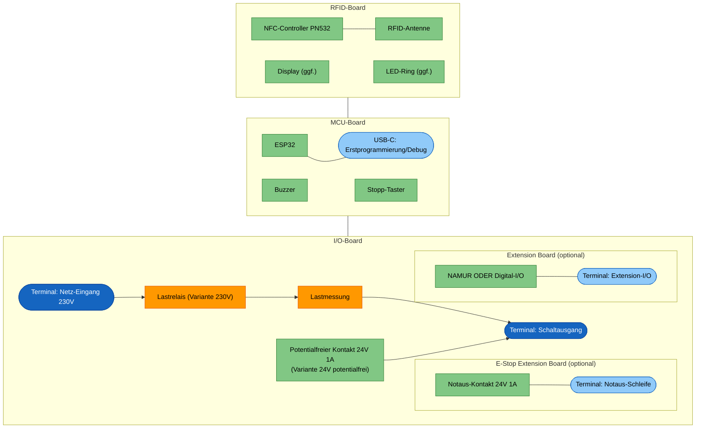

# Machine Node / RFID_BOX

## Einleitung

Dies ist der **RFID Node**: ein kompaktes Steuergerät, das elektrische
Geräte und Maschinen in der Werkstatt (z.B. Standfräse, Drehmaschine, FKS)
per RFID-Karte freischaltet. Er prüft die RFID-Karte einer Nutzerin oder
eines Nutzers gegen easyVerwaltung, gibt bei gültiger Berechtigung die
Maschine frei und schaltet sie beim Stopp oder bei Kartenentzug wieder ab.

Technisch ist der Node als Stack aus mehreren kompakten Platinen aufgebaut
(Netzteil/Schaltausgang, Controller mit Bedienoberfläche, RFID-Frontend),
ergänzt um optionale Erweiterungsboards für Maschinen mit zusätzlichem
Bedarf (z.B. NAMUR-I/O oder eine Notaus-/Bremsschleife). Die konkrete
Aufteilung und Auslegung folgt in den weiteren Kapiteln dieses Dokuments.

Die Anforderungen, aus denen diese Auslegung abgeleitet ist, stehen separat
in [Anforderungen.md](Anforderungen.md).

## Aufbau

Das Gehäuse ist 3D-gedruckt und staubdicht ausgeführt. Display und LED-Ring
sind von aussen sichtbar und durch eine Plexiglasscheibe geschützt; der
LED-Ring selbst sitzt dabei innerhalb des Gehäuses. Der Stopp-Knopf ist von
aussen erreichbar.

Alle Kabel werden einseitig über Kabeldurchführungen ins Gehäuse geführt, von
links nach rechts:

1. Netz-Eingang 230 V
2. Schaltausgang: geschaltete 230 V oder Steuerleitung für ein externes
   Schütz
3. Optionale Notaus-Schleife
4. Optionales Extension-I/O (NAMUR oder Digital-I/O)

Nicht verwendete Durchführungen werden verschlossen.

Die Boards werden über Board-to-Board-Stecker als Stack gesteckt und
geklipst — keine Kabelverbindungen zwischen den Platinen.

## Elektronik

Das Gerät ist als Platinenstack aufgebaut:

- **Oberste PCB (RFID-Board):** RFID-Antenne, ggf. Display und LED-Ring.
- **Mittlere PCB (MCU-Board):** Mikrocontroller (ESP32), Buzzer und
  Peripherie.
- **Unterste PCB (I/O-Board):** 230-V-Netz und Lastrelais, dazu die
  Extension-Header für das E-Stop Extension Board und das Extension Board.
  Dieses Board gibt es in zwei Bestückvarianten: **Variante 230V** mit
  Lastrelais und Lastmessung zum direkten Schalten von Lasten, und
  **Variante 24V potentialfrei** mit potentialfreiem Kontakt für ein
  externes Schütz.

## Architektur

Neben dem festen Dreier-Stack (I/O-, MCU-, RFID-Board) gibt es zwei
optionale, steckbare Erweiterungsboards, die auf das I/O-Board gesteckt
werden:

- **Extension Board:** generisches Zusatzboard mit zwei Bestückvarianten —
  **NAMUR** (zwei optoisolierte NAMUR-Ausgänge, ein galvanisch getrennter
  NAMUR-Eingang) oder **Digital-I/O** (einfache digitale Ein-/Ausgänge, noch
  nicht spezifiziert). Ein Node trägt höchstens eine Variante.
- **E-Stop Extension Board:** einfaches Relais (24 V / 1 A), dessen Kontakt
  in die Notaus-/Interlock-Schleife bzw. Bremsversorgung der Maschine
  eingeschleift wird. Fail-safe: stromlos = Notaus-Schleife unterbrochen;
  öffnet bei Stopp/Kartenentzug sofort, während die Hauptversorgung erst
  nach der Nachlaufzeit trennt (Details siehe
  [Anforderungen.md](Anforderungen.md)).

## Blockdiagramm

Die Form kennzeichnet die Art des Elements, die Farbe die Spannungsebene:

- Formen: abgerundet = Terminal/Steckverbinder, eckig = Funktionsblock; als
  "(optional)" markierte Boards sind steckbare Erweiterungen im I/O-Board.
- Farben: blau = 230-V-Terminal, hellblau = Kleinspannungs-Terminal,
  orange = 230-V-führender Schaltungsteil, grün = Kleinspannungs-
  Schaltungsteil.

## Power Distribution

Die gesamte Versorgung kommt aus dem Netz-Eingang 230 V auf dem I/O-Board
und teilt sich dort in zwei Pfade:

- **Lastpfad (nur Variante 230V):** Netz-Eingang → Ausgangssicherung →
  Lastrelais → Lastmessung → Schaltausgang.
- **Steuerpfad:** Netz-Eingang → Sicherung Steuerzweig → isolierender
  AC/AC-Trafo auf 24 VAC → Gleichrichter mit Regler auf 5 V →
  Sekundärsicherung. Die 5 V gehen über den Stack an das MCU-Board; dort
  erzeugt ein Regler die 3,3 V für ESP32 und NFC-Controller. LED-Ring und
  Buzzer laufen direkt auf 5 V.

Die Erweiterungsboards (Extension Board, E-Stop Extension Board) werden über
den Stack aus dem Steuerpfad versorgt; ihre Feldseite (NAMUR-Kanäle,
Notaus-Schleife) bleibt galvanisch getrennt und wird extern gespeist.

Alle Sicherungen sind gesockelt und nach dem Öffnen des Gehäuses ohne Löten
tauschbar (siehe [Anforderungen.md](Anforderungen.md), S5).

```mermaid
flowchart LR
    NETZ([Netz-Eingang<br/>230V 8A])
    FLAST["Ausgangssicherung<br/>230V 8A"]
    REL["Lastrelais<br/>230V 8A"]
    MESS[Lastmessung]
    OUT([Schaltausgang <br/>230V 8A])

    FSTEUER[Sicherung<br/>Steuerzweig<br/>230V 200mA]
    TRAFO["Trafo AC/AC<br/>230V → 24VAC, isoliert"]
    RECT["Gleichrichter +<br/>Regler 5V"]
    FSEK[Sekundärsicherung 5V]
    V5[5V: LED-Ring, Buzzer, Erweiterungsboards]
    V33[3V3-Regler auf MCU-Board]
    LOGIK[ESP32, NFC-Controller]

    NETZ -->|"[PIN]"| FLAST
    FLAST -->|"[PIN_FUSED]"| REL
    REL -->|"[PIN_SWITCHED]"| MESS
    MESS -->|"[PIN_SWITCHED]"| OUT
    NETZ -->|"[PIN]"| FSTEUER
    FSTEUER -->|"[PIN_CTRL]"| TRAFO
    TRAFO -->|"[24VAC]"| RECT
    RECT -->|"[+5V_RAW]"| FSEK
    FSEK -->|"[+5V]"| V5
    FSEK -->|"[+5V]"| V33
    V33 -->|"[+3V3]"| LOGIK

    linkStyle 0,4 stroke:#b71c1c,stroke-width:2px
    linkStyle 1 stroke:#e53935,stroke-width:2px
    linkStyle 2,3 stroke:#fb8c00,stroke-width:2px
    linkStyle 5 stroke:#f4511e,stroke-width:2px
    linkStyle 6 stroke:#fbc02d,stroke-width:2px
    linkStyle 7 stroke:#9ccc65,stroke-width:2px
    linkStyle 8,9 stroke:#2e7d32,stroke-width:2px
    linkStyle 10 stroke:#00897b,stroke-width:2px

    classDef term230 fill:#1565c0,color:#fff,stroke:#0d47a1
    classDef part230 fill:#ff9800,color:#000,stroke:#e65100
    classDef partSELV fill:#81c784,color:#000,stroke:#2e7d32

    class NETZ,OUT term230
    class FLAST,REL,MESS,FSTEUER,TRAFO part230
    class RECT,FSEK,V5,V33,LOGIK partSELV
```

Netze: `[PIN]` = Netzphase ungesichert, `[PIN_FUSED]` = Lastpfad nach
Ausgangssicherung, `[PIN_SWITCHED]` = geschaltete Phase hinter dem
Lastrelais, `[PIN_CTRL]` = Steuerzweig nach Sicherung, `[24VAC]` =
Trafo-Sekundärseite (isoliert), `[+5V_RAW]` = 5 V vor Sekundärsicherung,
`[+5V]` = abgesicherte 5-V-Schiene, `[+3V3]` = Logikversorgung.
