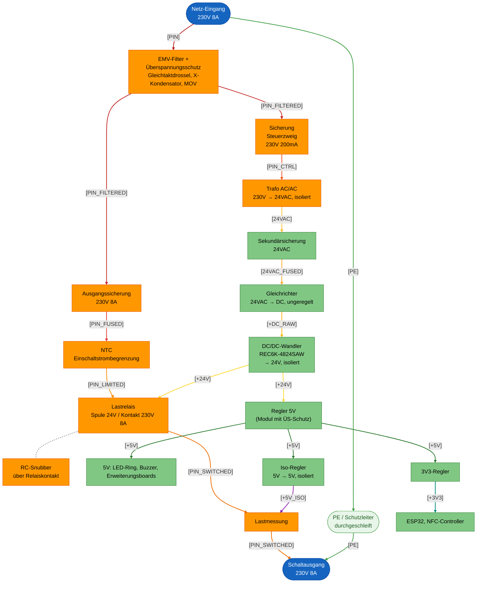
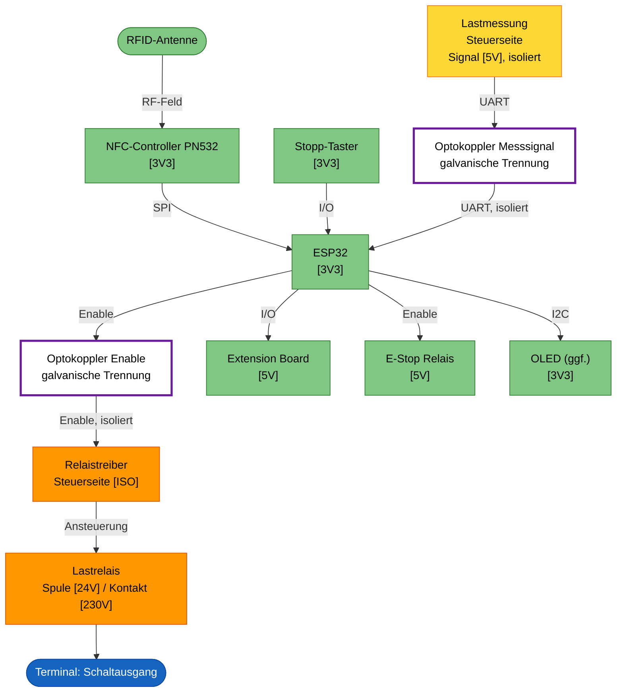

# Machine Node / RFID_BOX

## Einleitung

Dies ist der **RFID Node**: ein kompaktes Steuergerät, das elektrische
Geräte und Maschinen in der Werkstatt (z.B. Standfräse, Drehmaschine, FKS)
per RFID-Karte freischaltet. Er prüft die RFID-Karte einer Nutzerin oder
eines Nutzers gegen easyVerwaltung, gibt bei gültiger Berechtigung die
Maschine frei und schaltet sie beim Stopp oder bei Kartenentzug wieder ab.

Technisch ist der Node als Stack aus mehreren kompakten Platinen aufgebaut
(Netzteil/Schaltausgang, Controller mit Bedienoberfläche, RFID-Frontend),
ergänzt um optionale Erweiterungsboards für Maschinen mit zusätzlichem
Bedarf (z.B. NAMUR-I/O oder eine Notaus-/Bremsschleife). Die konkrete
Aufteilung und Auslegung folgt in den weiteren Kapiteln dieses Dokuments.

Die Anforderungen, aus denen diese Auslegung abgeleitet ist, stehen separat
in [Anforderungen.md](Anforderungen.md).

## Aufbau

Das Gehäuse ist 3D-gedruckt und staubdicht ausgeführt. Display und LED-Ring
sind von aussen sichtbar und durch eine Plexiglasscheibe geschützt; der
LED-Ring selbst sitzt dabei innerhalb des Gehäuses. Der Stopp-Knopf ist von
aussen erreichbar.

Alle Kabel werden einseitig über Kabeldurchführungen ins Gehäuse geführt, von
links nach rechts:

1. Netz-Eingang 230 V
2. Schaltausgang: geschaltete 230 V oder Steuerleitung für ein externes
   Schütz
3. Optionale Notaus-Schleife
4. Optionales Extension-I/O (NAMUR oder Digital-I/O)

Nicht verwendete Durchführungen werden verschlossen.

Die Boards werden über Board-to-Board-Stecker als Stack gesteckt und
geklipst — keine Kabelverbindungen zwischen den Platinen.

## Elektronik

Das Gerät ist als Platinenstack aufgebaut:

- **Oberste PCB (RFID-Board):** RFID-Antenne, ggf. Display und LED-Ring.
- **Mittlere PCB (MCU-Board):** Mikrocontroller (ESP32), Buzzer und
  Peripherie.
- **Unterste PCB (I/O-Board):** 230-V-Netz und Lastrelais, dazu die
  Extension-Header für das E-Stop Extension Board und das Extension Board.
  Dieses Board gibt es in zwei Bestückvarianten: **Variante 230V** mit
  Lastrelais und Lastmessung zum direkten Schalten von Lasten, und
  **Variante 24V potentialfrei** mit potentialfreiem Kontakt für ein
  externes Schütz.

## Architektur

Neben dem festen Dreier-Stack (I/O-, MCU-, RFID-Board) gibt es zwei
optionale, steckbare Erweiterungsboards, die auf das I/O-Board gesteckt
werden:

- **Extension Board:** generisches Zusatzboard mit zwei Bestückvarianten —
  **NAMUR** (zwei optoisolierte NAMUR-Ausgänge, ein galvanisch getrennter
  NAMUR-Eingang) oder **Digital-I/O** (einfache digitale Ein-/Ausgänge, noch
  nicht spezifiziert). Ein Node trägt höchstens eine Variante.
- **E-Stop Extension Board:** einfaches Relais (24 V / 1 A), dessen Kontakt
  in die Notaus-/Interlock-Schleife bzw. Bremsversorgung der Maschine
  eingeschleift wird. Fail-safe: stromlos = Notaus-Schleife unterbrochen;
  öffnet bei Stopp/Kartenentzug sofort, während die Hauptversorgung erst
  nach der Nachlaufzeit trennt (Details siehe
  [Anforderungen.md](Anforderungen.md)).

## Blockdiagramm

Die Form kennzeichnet die Art des Elements, die Farbe die Spannungsebene:

- Formen: abgerundet = Terminal/Steckverbinder, eckig = Funktionsblock; als
  "(optional)" markierte Boards sind steckbare Erweiterungen im I/O-Board.
- Farben: blau = 230-V-Terminal, hellblau = Kleinspannungs-Terminal,
  orange = 230-V-führender Schaltungsteil, grün = Kleinspannungs-
  Schaltungsteil.

## Power Distribution

Die gesamte Versorgung kommt aus dem Netz-Eingang 230 V auf dem I/O-Board
und teilt sich dort in zwei Pfade:

- **Lastpfad (nur Variante 230V):** Netz-Eingang → Ausgangssicherung →
  Lastrelais → Lastmessung → Schaltausgang.
- **Steuerpfad:** Netz-Eingang → Sicherung Steuerzweig → isolierender
  AC/AC-Trafo auf 24 VAC → Sekundärsicherung → Gleichrichter → DC/DC-Wandler
  REC6K-4824SAW (24 V, isoliert) → Regler auf 5 V (Modul mit integriertem
  Überspannungs-/Überlastschutz) → 3,3 V auf dem MCU-Board für ESP32 und
  NFC-Controller. Die 24-V-Schiene aus dem REC6K-4824SAW versorgt zusätzlich
  die Lastrelais-Spule. LED-Ring und Buzzer laufen direkt auf 5 V. Ein
  isolierter 5V→5V-Regler versorgt die Lastmessung galvanisch getrennt.

Die Erweiterungsboards (Extension Board, E-Stop Extension Board) werden über
den Stack aus dem Steuerpfad versorgt; ihre Feldseite (NAMUR-Kanäle,
Notaus-Schleife) bleibt galvanisch getrennt und wird extern gespeist.

Alle Sicherungen sind gesockelt und nach dem Öffnen des Gehäuses ohne Löten
tauschbar (siehe [Anforderungen.md](Anforderungen.md), S5).

Da das Werkstattnetz und die geschaltete Last (Motoren) elektrisch
"schmutzig" sein können, sitzen direkt am Netz-Eingang ein EMV-Filter mit
Überspannungsschutz sowie im Lastpfad eine Einschaltstrombegrenzung und eine
Kontakt-Schutzbeschaltung am Lastrelais. PE wird unverändert vom
Netz-Eingang zum Schaltausgang durchgeschleift; da das Gehäuse aus
Kunststoff besteht, gibt es keine Verbindung zu einer Gehäusemasse.

| Netz | Bedeutung |
|---|---|
| `[PIN]` | Netzphase, ungesichert |
| `[PIN_FILTERED]` | Nach EMV-Filter/Überspannungsschutz |
| `[PIN_FUSED]` | Lastpfad nach Ausgangssicherung |
| `[PIN_LIMITED]` | Nach Einschaltstrombegrenzung (NTC) |
| `[PIN_SWITCHED]` | Geschaltete Phase hinter dem Lastrelais |
| `[PIN_CTRL]` | Steuerzweig nach Sicherung |
| `[24VAC]` | Trafo-Sekundärseite, isoliert |
| `[24VAC_FUSED]` | Trafo-Sekundärseite nach Sicherung |
| `[+DC_RAW]` | Ungeregelte Gleichspannung nach dem Gleichrichter, Eingang des DC/DC-Wandlers |
| `[+24V]` | Geregelte 24-V-Schiene aus REC6K-4824SAW, versorgt die Lastrelais-Spule und den Eingang des 5V-Reglers |
| `[+5V]` | 5-V-Schiene (Schutz durch integrierten Modulschutz des Reglers) |
| `[+5V_ISO]` | Isolierte 5-V-Versorgung der Lastmessung |
| `[+3V3]` | Logikversorgung |
| `[PE]` | Schutzleiter, unverändert durchgeschleift, kein Bezug zum Kunststoffgehäuse |

Der RC-Snubber (gestrichelt) liegt parallel zum Relaiskontakt und führt
keinen eigenen Laststrompfad.

## Signalfluss

Analog zur Power Distribution beginnt auch der Signalfluss am Eingang
(RFID-Karte) und endet am Schaltausgang — hier geht es aber nicht um die
Leistungs-, sondern um die Steuersignale, die entscheiden, ob der
Schaltausgang aktiv ist.

Der Stopp-Taster wirkt zweifach: sofort an den ESP32 (Firmware-Status
`STOPPED`) und zusätzlich als hardwareseitiger Interlock direkt auf den
Relaistreiber, unabhängig von der Firmware. Enable-Signal und Messsignal
der Lastmessung queren die Isolationsbarriere jeweils über einen eigenen
Optokoppler.

Formen und Farben wie im Blockdiagramm (abgerundet = Terminal/Eingabe,
eckig = Funktionsblock); zusätzlich: weiss mit violettem Rahmen =
Optokoppler / Isolationsbarriere, gelb = Signalpegel isoliert/SELV, aber
das Bauteil selbst berührt die 230-V-Seite (z.B. Lastmessung). Die
Spannungsangabe `[…]` in den Blöcken zeigt den jeweiligen Signalpegel,
analog zu den Netznamen im Power-Distribution-Diagramm.
