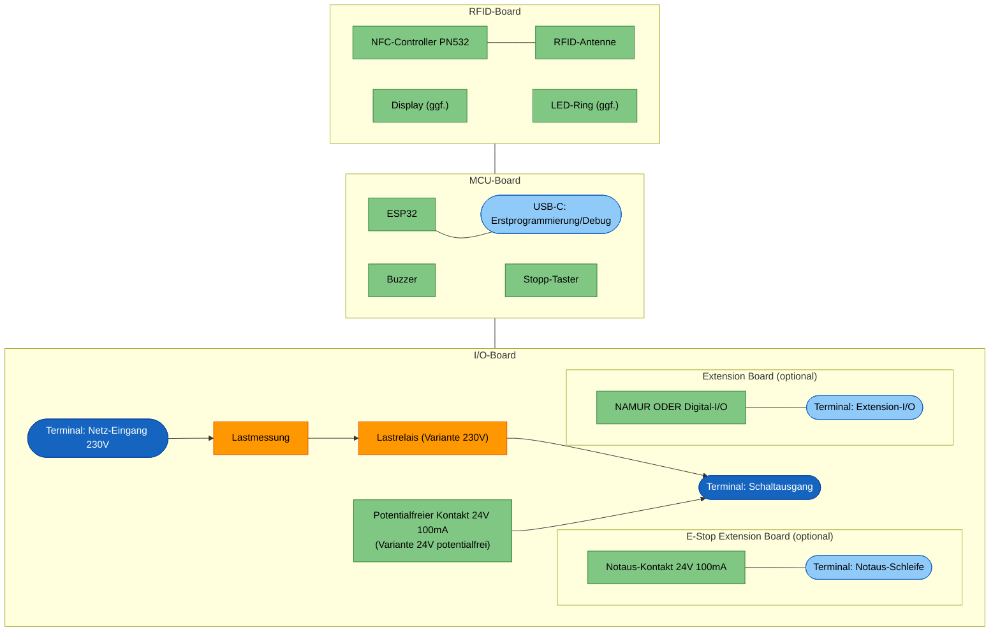
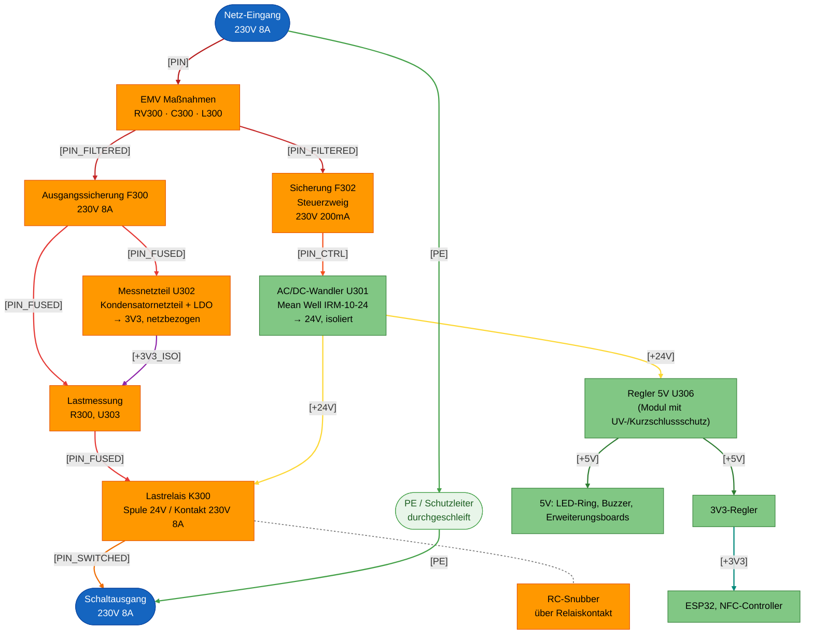
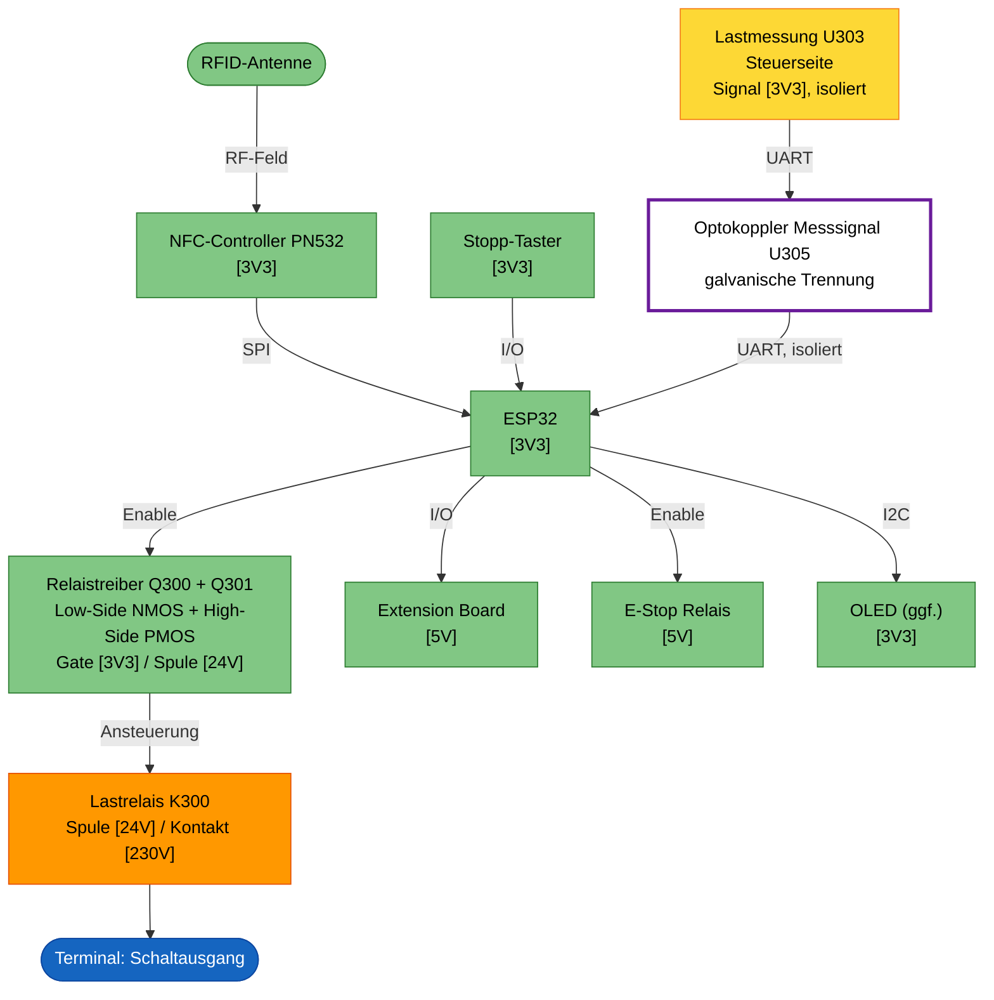

# Machine Node / RFID_BOX

## Einleitung

Dies ist der **RFID Node**: ein kompaktes Steuergerät, das elektrische
Geräte und Maschinen in der Werkstatt (z.B. Standfräse, Drehmaschine, FKS)
per RFID-Karte freischaltet. Er prüft die RFID-Karte einer Nutzerin oder
eines Nutzers gegen easyVerwaltung, gibt bei gültiger Berechtigung die
Maschine frei und schaltet sie beim Stopp oder bei Kartenentzug wieder ab.

Technisch ist der Node als Stack aus mehreren kompakten Platinen aufgebaut
(Netzteil/Schaltausgang, Controller mit Bedienoberfläche, RFID-Frontend),
ergänzt um optionale Erweiterungsboards für Maschinen mit zusätzlichem
Bedarf (z.B. NAMUR-I/O oder eine Notaus-/Bremsschleife). Die konkrete
Aufteilung und Auslegung folgt in den weiteren Kapiteln dieses Dokuments.

Die Anforderungen, aus denen diese Auslegung abgeleitet ist, stehen separat
in [Anforderungen.md](Anforderungen.md).

## Aufbau

Das Gehäuse ist 3D-gedruckt und staubdicht ausgeführt. Display und LED-Ring
sind von aussen sichtbar und durch eine Plexiglasscheibe geschützt; der
LED-Ring selbst sitzt dabei innerhalb des Gehäuses. Der Stopp-Knopf ist von
aussen erreichbar.

Alle Kabel werden einseitig über Kabeldurchführungen ins Gehäuse geführt, von
links nach rechts:

1. Netz-Eingang 230 V
2. Schaltausgang: geschaltete 230 V oder Steuerleitung für ein externes
   Schütz
3. Optionale Notaus-Schleife
4. Optionales Extension-I/O (NAMUR oder Digital-I/O)

Nicht verwendete Durchführungen werden verschlossen.

Die Boards werden über Board-to-Board-Stecker als Stack gesteckt und
geklipst — keine Kabelverbindungen zwischen den Platinen.

## Elektronik

Das Gerät ist als Platinenstack aufgebaut:

- **Oberste PCB (RFID-Board):** RFID-Antenne, ggf. Display und LED-Ring.
- **Mittlere PCB (MCU-Board):** Mikrocontroller (ESP32), Buzzer und
  Peripherie.
- **Unterste PCB (I/O-Board):** 230-V-Netz und Lastrelais, dazu die
  Extension-Header für das E-Stop Extension Board und das Extension Board.
  Dieses Board gibt es in zwei Bestückvarianten: **Variante 230V** mit
  Lastrelais und Lastmessung zum direkten Schalten von Lasten, und
  **Variante 24V potentialfrei** mit potentialfreiem Kontakt für ein
  externes Schütz.

## Architektur

Neben dem festen Dreier-Stack (I/O-, MCU-, RFID-Board) gibt es zwei
optionale, steckbare Erweiterungsboards, die auf das I/O-Board gesteckt
werden:

- **Extension Board:** generisches Zusatzboard mit zwei Bestückvarianten —
  **NAMUR** (zwei optoisolierte NAMUR-Ausgänge, ein galvanisch getrennter
  NAMUR-Eingang) oder **Digital-I/O** (einfache digitale Ein-/Ausgänge, noch
  nicht spezifiziert). Ein Node trägt höchstens eine Variante.
- **E-Stop Extension Board:** einfaches Relais (24 V / 100 mA), dessen Kontakt
  in die Notaus-/Interlock-Schleife bzw. Bremsversorgung der Maschine
  eingeschleift wird. Fail-safe: stromlos = Notaus-Schleife unterbrochen;
  öffnet bei Stopp/Kartenentzug sofort, während die Hauptversorgung erst
  nach der Nachlaufzeit trennt (Details siehe
  [Anforderungen.md](Anforderungen.md)).

## Blockdiagramm

Die Form kennzeichnet die Art des Elements, die Farbe die Spannungsebene:

- Formen: abgerundet = Terminal/Steckverbinder, eckig = Funktionsblock; als
  "(optional)" markierte Boards sind steckbare Erweiterungen im I/O-Board.
- Farben: blau = 230-V-Terminal, hellblau = Kleinspannungs-Terminal,
  orange = 230-V-führender Schaltungsteil, grün = Kleinspannungs-
  Schaltungsteil.

## Power Distribution

Die gesamte Versorgung kommt aus dem Netz-Eingang 230 V auf dem I/O-Board
und teilt sich dort in zwei Pfade:

- **Lastpfad (nur Variante 230V):** Netz-Eingang → Ausgangssicherung (F300) →
  Lastmessung (R300, U303) → Lastrelais (K300) → Schaltausgang. Die Messung
  sitzt vor dem Relais, damit sie unabhängig vom Schaltzustand versorgt und
  betriebsbereit bleibt.
- **Steuerpfad:** Netz-Eingang → Sicherung Steuerzweig (F302) → isoliertes
  AC/DC-Wandlermodul Mean Well IRM-10-24 (U301, 24 V, isoliert) → Regler auf
  5 V (U306, Modul mit Unterspannungs- und Kurzschlussschutz) → 3,3 V auf
  dem MCU-Board für ESP32 und NFC-Controller. Die 24-V-Schiene aus dem
  IRM-10-24 versorgt zusätzlich die Lastrelais-Spule. LED-Ring und Buzzer
  laufen direkt auf 5 V.
- **Messnetzteil:** Die Lastmessung liegt auf Netzpotential und wird
  netzseitig aus einem Kondensatornetzteil (U302) versorgt, nicht über die
  Isolationsbarriere hinweg. Details siehe
  [Leiterbahnbreiten und Abstände](#leiterbahnbreiten-und-abstände).

Die Erweiterungsboards (Extension Board, E-Stop Extension Board) werden über
den Stack aus dem Steuerpfad versorgt; ihre Feldseite (NAMUR-Kanäle,
Notaus-Schleife) bleibt galvanisch getrennt und wird extern gespeist.

Die Lastausgangssicherung (F300) ist gesockelt und nach dem Öffnen des
Gehäuses ohne Löten tauschbar; eine Ersatzsicherung wird im Gehäuse
mitgeführt. Die Gerätesicherung (F302) ist als dokumentierte Ausnahme fest
verlötet (siehe [Anforderungen.md](Anforderungen.md), S5).

Da das Werkstattnetz und die geschaltete Last (Motoren) elektrisch
"schmutzig" sein können, sitzen direkt am Netz-Eingang EMV-Maßnahmen (RV300,
C300, L300) sowie eine Kontakt-Schutzbeschaltung am Lastrelais. Eine
Einschaltstrombegrenzung im Lastpfad gibt es bewusst nicht: den Anlauf
tragen die träge Ausgangssicherung F300 und das Einschaltvermögen von K300
(30 A, AgCdO-Kontakte). Das Lastrelais (K300) trennt L und
N gemeinsam (2-polig), da die
N/L-Zuordnung an der Werkstatt-Steckdose nicht garantiert eindeutig ist.
PE wird unverändert vom
Netz-Eingang zum Schaltausgang durchgeschleift; da das Gehäuse aus
Kunststoff besteht, gibt es keine Verbindung zu einer Gehäusemasse.

| Netz | Bedeutung |
|---|---|
| `[PIN]` | Netzphase, ungesichert |
| `[PIN_FILTERED]` | Nach EMV-Maßnahmen |
| `[PIN_FUSED]` | Lastpfad nach Ausgangssicherung, speist Lastmessung und Messnetzteil |
| `[PIN_SWITCHED]` | Geschaltete Phase hinter dem Lastrelais |
| `[PIN_CTRL]` | Steuerzweig nach Sicherung |
| `[+24V]` | Geregelte 24-V-Schiene aus dem AC/DC-Wandler IRM-10-24 (U301), versorgt die Lastrelais-Spule und den Eingang des 5V-Reglers |
| `[+5V]` | 5-V-Schiene (Schutz durch integrierten Modulschutz des Reglers) |
| `[+3V3_ISO]` | Netzbezogene 3,3-V-Versorgung der Lastmessung (U303) aus dem Messnetzteil (U302) |
| `[+3V3]` | Logikversorgung |
| `[PE]` | Schutzleiter, unverändert durchgeschleift, kein Bezug zum Kunststoffgehäuse |

Die EMV-Maßnahmen am Netz-Eingang bestehen aus einer Gleichtaktdrossel
(L300) und einem X2-Kondensator (C300) als eigentlichem EMV-Filter sowie
einem MOV (RV300, Metall-Oxid-Varistor) als Überspannungsschutz.

Der RC-Snubber (gestrichelt) liegt parallel zum Relaiskontakt und führt
keinen eigenen Laststrompfad.

## Signalfluss

Analog zur Power Distribution beginnt auch der Signalfluss am Eingang
(RFID-Karte) und endet am Schaltausgang — hier geht es aber nicht um die
Leistungs-, sondern um die Steuersignale, die entscheiden, ob der
Schaltausgang aktiv ist.

Der Stopp-Taster wirkt auf den ESP32 (Firmware-Status `STOPPED`); dieser
schaltet, falls bestückt, das E-Stop Relais aus. Es gibt keinen separaten
hardwareseitigen Bypass am E-Stop Relais, der unabhängig von der Firmware
wirkt. Der Relaistreiber der Hauptversorgung bekommt **keinen** direkten
Hardware-Interlock vom Stopp-Taster: die Hauptversorgung wird
ausschliesslich vom ESP32 nach Ablauf der Nachlaufzeit abgeschaltet (siehe
Power Distribution und Anforderungen.md). Das Enable bleibt vollständig auf
der SELV-Seite: die Relaisspule hängt an der 24-V-Schiene aus dem isolierten
IRM-10-24 und wird von **zwei Schaltern in Reihe** geführt — einem
Low-Side-NMOS (Q300) und einem High-Side-PMOS (Q301) an getrennten GPIOs.
Beide gehen im Ruhezustand über Pulldown bzw. Pull-up sicher auf, und ein
durchlegierter Schalter lässt sich über den anderen noch abschalten (siehe
FMEA). Die Isolationsbarriere quert nur das Messsignal der Lastmessung,
über den Optokoppler U305.

Formen und Farben wie im Blockdiagramm (abgerundet = Terminal/Eingabe,
eckig = Funktionsblock); zusätzlich: weiss mit violettem Rahmen =
Optokoppler / Isolationsbarriere, gelb = Signalpegel isoliert/SELV, aber
das Bauteil selbst berührt die 230-V-Seite (z.B. Lastmessung). Die
Spannungsangabe `[…]` in den Blöcken zeigt den jeweiligen Signalpegel,
analog zu den Netznamen im Power-Distribution-Diagramm.

## Bauteilauswahl

Bereits festgelegte Bauteile für die in den vorherigen Kapiteln gezeigten
Funktionsblöcke. Preise sind Einzelstückpreise, sofern nicht anders
angegeben (z.B. "@10 Stk"); wo kein Distributorpreis vorliegt, ist der Wert
geschätzt (·). Lieferant/Bestellnummer sind nur eingetragen, wo bereits
konkret geprüft; "*offen*" heisst nicht unbekannt/unmöglich, sondern noch
nicht recherchiert.

### ICs & Module

| Funktion | Hersteller / Teilenummer | Beschreibung | Lieferant / Bestellnummer | Preis |
|---|---|---|---|---:|
| Mikrocontroller | Espressif ESP32-S3-WROOM-1-N16R8 | MCU-Modul mit WLAN/BLE, 16MB Flash, 8MB PSRAM | Mouser 356-ESP32S3WRM1N16R8 | 4,82 € @25 Stk |
| Leistungsmessung (U303) | Microchip MCP39F51A | Single-Phase Energy-Monitoring-IC, UART-Schnittstelle | Farnell 2478286 | 3,61 € @25 Stk |
| RFID-Controller | NXP PN5321A3HN/C106 | NFC-Frontend-IC (ISO14443), SPI-Schnittstelle | Mouser 771-PN5321A3HN10 | 11,25 € @1 Stk |
| AC/DC-Wandler 24V (Steuerpfad, U301) | Mean Well IRM-10-24 | 10W isoliert, 24V/0,42A, 4,2kVac I/P-O/P, Isolationsklasse II, PCB-Mount | Digikey 1866-3030-ND | 5,650 € @25 Stk |
| Regler 5V (Steuerpfad, U306) | RECOM R-78K5.0-2.0 | DC/DC-Wandler 24V→5V, 2A, SIP3/TO-220-kompatibel | Digikey 945-R-78K5.0-2.0-ND | 4,71 € @25 Stk |
| 3V3-Regler (nicht isoliert, ESP32/NFC) | EVVOSEMI AMS1117-3.3 | LDO 1A, SOT-223-3L | Digikey 5272-AMS1117-3.3CT-ND | 0,1552 € @25 Stk |
| Optokoppler Messsignal (U305) | Vishay VO615A-X017T | Phototransistor-Optokoppler, VDE 0884-5 verstärkte Isolierung, SMD-4, Kriechstrecke ≥7,6mm | Digikey 751-VO615A-X017TCT-ND | 0,269 € @10 Stk |
| Relaistreiber Low-Side (Q300) | *offen* | Logic-Level-NMOS, Gate-Ansteuerung mit 3,3 V, Gate-Pulldown | *offen* | ca. 0,10 € · |
| Relaistreiber High-Side (Q301) | *offen* | PMOS ≥ 40V in der 24V-Zuleitung der Spule, mit NPN-Pegelwandler, Gate-Pull-up und Vgs-Klemmung — redundanter zweiter Schalter (siehe FMEA) | *offen* | ca. 0,25 € · |
| Freilaufdiode Relaisspule (D305) | *offen* | über der Spule, wirkt unabhängig davon welcher Schalter öffnet | *offen* | ca. 0,03 € · |
| LDO Messnetzteil (U302) | Microchip MCP1703A-3302E/CB | 3,3 V, 250 mA, Vin bis 16 V, Ruhestrom 2 µA, SOT-23A | *offen* | ca. 0,40 € · |
| Pegelwandler LED-Ring (3V3→5V) | diverse 74AHCT125 | Quad-Buffer/Levelshifter 3,3V→5V | *offen* | ca. 0,30 € · |

### Widerstände

| Funktion | Hersteller / Teilenummer | Beschreibung | Lieferant / Bestellnummer | Preis |
|---|---|---|---|---:|
| Shunt (Leistungsmessung, R300) | Yageo PA1206FRM670R002L | 2mOhm, Strommess-Shunt, 1206 | Mouser 603-PA1206FRM670R02L | 0,131 € @25 Stk |
| Strombegrenzung Messnetzteil (R301, R302) | *offen* | 2× 47 Ohm, 1206, flammfest/Sicherungstyp, in Reihe | *offen* | ca. 0,10 € · |
| Entladewiderstand Messnetzteil (R303–R306) | *offen* | 4× 680 kOhm, 1206 — zwei Reihenpaare parallel zu C307, redundant gegen Ausfall offen (siehe FMEA) | *offen* | ca. 0,08 € · |

### Kondensatoren

| Funktion | Hersteller / Teilenummer | Beschreibung | Lieferant / Bestellnummer | Preis |
|---|---|---|---|---:|
| X2-Kondensator (EMV, C300) | Würth Elektronik 890334023023CS | Funkentstörkondensator X2 (MKP), 100nF, 310VAC/560VDC, Rastermaß 10mm | Digikey 732-5733-ND | 0,35 € @1 Stk |
| X2-Kondensator (Messnetzteil, C307) | *offen* | Funkentstörkondensator X2 (MKP), 680nF, 310VAC — setzt den Strom des Messnetzteils auf 22mA | *offen* | ca. 0,70 € · |
| Puffer-Elko (Messnetzteil, C308) | *offen* | 220µF/16V, 105°C, ≥10000h Lebensdauer (z.B. Panasonic FR, Nichicon PW) | *offen* | ca. 0,30 € · |
| Ausgangs-Stützkondensator (U301) | Murata GCM155R71H104KE02J | 100nF/50V, 0805 (C301) | Mouser 81-GCM155R71H104KE2J | 0,021 € @10 Stk |
| Ausgangs-Elko (U301) | Würth Elektronik 860010673012 | 47µF/50V (C302) | Mouser 710-860010673012 | 0,129 € @1 Stk |
| Ausgangs-MLCC (U306) | Murata GRM21BR71A106KA73K | 10µF/10V, 0805 (C303) | Mouser 81-GRM21BR71A106KA3K | 0,04 € @10 Stk |
| RC-Snubber | *offen* | 100R + 100nF X2, diskret | *offen* | ca. 0,20 € · |

### Induktivitäten

| Funktion | Hersteller / Teilenummer | Beschreibung | Lieferant / Bestellnummer | Preis |
|---|---|---|---|---:|
| Gleichtaktdrossel (EMV, L300) | Würth Elektronik 7448258022 | Stromkompensierte Drossel, 2,2mH, 8A, DCR 14mΩ, bedrahtet | Digikey 732-1455-ND | 5,067 € @10 Stk |

### Relais & Schutzbeschaltung

| Funktion | Hersteller / Teilenummer | Beschreibung | Lieferant / Bestellnummer | Preis |
|---|---|---|---|---:|
| Lastrelais (K300) | TE Connectivity T92S11D12-24 (9-1393211-0) | 2-polig (N+L), 2 Form C, AgCdO, 30A/40A NO, verstärkte Isolation Spule/Kontakt 8mm/9,5mm/4kVrms, Höhe 30,7mm | Digikey PB352-ND | 27,46 € @30 Stk |
| Potentialfreier Kontakt (K2) | Omron G5V-1-2 DC24 | 100mA/24V, Spule 24V | Digikey Z11621-ND | 1,9556 € @25 Stk |
| Polyfuse (K2) | Yageo SMD1812B020TF-J | PTC-Rückstellsicherung, Hold 0,2A, Trip 0,4A, 60V, SMD | Mouser 603-SMD1812B020TF-J | 0,095 € @10 Stk |
| E-Stop-Relais (K3) | Omron G5V-1-2 DC24 | 100mA/24V, Spule 24V | Digikey Z11621-ND | 1,9556 € @25 Stk |
| Polyfuse (K3) | Yageo SMD1812B020TF-J | PTC-Rückstellsicherung, Hold 0,2A, Trip 0,4A, 60V, SMD | Mouser 603-SMD1812B020TF-J | 0,095 € @10 Stk |
| Überspannungsschutz (EMV, RV300) | TDK B72210S0271K101 (SIOV-S10K275) | Metalloxid-Varistor, 275VAC/430V, 2500A Stoßstrom, bedrahtet Ø12,5mm | Digikey 495-3786-ND | 0,186 € @25 Stk |
| Gleichrichter + Rückflussdiode (Messnetzteil, D300/D301) | *offen* | 2× 1000V/1A, SMA; D301 antiparallel zu D300 | *offen* | ca. 0,06 € · |
| Z-Diode (Messnetzteil, D302, D303) | *offen* | 2× 5,6V, 0,5W, SOD-123 — parallel, redundant gegen Ausfall offen (siehe FMEA) | *offen* | ca. 0,10 € · |
| Gerätesicherung (F302) | Bel Fuse MRT 1-BULK | 1A/250V träge, THT radial, fest verlötet (Abweichung von S5, siehe Anforderungen.md) | Digikey 5923-MRT1-BULK-ND | 0,402 € @10 Stk |
| Lastausgangssicherung (F300) | Schurter 0034.3127 (FST 5x20) | 10A/250V träge | Digikey 486-1226-ND | 0,414 € @50 Stk |
| Sicherungshalter (F300) | Würth WR-FSH 696309001002 | VDE 10A, Berührschutz Shocksafe PC2/IP20, THT stehend | Digikey 732-11383-ND | 1,30 € @10 Stk |
| Ersatzsicherung (im Gehäuse) | Schurter 0034.3127 (FST 5x20) | Reserve wie F300, im Gehäuse mitgeführt | Digikey 486-1226-ND | 0,414 € @50 Stk |

### Steckverbinder & Bedienelemente

| Funktion | Hersteller / Teilenummer | Beschreibung | Lieferant / Bestellnummer | Preis |
|---|---|---|---|---:|
| Netz-Eingang / Schaltausgang (Terminal, J300) | WAGO 2604-1103 | 3-pol. Hebelklemme, Rastermaß 5mm | Digikey 2946-2604-1103-ND | 2,95 € @50 Stk |
| USB-C-Buchse (Service) | *offen* USB4105-GF-A | THT | *offen* | ca. 0,30 € · |
| Stopp-Taster | *offen* | Panelmontage, IP65, 12mm | *offen* | ca. 1,50 € · |

### Anzeige & Akustik

| Funktion | Hersteller / Teilenummer | Beschreibung | Lieferant / Bestellnummer | Preis |
|---|---|---|---|---:|
| OLED | Displaytech DT010ATFT | 1" IPS-LCD mit integriertem Controller, I2C-Ansteuerung | Mouser 758-DT010ATFT | 10,92 € @10 Stk |
| LED-Ring | Inolux IN-PI20TATPRPGPB | 12x, 2020-Gehäuse, adressierbar über Single-Wire-Protokoll (WS2812B-kompatibel) | Digikey 1830-IN-PI20TATPRPGPBCT-ND | 0,2225 € @100 Stk |
| Buzzer | TDK PS1240P02BT | Piezo-Buzzer ohne Oszillator, Pin-Terminal (THT), externe Ansteuerung (Resonanz ~4kHz) | Digikey 445-2525-1-ND | 0,3844 € @25 Stk |

### Sonstige

| Funktion | Hersteller / Teilenummer | Beschreibung | Lieferant / Bestellnummer | Preis |
|---|---|---|---|---:|
| Extension Board (NAMUR/Digital-I/O) | *offen (eigenes Board, kein Einzelbauteil)* | | | — |

**Summe: ca. 89,38 €** (1× je Zeile über alle Kategorien, ohne Mengen und
ohne Extension Board). Die Summe zählt jede Zeile einfach (auch wo "/Stk"
steht, z.B. LED-Ring, Sicherungen); sie berücksichtigt keine tatsächlich
benötigten Stückzahlen pro Board (z.B. 12× LED, mehrere
Sicherungen/Terminals) und ist daher kein vollständiger BOM-Preis, sondern
ein grober erster Anhaltspunkt.

## Leiterbahnbreiten und Abstände

### 1. Fertigungsbasis

| Board | Lagen | Kupfer |
|---|---|---|
| I/O-Board | 2 | **70 µm (2 oz)** |
| MCU-Board | **4** | 35 µm außen, 17,5 µm innen |
| RFID-Board | 2 | 35 µm |

Alle FR4, 1,6 mm. Fertigungsuntergrenzen: 0,2 mm Bahn/Abstand, 0,3 mm
Bohrung, 0,5 mm Via, 0,5 mm Kupfer zur Boardkante, 1,0 mm Fräsnut.

Ein Punkt, der leicht übersehen wird: die Innenlagen sind nur 17,5 µm, und
IPC-2221 rechnet für sie mit halbem Faktor (k = 0,024). Eine Innenlagenbahn
braucht damit rund das Fünffache der Außenlagenbreite — 2 A dort 6,2 mm
statt 1,2 mm.

### 2. Leiterbahnbreiten

Grundlage IPC-2221 für Außenlagen, `A = (I / (k · ΔT^0,44))^(1/0,725)` mit
k = 0,048 (außen) bzw. 0,024 (innen), **ΔT = 5 K**. Unterhalb von ~2 A sind
die Breiten nicht thermisch bestimmt, sondern durch Spannungsabfall und
mechanische Robustheit — die Spalte "rechnerisch" liegt dort deutlich unter
dem Designwert.

Via-Größen als Referenz, Restring ≥ 0,125 mm je Seite. Belastbarkeit nach
derselben Formel über den Barrel-Querschnitt `A = π · d · t`, t = 20 µm
Galvanik:

| Bohrung | Pad | Aspect Ratio | Barrel-Querschnitt | je Via @ ΔT 5 K | Verwendung |
|---:|---:|---:|---:|---:|---|
| **⌀0,2 mm** | 0,45 mm | 8:1 | 0,013 mm² | 0,8 A | enge Bereiche mit Kleinstströmen |
| **⌀0,3 mm** | 0,6 mm | 5,3:1 | 0,019 mm² | 1,1 A | Signale, GND-Stitching |
| **⌀0,6 mm** | 1,0 mm | 2,7:1 | 0,038 mm² | 1,9 A | Versorgungsschienen |
| **⌀1,0 mm** | 1,4 mm | 1,6:1 | 0,063 mm² | 2,7 A | Lastpfad |

Stückzahlen in den Tabellen mit Faktor 0,7 für eng gesetzte Via-Felder
gerechnet.

#### 2.1 I/O-Board — 2 Lagen, 70 µm

**P:** = Primärseite, Netzpotential · **S:** = Sekundärseite, SELV. Innerhalb
jeder Gruppe von hoher zu niedriger Spannung; die ISO-Insel schliesst die
P-Gruppe ab, weil sie trotz 3,3-V-Pegeln zur Primärseite gehört.

| Klasse | Netze | Bemessung | Rechnerisch | Breite | Vias |
|---|---|---|---:|---:|---|
| **P:** 230 V Lastpfad | `PIN_*`, `PIN_FILTERED_*`, `PIN_FUSED_L`, `PIN_SWITCHED_*` | 8 A → ≥ 0,28 mm² | 4,03 mm | **4,0 mm** / Polygon | kein Lagenwechsel; unvermeidbar: **5 × ⌀1,0 mm** oder **8 × ⌀0,6 mm** |
| **P:** PE | `PIN_PE` | 8 A → ≥ 0,28 mm² | 4,03 mm | **4,0 mm** | wie Lastpfad |
| **P:** 230 V Steuerzweig | `PIN_CTRL_L/N` (F302 → U301), Netzseite des Messnetzteils U302 | ≤ 500 mA (real ~50 mA + ~50 mA) | 0,09 mm | **1,0 mm** | **1 × ⌀0,6 mm** |
| **P:** Signale ISO-Insel | `+3V3_ISO` (U302 → U303), UART U303 ↔ U305, Shunt-Sense von R300 | ≤ 20 mA | < 0,05 mm | **0,4 mm** | **1 × ⌀0,2 mm** |
| **P:** GND ISO-Insel | `GND_ISO` | — | — | eigene Massefläche | Stitching ⌀0,2 mm |
| **S:** 24 V | `+24V` (Spule K300, Eingang U306) | ≤ 500 mA | 0,09 mm | **0,8 mm** | **1 × ⌀0,6 mm** |
| **S:** 5 V | `+5V` (Erzeugung + Weitergabe in den Stack) | ≤ 2 A | 0,59 mm | **1,0 mm** | **2 × ⌀0,6 mm** |
| **S:** Signale | Enable zum Relaistreiber, UART von U305, Stack-Signale | < 100 mA | < 0,05 mm | **0,3 mm** | **1 × ⌀0,3 mm** |
| **S:** GND | `GND` | — | — | Massefläche | Stitching ⌀0,3 mm, Raster ≤ 10 mm |

- Lastpfad als Polygon, ohne Lagenwechsel. Untergrenze an unvermeidbaren
  Engstellen 2,65 mm (ΔT 10 K); Bauteilpads ausgenommen (R300 als 1206
  schnürt auf ~1,6 mm ein).
- R300 in Kelvin-Anbindung, Sense-Abgriffe direkt an den Pads.

#### 2.2 MCU-Board — 4 Lagen, 35 µm außen / 17,5 µm innen

Lagenaufbau: **L1** Signal + Bauteile · **L2** GND durchgehend ·
**L3** Flächen `+3V3` / `+5V` · **L4** Signal + Stack-Stecker.

| Klasse | Netze | Bemessung | Rechnerisch (L1/L4) | Breite | Vias |
|---|---|---|---:|---:|---|
| 5 V | `+5V` (LED-Ring, Buzzer, Weitergabe) | ≤ 2 A | 1,19 mm | **1,3 mm** | **2 × ⌀0,6 mm** |
| 3,3 V | `+3V3` (ESP32-S3, OLED, PN532 über Stack) | ≤ 1 A | 0,46 mm | **0,5 mm** | **2 × ⌀0,3 mm** |
| LED-Daten | Single-Wire nach 74AHCT125, 5 V | < 100 mA | < 0,05 mm | **0,25 mm** | **1 × ⌀0,3 mm** |
| Signale | SPI, I2C, UART, GPIO, Stopp-Taster | < 100 mA | < 0,05 mm | **0,25 mm** | **1 × ⌀0,3 mm** |
| USB D+/D− | Service-Buchse J4 | Full Speed | impedanzbestimmt | **0,25 mm**, eng gekoppelt | **keine** im Paar |
| GND | `GND` | — | — | durchgehende Lage L2 | Stitching ⌀0,3 mm, ≤ 5 mm am Modulrand |

- Strom auf L2/L3 nur als Fläche, nie als Bahn (2 A bräuchten dort 6,2 mm).
- L2 nicht aufschneiden; Signalwechsel L1↔L4 mit GND-Via daneben.
- Antennen-Keepout des WROOM-Moduls gilt auf **allen vier** Lagen.
- USB ist Full Speed, keine Impedanzkontrolle nötig: symmetrisch, < 50 mm,
  durchgehend über L2, keine Stubs.

#### 2.3 RFID-Board — 2 Lagen, 35 µm

| Klasse | Netze | Bemessung | Rechnerisch | Breite | Vias |
|---|---|---|---:|---:|---|
| 3,3 V | `+3V3` (PN5321) | ≤ 300 mA | 0,09 mm | **0,5 mm** | **1 × ⌀0,6 mm** |
| Antennentreiber | TX1/TX2 → Matching → Antenne | HF, ~200 mA | — | **≥ 0,8 mm**, symmetrisch | **keine**; unvermeidbar: 2 × ⌀0,6 mm parallel |
| Antennenschleife | — | HF | — | nach Antennenauslegung, typ. 0,5–1,5 mm | **keine** |
| Signale | SPI zum Stack, IRQ, RST | < 100 mA | < 0,05 mm | **0,25 mm** | **1 × ⌀0,3 mm** |
| GND | `GND` | — | — | Massefläche, **unter der Antenne ausgespart** | Stitching ⌀0,3 mm, nicht unter der Antenne |

- Kein Kupfer unter der Antennenschleife, auf beiden Lagen.
- TX1/TX2 symmetrisch und gleich lang, Matching dicht am PN5321, keine Vias
  im TX-Pfad.
- Antennenabstimmung gilt erst am vollständigen Stack — das MCU-Board sitzt
  direkt darunter.

### 3. Domänen und Abstände

Betrifft nur das I/O-Board; MCU- und RFID-Board liegen vollständig in SELV
(0,2 mm durchgehend). Vier Domänen:

- **NETZ** — alles vor/hinter dem Relais auf Netzpotential (beide Pole, PE).
- **ISO-Insel** — `+3V3_ISO`, `GND_ISO`, die UART zu U305, der Shunt-Sense
  und das Messnetzteil. „ISO" heisst isoliert **gegen SELV**, nicht
  berührsicher: die Insel hängt über R300 am Lastpfad und bekommt deshalb
  keine SELV-Abstände.
- **SELV** — 24 V / 5 V / 3,3 V / alle Logiksignale, Relaistreiber, gesamtes
  MCU- und RFID-Board.
- **FELD** — extern gespeiste Seite der Erweiterungsboards (NAMUR-Kanäle,
  Notaus-Schleife), galvanisch getrennt laut X2 und BR1.

Normbasis: IEC 60664-1, 250 V AC Arbeitsspannung, Überspannungskategorie II,
Verschmutzungsgrad 2 (zulässig, weil das IP64-Gehäuse staubdicht ist),
Werkstoffgruppe IIIa.

Abstandsmatrix (Luft- **und** Kriechstrecke, Designwerte):

| | NETZ gl. Pol | NETZ Gegenpol | ISO-Insel | SELV | FELD |
|---|---:|---:|---:|---:|---:|
| **NETZ gl. Pol** | 0,5 mm | 3,0 mm | 0,5 mm | 8,0 mm | 8,0 mm |
| **NETZ Gegenpol** | | 0,5 mm | 3,0 mm | 8,0 mm | 8,0 mm |
| **ISO-Insel** | | | 0,3 mm | 8,0 mm | 8,0 mm |
| **SELV** | | | | 0,2 mm | 2,0 mm |

- Die 8,0 mm liegen bewusst über der Norm (3,0 / 5,0 mm) und kommen von den
  Bauteilen: K300 8 mm / 9,5 mm / 4 kVrms, VO615A-X017T ≥ 7,6 mm. Nicht auf
  5 mm reduzieren.
- `GND_ISO` und `GND` sind getrennte Flächen; ihre gegenüberliegenden Kanten
  sind die längste Strecke der Barriere und brauchen einen definierten
  Umriss statt freier Füllung.
- Die ISO-Insel wird komplett von der Barriere umschlossen, auch wo auf ihr
  nur 3,3 V liegen.
- Netzkupfer inkl. ISO-Insel ≥ 2,0 mm zu Kante, Bohrungen, Fräsungen;
  SELV ≥ 0,5 mm.
- Lötstopplack und Bestückungsdruck zählen nicht zur Kriechstrecke.
- Fräsnuten ≥ 1,0 mm breit, sonst bei Verschmutzungsgrad 2 als überbrückt
  gewertet.
- Keine Vias in der Barriere — die 8 mm gelten auf beiden Lagen.
- Die 8 mm gelten auch vertikal gegen die Unterseite des MCU-Boards:
  entweder Stackhöhe ≥ 8 mm oder Netzzone dort kupferfrei. Randbedingung für
  den Board-to-Board-Stecker.

### 4. Messnetzteil

Die ISO-Insel wird netzseitig aus einem Kondensatornetzteil gespeist.
**Halbwelle, nicht Brücke:** ein Brückengleichrichter käme mit der halben
X2-Kapazität aus, lässt die DC-Masse aber über Dioden gegen Netz floaten.
`GND_ISO` muss hart am Shunt-Knoten liegen, sonst hat U303 keine stabile
Referenz.

Lastbudget: U303 6 mA, LED von U305 3 mA, Spannungsteiler V1+ 0,2 mA,
Ruhestrom des LDO 0,002 mA, Reserve 3 mA → **~12 mA**.

C307 setzt den Strom. Bei Halbwelle gilt `I_dc = f · C · 2·V_peak`, mit
V_peak = 325 V: `50 · 0,68 µF · 650 V = 22 mA` — gegen 12 mA Last rund 45 %
Reserve. Verlustleistung gesamt ~0,5 W, dauerhaft, da das Netzteil am
ungeschalteten Netz hängt.

Z-Diode und Entladewiderstände sind aus der FMEA heraus redundant
ausgeführt: D302/D303 parallel, R303–R306 als zwei parallele Reihenpaare
(je 2 × 680 kΩ, zusammen 680 kΩ → Entladung auf < 60 V in 0,78 s).

Vier Punkte, die sonst schiefgehen:

- **Kein AMS1117 als LDO.** Sein Ruhestrom liegt bei ~5 mA, das wären 40 %
  des Budgets. Der MCP1703A verträgt zudem 16 V am Eingang — wichtig, weil
  die Z-Diode bei 5,6 V klemmt, Transienten aber darüber gehen können.
  Typen mit 6 V Maximum haben dafür zu wenig Reserve.
- **Optokoppler-LED von U305 low-aktiv beschalten.** Eine UART-TX-Leitung
  ruht auf High; läge die Anode an TX, flössen im Ruhezustand dauerhaft
  10 mA. Richtig ist: Anode über den Vorwiderstand an `+3V3_ISO`, Kathode an
  TX von U303. Die Invertierung hebt sich von selbst auf, weil der
  Fototransistor ein zweites Mal invertiert — TX high → LED aus →
  Transistor sperrt → Pull-up zieht den Kollektor hoch → RX sieht Ruhepegel.
  Keine Invertierung in der Firmware nötig.
- **R301/R302 als Sicherungs-/Flammschutztyp**, in Reihe wegen der
  Spannungsfestigkeit: beim Einschalten im Scheitel liegen 325 V an, ein
  einzelner 1206 hält das nicht. Sie sind zugleich das Schutzelement — F300
  mit 10 A sichert einen 22-mA-Zweig nicht ab.
- **C308 mit ≥ 10000 h Lebensdauer.** Bei 50 °C Innentemperatur ergibt die
  Verdopplung je 10 K rund 450.000 h. Ein 2000-h-Typ käme auf wenige Jahre.
  Polymer hilft nicht: dort gilt die Verdopplung erst je 20 K.

## TODO

- E-Stop-Relais (K3) öffnet aktuell ausschliesslich über den ESP32, es
  gibt keinen von der Firmware unabhängigen Hardware-Bypass (siehe BR3 in
  Anforderungen.md). Eine latchende/hardwareseitige Lösung für ein höheres
  Sicherheitsniveau wäre möglich, ist aber mit vertretbarem Aufwand aktuell
  nicht umsetzbar und daher bewusst zurückgestellt.
- Lastrelais T92S11D12-24: prüfen, ob die reguläre Wash-tight-Variante
  (ohne "-00"-Suffix) für den Einsatzzweck ausreicht oder ob explizit die
  WG-Variante ("-00") bestellt werden muss — das Datenblatt nennt die
  EN-60335-1-Zulassung nur für die WG-Variante, während die Kernwerte
  (8mm/9,5mm/4kV) laut Insulation-Data-Tabelle für die ganze Serie gelten.
- Anlaufstrom der Zielmaschinen am Prototyp messen. Mit dem Wegfall der
  Einschaltstrombegrenzung tragen F300 und K300 den Anlauf allein. Mit
  Stromzange an Standfräse und Drehmaschine (je ~800 W) prüfen, dass der
  Spitzenstrom unter dem Einschaltvermögen von K300 (30 A) bleibt und F300
  nicht anspricht.
- Messnetzteil in den Schaltplan übernehmen. Die Auslegung steht im Kapitel
  [Leiterbahnbreiten und Abstände](#4-messnetzteil), im ECAD ist sie noch
  nicht umgesetzt. Zu tun: C307, R301–R304, D300–D302, C308 und U302
  ergänzen; die LED von U305 low-aktiv beschalten; Bestellnummern für C307
  (0,68 µF X2, 310 VAC) und C308 (220 µF/16 V, 105 °C, ≥ 10000 h)
  festlegen; die Stromaufnahme von U303 am Prototyp gegen das 12-mA-Budget
  gegenprüfen.
- Spannungsteiler für die Netzspannungsmessung fehlt in der BOM. Der
  MCP39F51A (U303) braucht neben dem Shunt einen hochohmigen Teiler auf den
  Spannungseingang. Layoutrelevant: mindestens zwei Widerstände in Reihe, je
  ≥ 1 mm Kriechstrecke über dem Bauteil, vollständig in der ISO-Insel.

## FMEA

Betrachtet werden Einzelfehler, die nach aussen wirken — Brandgefahr,
Netzspannung auf berührbaren Teilen oder ein Schaltausgang, der sich nicht
mehr abschalten lässt. Reiner Funktionsverlust ohne Gefährdung ist nicht
aufgeführt.

| Bauteil | Fehlerart | Auswirkung ohne Maßnahme | Maßnahme |
|---|---|---|---|
| C307 (X2) | Kurzschluss | 230 V über R301/R302 → ~2,4 A, ~560 W in den Widerständen → Brand | X2-Klasse (versagt bauartbedingt offen) **und** R301/R302 als flammfeste Sicherungswiderstände, in Reihe |
| R301/R302 | einer kurzgeschlossen | Strombegrenzung halbiert, Schutz aber noch vorhanden | Aufdopplung: zwei in Reihe statt einem |
| D302 (Z-Diode) | **offen** | Kondensatornetzteil ist eine Stromquelle: Rail steigt mit 100 V/s, überschreitet nach ~0,16 s die 16 V von C308 und U302 → Folgeschaden, im Grenzfall Durchschlag auf die 3,3-V-Insel | **Zweite Z-Diode parallel (D303)** |
| D302 | Kurzschluss | Insel unversorgt, Messung fällt aus | keine — Funktionsverlust ohne Gefährdung |
| R303/R304 | einer offen | X2-Kondensator wird nicht entladen → bis 325 V an den Anschlüssen nach dem Ziehen des Steckers | **Zwei Reihenpaare parallel (R303–R306)**, damit ein offener Widerstand die Entladung nicht aufhebt |
| U305 (VO615A) | Isolationsdurchschlag | Netzpotential auf der SELV-Seite | verstärkte Isolierung (VDE 0884-5) **und** 8 mm Barriere auf der Leiterplatte — zwei unabhängige Ebenen |
| Relaistreiber | ein Schalter durchlegiert | Relais dauerhaft angezogen, Firmware kann nicht mehr abschalten | **Zwei Schalter in Reihe in der Spule:** High-Side-PMOS (Q301) und Low-Side-NMOS (Q300), an getrennten GPIOs. Ein durchlegierter Schalter lässt sich über den anderen abschalten |
| Relaistreiber | beide Schalter durchlegiert | wie oben | Doppelfehler, nicht abgedeckt — Erkennung über die Lastmessung |
| K300 | Kontakt verschweisst | Schaltausgang bleibt aktiv | Lastmessung als Plausibilitätsprüfung: Strom bei kommandiertem AUS ist ein Fehler. Abschalten nicht möglich, siehe unten |
| Gate-Pulldown/Pull-up | offen | Gate floatet bei Reset/Boot, Relaiszustand undefiniert | Pulldown an Q300, Pull-up an Q301, beide nahe am Gate; Prüfpunkt im Abnahmetest |

Die Erkennung über die Lastmessung funktioniert, weil R300 **vor** dem
Relais sitzt und in Reihe dazu liegt: bei offenem Relais fliesst kein Strom.
Ein gemessener Strom im Zustand AUS ist damit eindeutig ein Fehler.

Beim Treiber kann die Firmware darauf reagieren — sie öffnet den jeweils
anderen Schalter, und das Relais fällt ab. Beim verschweissten Kontakt kann
sie nur melden: K300 lässt sich dann nur extern freischalten. Ein zweites
Lastrelais in Reihe wäre die Lösung, ist aber auf 100x100 mm nicht
unterzubringen und steht zurück — wie der fehlende Hardware-Bypass am
E-Stop-Relais (BR3).
