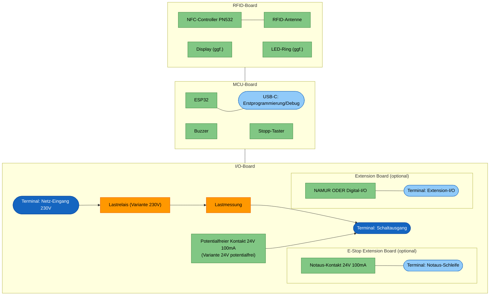
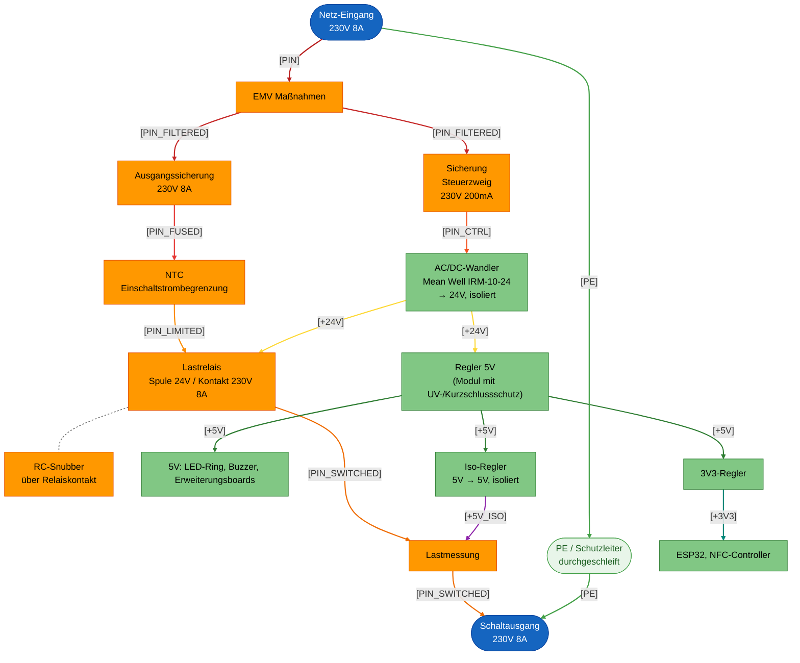

# Machine Node / RFID_BOX

## Einleitung

Dies ist der **RFID Node**: ein kompaktes Steuergerät, das elektrische
Geräte und Maschinen in der Werkstatt (z.B. Standfräse, Drehmaschine, FKS)
per RFID-Karte freischaltet. Er prüft die RFID-Karte einer Nutzerin oder
eines Nutzers gegen easyVerwaltung, gibt bei gültiger Berechtigung die
Maschine frei und schaltet sie beim Stopp oder bei Kartenentzug wieder ab.

Technisch ist der Node als Stack aus mehreren kompakten Platinen aufgebaut
(Netzteil/Schaltausgang, Controller mit Bedienoberfläche, RFID-Frontend),
ergänzt um optionale Erweiterungsboards für Maschinen mit zusätzlichem
Bedarf (z.B. NAMUR-I/O oder eine Notaus-/Bremsschleife). Die konkrete
Aufteilung und Auslegung folgt in den weiteren Kapiteln dieses Dokuments.

Die Anforderungen, aus denen diese Auslegung abgeleitet ist, stehen separat
in [Anforderungen.md](Anforderungen.md).

## Aufbau

Das Gehäuse ist 3D-gedruckt und staubdicht ausgeführt. Display und LED-Ring
sind von aussen sichtbar und durch eine Plexiglasscheibe geschützt; der
LED-Ring selbst sitzt dabei innerhalb des Gehäuses. Der Stopp-Knopf ist von
aussen erreichbar.

Alle Kabel werden einseitig über Kabeldurchführungen ins Gehäuse geführt, von
links nach rechts:

1. Netz-Eingang 230 V
2. Schaltausgang: geschaltete 230 V oder Steuerleitung für ein externes
   Schütz
3. Optionale Notaus-Schleife
4. Optionales Extension-I/O (NAMUR oder Digital-I/O)

Nicht verwendete Durchführungen werden verschlossen.

Die Boards werden über Board-to-Board-Stecker als Stack gesteckt und
geklipst — keine Kabelverbindungen zwischen den Platinen.

## Elektronik

Das Gerät ist als Platinenstack aufgebaut:

- **Oberste PCB (RFID-Board):** RFID-Antenne, ggf. Display und LED-Ring.
- **Mittlere PCB (MCU-Board):** Mikrocontroller (ESP32), Buzzer und
  Peripherie.
- **Unterste PCB (I/O-Board):** 230-V-Netz und Lastrelais, dazu die
  Extension-Header für das E-Stop Extension Board und das Extension Board.
  Dieses Board gibt es in zwei Bestückvarianten: **Variante 230V** mit
  Lastrelais und Lastmessung zum direkten Schalten von Lasten, und
  **Variante 24V potentialfrei** mit potentialfreiem Kontakt für ein
  externes Schütz.

## Architektur

Neben dem festen Dreier-Stack (I/O-, MCU-, RFID-Board) gibt es zwei
optionale, steckbare Erweiterungsboards, die auf das I/O-Board gesteckt
werden:

- **Extension Board:** generisches Zusatzboard mit zwei Bestückvarianten —
  **NAMUR** (zwei optoisolierte NAMUR-Ausgänge, ein galvanisch getrennter
  NAMUR-Eingang) oder **Digital-I/O** (einfache digitale Ein-/Ausgänge, noch
  nicht spezifiziert). Ein Node trägt höchstens eine Variante.
- **E-Stop Extension Board:** einfaches Relais (24 V / 100 mA), dessen Kontakt
  in die Notaus-/Interlock-Schleife bzw. Bremsversorgung der Maschine
  eingeschleift wird. Fail-safe: stromlos = Notaus-Schleife unterbrochen;
  öffnet bei Stopp/Kartenentzug sofort, während die Hauptversorgung erst
  nach der Nachlaufzeit trennt (Details siehe
  [Anforderungen.md](Anforderungen.md)).

## Blockdiagramm

Die Form kennzeichnet die Art des Elements, die Farbe die Spannungsebene:

- Formen: abgerundet = Terminal/Steckverbinder, eckig = Funktionsblock; als
  "(optional)" markierte Boards sind steckbare Erweiterungen im I/O-Board.
- Farben: blau = 230-V-Terminal, hellblau = Kleinspannungs-Terminal,
  orange = 230-V-führender Schaltungsteil, grün = Kleinspannungs-
  Schaltungsteil.

## Power Distribution

Die gesamte Versorgung kommt aus dem Netz-Eingang 230 V auf dem I/O-Board
und teilt sich dort in zwei Pfade:

- **Lastpfad (nur Variante 230V):** Netz-Eingang → Ausgangssicherung →
  Lastrelais → Lastmessung → Schaltausgang.
- **Steuerpfad:** Netz-Eingang → Sicherung Steuerzweig → isoliertes
  AC/DC-Wandlermodul Mean Well IRM-10-24 (24 V, isoliert) → Regler auf 5 V
  (Modul mit Unterspannungs- und Kurzschlussschutz) → 3,3 V auf dem
  MCU-Board für ESP32 und NFC-Controller. Die 24-V-Schiene aus dem
  IRM-10-24 versorgt zusätzlich die Lastrelais-Spule. LED-Ring und Buzzer
  laufen direkt auf 5 V. Ein isolierter 5V→5V-Regler versorgt die
  Lastmessung galvanisch getrennt.

Die Erweiterungsboards (Extension Board, E-Stop Extension Board) werden über
den Stack aus dem Steuerpfad versorgt; ihre Feldseite (NAMUR-Kanäle,
Notaus-Schleife) bleibt galvanisch getrennt und wird extern gespeist.

Die Lastausgangssicherung (F2) ist gesockelt und nach dem Öffnen des
Gehäuses ohne Löten tauschbar; eine Ersatzsicherung wird im Gehäuse
mitgeführt. Die Gerätesicherung (F1) ist als dokumentierte Ausnahme fest
verlötet (siehe [Anforderungen.md](Anforderungen.md), S5).

Da das Werkstattnetz und die geschaltete Last (Motoren) elektrisch
"schmutzig" sein können, sitzen direkt am Netz-Eingang EMV-Maßnahmen sowie
im Lastpfad eine Einschaltstrombegrenzung und eine Kontakt-Schutzbeschaltung
am Lastrelais. Das Lastrelais trennt L und N gemeinsam (2-polig), da die
N/L-Zuordnung an der Werkstatt-Steckdose nicht garantiert eindeutig ist.
PE wird unverändert vom
Netz-Eingang zum Schaltausgang durchgeschleift; da das Gehäuse aus
Kunststoff besteht, gibt es keine Verbindung zu einer Gehäusemasse.

| Netz | Bedeutung |
|---|---|
| `[PIN]` | Netzphase, ungesichert |
| `[PIN_FILTERED]` | Nach EMV-Maßnahmen |
| `[PIN_FUSED]` | Lastpfad nach Ausgangssicherung |
| `[PIN_LIMITED]` | Nach Einschaltstrombegrenzung (NTC) |
| `[PIN_SWITCHED]` | Geschaltete Phase hinter dem Lastrelais |
| `[PIN_CTRL]` | Steuerzweig nach Sicherung |
| `[+24V]` | Geregelte 24-V-Schiene aus dem AC/DC-Wandler IRM-10-24, versorgt die Lastrelais-Spule und den Eingang des 5V-Reglers |
| `[+5V]` | 5-V-Schiene (Schutz durch integrierten Modulschutz des Reglers) |
| `[+5V_ISO]` | Isolierte 5-V-Versorgung der Lastmessung |
| `[+3V3]` | Logikversorgung |
| `[PE]` | Schutzleiter, unverändert durchgeschleift, kein Bezug zum Kunststoffgehäuse |

Die EMV-Maßnahmen am Netz-Eingang bestehen aus einer Gleichtaktdrossel und
einem X2-Kondensator als eigentlichem EMV-Filter sowie einem MOV
(Metall-Oxid-Varistor) als Überspannungsschutz.

Der RC-Snubber (gestrichelt) liegt parallel zum Relaiskontakt und führt
keinen eigenen Laststrompfad.

## Signalfluss

Analog zur Power Distribution beginnt auch der Signalfluss am Eingang
(RFID-Karte) und endet am Schaltausgang — hier geht es aber nicht um die
Leistungs-, sondern um die Steuersignale, die entscheiden, ob der
Schaltausgang aktiv ist.

Der Stopp-Taster wirkt auf den ESP32 (Firmware-Status `STOPPED`); dieser
schaltet, falls bestückt, das E-Stop Relais aus. Es gibt keinen separaten
hardwareseitigen Bypass am E-Stop Relais, der unabhängig von der Firmware
wirkt. Der Relaistreiber der Hauptversorgung bekommt **keinen** direkten
Hardware-Interlock vom Stopp-Taster: die Hauptversorgung wird
ausschliesslich vom ESP32 nach Ablauf der Nachlaufzeit abgeschaltet (siehe
Power Distribution und Anforderungen.md). Enable-Signal und Messsignal der
Lastmessung queren die Isolationsbarriere jeweils über einen eigenen
Optokoppler.

Formen und Farben wie im Blockdiagramm (abgerundet = Terminal/Eingabe,
eckig = Funktionsblock); zusätzlich: weiss mit violettem Rahmen =
Optokoppler / Isolationsbarriere, gelb = Signalpegel isoliert/SELV, aber
das Bauteil selbst berührt die 230-V-Seite (z.B. Lastmessung). Die
Spannungsangabe `[…]` in den Blöcken zeigt den jeweiligen Signalpegel,
analog zu den Netznamen im Power-Distribution-Diagramm.

## Bauteilauswahl

Bereits festgelegte Bauteile für die in den vorherigen Kapiteln gezeigten
Funktionsblöcke. Preise sind Einzelstückpreise, sofern nicht anders
angegeben (z.B. "@10 Stk"); wo kein Distributorpreis vorliegt, ist der Wert
geschätzt (·). Lieferant/Bestellnummer sind nur eingetragen, wo bereits
konkret geprüft; "*offen*" heisst nicht unbekannt/unmöglich, sondern noch
nicht recherchiert.

| Funktion | Hersteller / Teilenummer | Beschreibung | Lieferant / Bestellnummer | Preis |
|---|---|---|---|---:|
| Mikrocontroller | Espressif ESP32-S3-WROOM-1-N16R8 | MCU-Modul mit WLAN/BLE, 16MB Flash, 8MB PSRAM | Mouser 356-ESP32S3WRM1N16R8 | 4,82 € @25 Stk |
| OLED | Displaytech DT010ATFT | 1" IPS-LCD mit integriertem Controller, I2C-Ansteuerung | Mouser 758-DT010ATFT | 10,92 € @10 Stk |
| Leistungsmessung | Microchip MCP39F51A | Single-Phase Energy-Monitoring-IC, UART-Schnittstelle | Farnell 2478286 | 3,61 € @25 Stk |
| Shunt (Leistungsmessung) | Yageo PA1206FRM670R002L | 2mOhm, Strommess-Shunt, 1206 | Mouser 603-PA1206FRM670R02L | 0,131 € @25 Stk |
| RFID-Controller | NXP PN5321A3HN/C106 | NFC-Frontend-IC (ISO14443), SPI-Schnittstelle | Mouser 771-PN5321A3HN10 | 11,25 € @1 Stk |
| Iso-Regler 5V → 5V (Lastmessung) | RECOM RFB-0505S | Isoliertes DC/DC-Modul, 1W, keine Mindestlast, 500VAC Isolation | Mouser 919-RFB-0505S | 1,80 € @25 Stk |
| Netz-Eingang / Schaltausgang (Terminal) | WAGO 2604-1103 | 3-pol. Hebelklemme, Rastermaß 5mm | Digikey 2946-2604-1103-ND | 2,95 € @50 Stk |
| Lastrelais (Q1) | TE Connectivity T92S11D12-24 (9-1393211-0) | 2-polig (N+L), 2 Form C, AgCdO, 30A/40A NO, verstärkte Isolation Spule/Kontakt 8mm/9,5mm/4kVrms, Höhe 30,7mm | Digikey PB352-ND | 27,46 € @30 Stk |
| AC/DC-Wandler 24V (Steuerpfad) | Mean Well IRM-10-24 | 10W isoliert, 24V/0,42A, 4,2kVac I/P-O/P, Isolationsklasse II, PCB-Mount | Digikey 1866-3030-ND | 5,650 € @25 Stk |
| Regler 5V (Steuerpfad) | RECOM R-78K5.0-2.0 | DC/DC-Wandler 24V→5V, 2A, SIP3/TO-220-kompatibel | Digikey 945-R-78K5.0-2.0-ND | 4,71 € @25 Stk |
| 3V3-Regler | EVVOSEMI AMS1117-3.3 | LDO 1A, SOT-223-3L | Digikey 5272-AMS1117-3.3CT-ND | 0,1552 € @25 Stk |
| Potentialfreier Kontakt (K2) | Omron G5V-1-2 DC24 | 100mA/24V, Spule 24V | Digikey Z11621-ND | 1,9556 € @25 Stk |
| Polyfuse (K2) | Yageo SMD1812B020TF-J | PTC-Rückstellsicherung, Hold 0,2A, Trip 0,4A, 60V, SMD | Mouser 603-SMD1812B020TF-J | 0,095 € @10 Stk |
| E-Stop-Relais (K3) | Omron G5V-1-2 DC24 | 100mA/24V, Spule 24V | Digikey Z11621-ND | 1,9556 € @25 Stk |
| Polyfuse (K3) | Yageo SMD1812B020TF-J | PTC-Rückstellsicherung, Hold 0,2A, Trip 0,4A, 60V, SMD | Mouser 603-SMD1812B020TF-J | 0,095 € @10 Stk |
| Optokoppler (Enable/Messsignal) | Vishay VO615A-X017T | Phototransistor-Optokoppler, VDE 0884-5 verstärkte Isolierung, SMD-4, Kriechstrecke ≥7,6mm | Digikey 751-VO615A-X017TCT-ND | 0,269 € @10 Stk |
| Relaistreiber | diverse BC847 + 1N4148 | NPN-Transistor-Treiber + Freilaufdiode für Relaisspule | *offen* | ca. 0,10 € · |
| LED-Ring | Inolux IN-PI20TATPRPGPB | 12x, 2020-Gehäuse, adressierbar über Single-Wire-Protokoll (WS2812B-kompatibel) | Digikey 1830-IN-PI20TATPRPGPBCT-ND | 0,2225 € @100 Stk |
| Pegelwandler LED-Ring (3V3→5V) | diverse 74AHCT125 | Quad-Buffer/Levelshifter 3,3V→5V | *offen* | ca. 0,30 € · |
| Buzzer | TDK PS1240P02BT | Piezo-Buzzer ohne Oszillator, Pin-Terminal (THT), externe Ansteuerung (Resonanz ~4kHz) | Digikey 445-2525-1-ND | 0,3844 € @25 Stk |
| Stopp-Taster | *offen* | Panelmontage, IP65, 12mm | *offen* | ca. 1,50 € · |
| USB-C-Buchse (Service) | *offen* USB4105-GF-A | THT | *offen* | ca. 0,30 € · |
| Überspannungsschutz (EMV) | TDK B72210S0271K101 (SIOV-S10K275) | Metalloxid-Varistor, 275VAC/430V, 2500A Stoßstrom, bedrahtet Ø12,5mm | Digikey 495-3786-ND | 0,186 € @25 Stk |
| X2-Kondensator (EMV) | Würth Elektronik 890334023023CS | Funkentstörkondensator X2 (MKP), 100nF, 310VAC/560VDC, Rastermaß 10mm | Digikey 732-5733-ND | 0,35 € @1 Stk |
| Gleichtaktdrossel (EMV) | Würth Elektronik 7448258022 | Stromkompensierte Drossel, 2,2mH, 8A, DCR 14mΩ, bedrahtet | Digikey 732-1455-ND | 5,067 € @10 Stk |
| NTC (Einschaltstrombegrenzung) | Bourns BN-LG15Y2R5MYB | Power-NTC, 2,5 Ohm, 8A Dauerstrom, 15mm Scheibe, bedrahtet (kinked) | Digikey 118-BN-LG15Y2R5MYB-ND | 0,748 € @10 Stk |
| RC-Snubber | *offen* | 100R + 100nF X2, diskret | *offen* | ca. 0,20 € · |
| Gerätesicherung (F1) | Bel Fuse MRT 1-BULK | 1A/250V träge, THT radial, fest verlötet (Abweichung von S5, siehe Anforderungen.md) | Digikey 5923-MRT1-BULK-ND | 0,402 € @10 Stk |
| Lastausgangssicherung (F2) | Schurter 0034.3127 (FST 5x20) | 10A/250V träge | Digikey 486-1226-ND | 0,414 € @50 Stk |
| Sicherungshalter (F2) | Würth WR-FSH 696309001002 | VDE 10A, Berührschutz Shocksafe PC2/IP20, THT stehend | Digikey 732-11383-ND | 1,30 € @10 Stk |
| Ersatzsicherung (im Gehäuse) | Schurter 0034.3127 (FST 5x20) | Reserve wie F2, im Gehäuse mitgeführt | Digikey 486-1226-ND | 0,414 € @50 Stk |
| Extension Board (NAMUR/Digital-I/O) | *offen (eigenes Board, kein Einzelbauteil)* | | | — |
| **Summe** | | 1× je Zeile, ohne Mengen und ohne Extension Board | | **ca. 89,72 € ·** |

Die Summe zählt jede Zeile einfach (auch wo "/Stk" steht, z.B. LED-Ring,
Sicherungen); sie berücksichtigt keine tatsächlich benötigten Stückzahlen
pro Board (z.B. 12× LED, mehrere Sicherungen/Terminals) und ist daher kein
vollständiger BOM-Preis, sondern ein grober erster Anhaltspunkt.

## TODO

- E-Stop-Relais (K3) öffnet aktuell ausschliesslich über den ESP32, es
  gibt keinen von der Firmware unabhängigen Hardware-Bypass (siehe BR3 in
  Anforderungen.md). Eine latchende/hardwareseitige Lösung für ein höheres
  Sicherheitsniveau wäre möglich, ist aber mit vertretbarem Aufwand aktuell
  nicht umsetzbar und daher bewusst zurückgestellt.
- Lastrelais T92S11D12-24: prüfen, ob die reguläre Wash-tight-Variante
  (ohne "-00"-Suffix) für den Einsatzzweck ausreicht oder ob explizit die
  WG-Variante ("-00") bestellt werden muss — das Datenblatt nennt die
  EN-60335-1-Zulassung nur für die WG-Variante, während die Kernwerte
  (8mm/9,5mm/4kV) laut Insulation-Data-Tabelle für die ganze Serie gelten.
