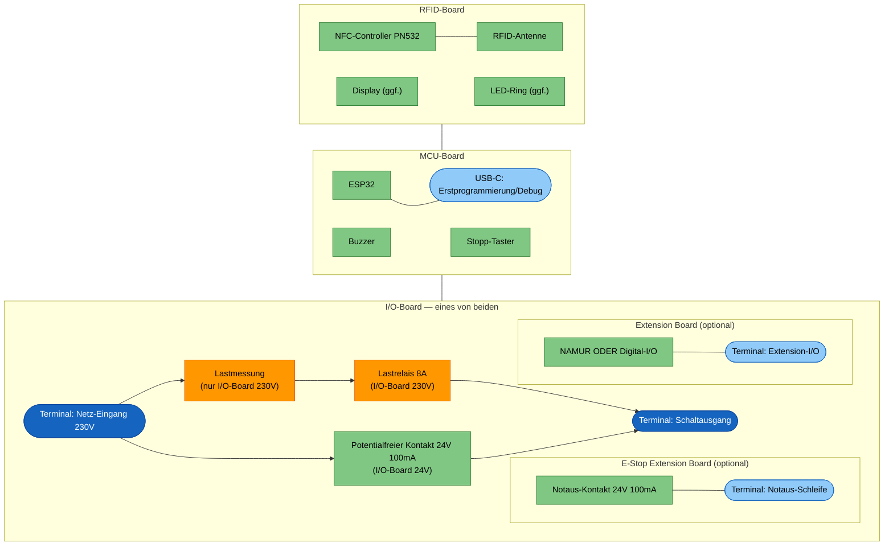
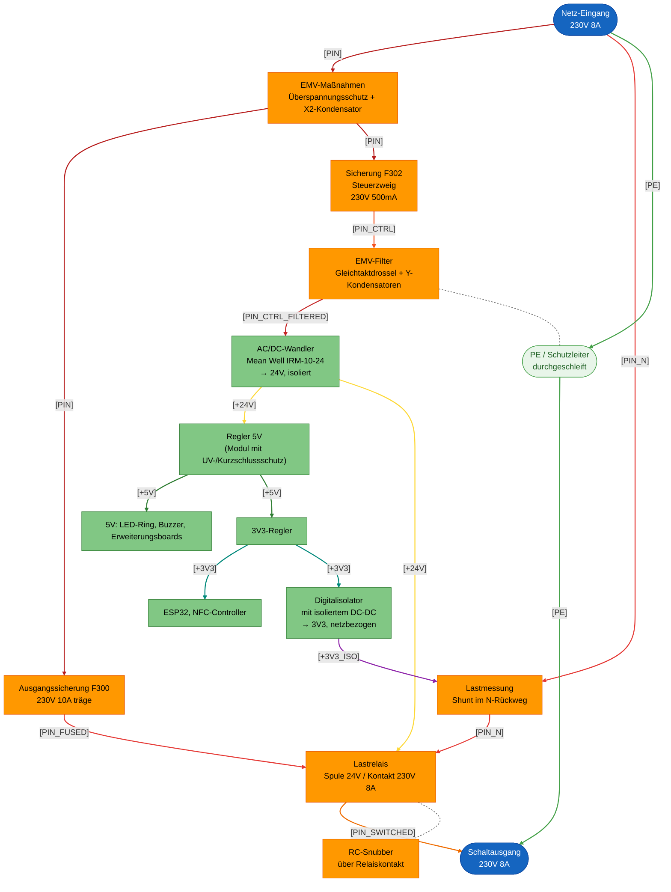
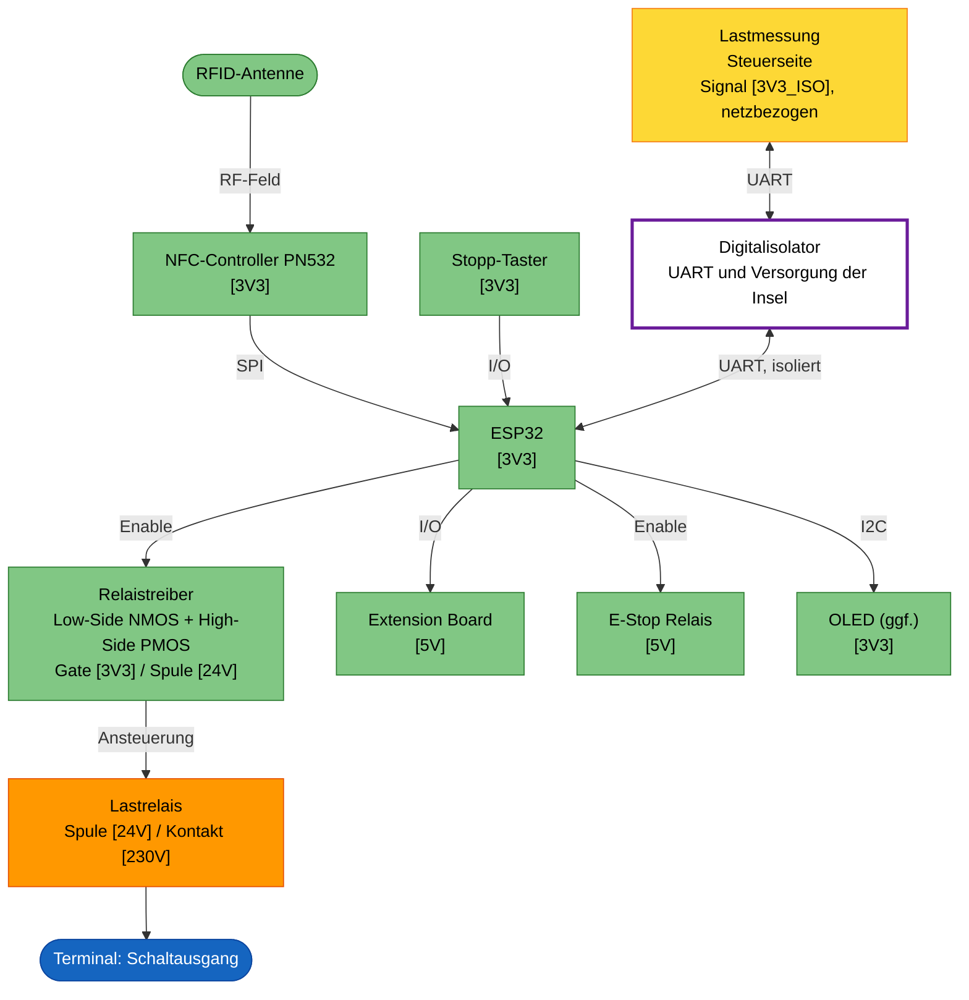

# Machine Node / RFID_BOX

> **Sicherheit geht vor Kosten, Baugröße und Bauteilzahl.** Das Gerät
> schaltet Netzspannung in einer Werkstatt, in der ungeschulte Personen
> daneben stehen. Wo Ziele kollidieren, gewinnt die Sicherheit.
>
> Vier Festlegungen sind bindend und werden nicht aufgeweicht:
>
> - Die Barriere Netz ↔ SELV beträgt **8 mm Luft- und Kriechstrecke** und
>   wird nicht auf den Normwert von 5 mm reduziert. Maßgeblich sind die
>   Bauteile, die sie queren, nicht das Minimum der Norm.
> - Bauteile über der Barriere brauchen **verstärkte oder doppelte
>   Isolierung** bei 250 V Arbeitsspannung. Eine hohe Prüfspannung in kV
>   allein genügt nicht — sie sagt über die Isolationsklasse nichts aus.
> - **Ein Einzelfehler darf nicht nach außen wirken.** Neue Schaltungsteile
>   werden gegen die [FMEA](#fmea) geprüft, bevor sie ins Layout gehen.
> - **Beim geöffneten Gerät ist nichts Netzführendes berührbar.** Feste
>   Abdeckplatten über dem I/O-Board geben nur die Feldterminals und den
>   Sicherungshalter frei. MCU- und RFID-Board führen kein 230 V und dürfen
>   angefasst werden. Siehe [Aufbau](#aufbau).
>
> Die Auslegung dazu steht in
> [Leiterbahnbreiten und Abstände](#leiterbahnbreiten-und-abstände).

## Einleitung

Dies ist der **RFID Node**: ein kompaktes Steuergerät, das elektrische
Geräte und Maschinen in der Werkstatt (z.B. Standfräse, Drehmaschine, FKS)
per RFID-Karte freischaltet. Er prüft die RFID-Karte einer Nutzerin oder
eines Nutzers gegen easyVerwaltung, gibt bei gültiger Berechtigung die
Maschine frei und schaltet sie beim Stopp oder bei Kartenentzug wieder ab.

Technisch ist der Node als Stack aus mehreren kompakten Platinen aufgebaut
(Netzteil/Schaltausgang, Controller mit Bedienoberfläche, RFID-Frontend),
ergänzt um optionale Erweiterungsboards für Maschinen mit zusätzlichem
Bedarf (z.B. NAMUR-I/O oder eine Notaus-/Bremsschleife). Die konkrete
Aufteilung und Auslegung folgt in den weiteren Kapiteln dieses Dokuments.

Die Anforderungen, aus denen diese Auslegung abgeleitet ist, stehen separat
in [Anforderungen.md](Anforderungen.md).

## Aufbau

Das Gehäuse ist 3D-gedruckt und staubdicht ausgeführt. Display und LED-Ring
sind von aussen sichtbar und durch eine Plexiglasscheibe geschützt; der
LED-Ring selbst sitzt dabei innerhalb des Gehäuses. Der Stopp-Knopf ist von
aussen erreichbar.

Alle Kabel werden einseitig über Kabeldurchführungen ins Gehäuse geführt, von
links nach rechts:

1. Netz-Eingang 230 V
2. Schaltausgang: geschaltete 230 V oder Steuerleitung für ein externes
   Schütz
3. Optionale Notaus-Schleife
4. Optionales Extension-I/O (NAMUR oder Digital-I/O)

Nicht verwendete Durchführungen werden verschlossen.

Die Boards werden über Board-to-Board-Stecker als Stack gesteckt und
geklipst — keine Kabelverbindungen zwischen den Platinen.

### Berührschutz

Das Gerät wird im Servicefall geöffnet, während es unter Umständen noch am
Netz hängt. Deshalb:

- Über dem I/O-Board sitzen **fest installierte, 3D-gedruckte
  Abdeckplatten**. Sie geben nur die Feldterminals und den Sicherungshalter
  frei — beide sind berührsichere Bauformen (WAGO Hebelklemme, WR-FSH mit
  Shocksafe PC2/IP20). Alles andere Netzführende bleibt abgedeckt.
- Die Platten sind kein Deckel, der beim Öffnen mitkommt: sie bleiben am
  Board bzw. am Gehäuseunterteil und lassen sich nur mit Werkzeug lösen.
- **MCU- und RFID-Board führen kein 230 V** und dürfen im geöffneten Zustand
  berührt werden. Das ist eine bindende Randbedingung, keine Momentaufnahme
  — es darf kein netzführendes Netz auf diese Boards wandern.

Zusätzlich werden alle Boards **lackiert** (Schutzlack), um den IP-Schutz
über die Lebensdauer zu stützen: Sägemehl und Feuchtigkeit sollen auf
Dauer keine Kriechpfade bilden. Vom Lack ausgenommen bleiben Feldterminals,
Sicherungskontakte und die Board-to-Board-Stecker.

Der Lack ersetzt keine Abstände: Kriech- und Luftstrecken werden weiterhin
nach [Leiterbahnbreiten und Abstände](#leiterbahnbreiten-und-abstände)
bemessen, als wäre kein Lack vorhanden.

## Elektronik

Das Gerät ist als Platinenstack aufgebaut:

- **Oberste PCB (RFID-Board):** RFID-Antenne, ggf. Display und LED-Ring.
- **Mittlere PCB (MCU-Board):** Mikrocontroller (ESP32), Buzzer und
  Peripherie.
- **Unterste PCB (I/O-Board):** 230-V-Netz und Schaltausgang, dazu die
  Extension-Header für das E-Stop Extension Board und das Extension Board.
  Hiervon gibt es **zwei getrennte Boards mit eigenem Layout**, von denen
  pro Gerät genau eines bestückt wird:
  - **I/O-Board 230V** — Lastrelais und Lastmessung zum direkten Schalten
    von Lasten bis 8 A.
  - **I/O-Board 24V** — potentialfreier Kontakt für ein externes Schütz.
    Ohne Lastpfad und Lastmessung; dadurch deutlich einfacher,
    rund 33 € günstiger und ohne Bedarf an 70 µm Kupfer.

  Beide haben denselben Formfaktor und denselben Board-to-Board-Stecker zum
  MCU-Board.

## Architektur

Neben dem festen Dreier-Stack (I/O-, MCU-, RFID-Board) gibt es zwei
optionale, steckbare Erweiterungsboards, die auf das I/O-Board gesteckt
werden:

- **Extension Board:** generisches Zusatzboard mit zwei Bestückvarianten —
  **NAMUR** (zwei optoisolierte NAMUR-Ausgänge, ein galvanisch getrennter
  NAMUR-Eingang) oder **Digital-I/O** (einfache digitale Ein-/Ausgänge, noch
  nicht spezifiziert). Ein Node trägt höchstens eine Variante.
- **E-Stop Extension Board:** einfaches Relais (24 V / 100 mA), dessen Kontakt
  in die Notaus-/Interlock-Schleife bzw. Bremsversorgung der Maschine
  eingeschleift wird. Fail-safe: stromlos = Notaus-Schleife unterbrochen;
  öffnet bei Stopp/Kartenentzug sofort, während die Hauptversorgung erst
  nach der Nachlaufzeit trennt (Details siehe
  [Anforderungen.md](Anforderungen.md)).

## Blockdiagramm

Die Form kennzeichnet die Art des Elements, die Farbe die Spannungsebene:

- Formen: abgerundet = Terminal/Steckverbinder, eckig = Funktionsblock; als
  "(optional)" markierte Boards sind steckbare Erweiterungen im I/O-Board.
- Farben: blau = 230-V-Terminal, hellblau = Kleinspannungs-Terminal,
  orange = 230-V-führender Schaltungsteil, grün = Kleinspannungs-
  Schaltungsteil.

## Power Distribution

Die gesamte Versorgung kommt aus dem Netz-Eingang 230 V auf dem I/O-Board
und teilt sich dort in zwei Pfade:

- **Lastpfad (nur I/O-Board 230V):** Netz-Eingang → Ausgangssicherung (F300)
  → Lastrelais (K300) → Schaltausgang. Der Shunt (R300) liegt im
  **N-Rückweg**, vor dem Relais, damit die Messung unabhängig vom
  Schaltzustand versorgt und betriebsbereit bleibt.
- **Steuerpfad:** Netz-Eingang → Sicherung Steuerzweig (F302) →
  Gleichtaktdrossel (L300) → Y-Kondensatorpaar (C309, C310, Mittelabgriff
  an PE) → isoliertes AC/DC-Wandlermodul Mean Well IRM-10-24 (U301, 24 V,
  isoliert) → Regler auf 5 V (U306, Modul mit Unterspannungs- und
  Kurzschlussschutz) → 3,3 V auf dem MCU-Board für ESP32 und
  NFC-Controller. Die 24-V-Schiene aus dem IRM-10-24 versorgt zusätzlich
  die Lastrelais-Spule. LED-Ring und Buzzer laufen direkt auf 5 V.
- **ISO-Insel:** Die Lastmessung liegt auf Netzpotential. Versorgung und
  UART laufen über den Digitalisolator U300 (ISOW7721) mit integriertem
  DC-DC-Wandler, gespeist aus der SELV-Seite. Die Insel führt damit keinen
  eigenen Netzzweig. Details siehe
  [Leiterbahnbreiten und Abstände](#leiterbahnbreiten-und-abstände).

Die Erweiterungsboards (Extension Board, E-Stop Extension Board) werden über
den Stack aus dem Steuerpfad versorgt; ihre Feldseite (NAMUR-Kanäle,
Notaus-Schleife) bleibt galvanisch getrennt und wird extern gespeist.

Die Lastausgangssicherung (F300) ist gesockelt und nach dem Öffnen des
Gehäuses ohne Löten tauschbar; eine Ersatzsicherung wird im Gehäuse
mitgeführt. Die Gerätesicherung (F302) ist als dokumentierte Ausnahme fest
verlötet (siehe [Anforderungen.md](Anforderungen.md), S5).

Am Netz-Eingang liegen RV300 als Überspannungsschutz und C300 als
X2-Kondensator, beide als Parallelelemente gegen den Netzknoten. Das
Gleichtaktfilter aus L300 und C309/C310 sitzt im Steuerzweig direkt vor
U301, also an der Störquelle; damit sind Netz-Eingang und Schaltausgang
gleichermaßen abgedeckt. Der Lastpfad trägt kein Filterbauteil.

Eine Kontakt-Schutzbeschaltung sitzt am Lastrelais. Eine
Einschaltstrombegrenzung im Lastpfad gibt es bewusst nicht: den Anlauf
tragen die träge Ausgangssicherung F300 und das Einschaltvermögen von K300
(30 A, AgCdO-Kontakte). Das Lastrelais (K300) trennt L und
N gemeinsam (2-polig), da die
N/L-Zuordnung an der Werkstatt-Steckdose nicht garantiert eindeutig ist.
PE wird unverändert vom
Netz-Eingang zum Schaltausgang durchgeschleift und trägt zusätzlich den
Mittelabgriff von C309/C310; da das Gehäuse aus Kunststoff besteht, gibt es
keine Verbindung zu einer Gehäusemasse.

| Netz | Bedeutung |
|---|---|
| `[PIN]` | Netzknoten, ungesichert; hier liegen RV300 und C300 parallel |
| `[PIN_FUSED]` | Lastpfad nach Ausgangssicherung, bis zum Lastrelais |
| `[PIN_N]` | N-Rückweg vom Eingangsterminal über den Shunt zum Lastrelais |
| `[PIN_SWITCHED]` | Geschaltete Phase hinter dem Lastrelais |
| `[PIN_CTRL]` | Steuerzweig nach Sicherung, bis zur Gleichtaktdrossel |
| `[PIN_CTRL_FILTERED]` | Steuerzweig nach L300, speist U301; hier liegt das Y-Paar C309/C310 gegen PE |
| `[+24V]` | Geregelte 24-V-Schiene aus dem AC/DC-Wandler IRM-10-24 (U301), versorgt die Lastrelais-Spule und den Eingang des 5V-Reglers |
| `[+5V]` | 5-V-Schiene (Schutz durch integrierten Modulschutz des Reglers) |
| `[+3V3_ISO]` | Netzbezogene 3,3-V-Versorgung der Lastmessung (U303) aus dem Digitalisolator (U300) |
| `[GND_ISO]` | Messreferenz der ISO-Insel, hart am Shunt-Knoten |
| `[GND_ISO2]` | Rückweg des isolierten DC-DC-Wandlers, von `GND_ISO` durch einen Ferrit getrennt |
| `[+3V3]` | Logikversorgung |
| `[PE]` | Schutzleiter, unverändert durchgeschleift, trägt den Mittelabgriff von C309/C310, kein Bezug zum Kunststoffgehäuse |

Bemessung des Gleichtaktfilters: im Gleichtakt liegen die Y-Kondensatoren
parallel, `C_CM = 2 · Cy`, und mit `f₀ = 1 / (2π · √(L · C))` steigt die
Dämpfung oberhalb f₀ mit 40 dB/Dekade. Auslegungspunkt ist 150 kHz, Ziel
20 dB. Gerechnet wird mit dem Toleranz-Worst-Case der Drossel (−30 %) und
dem Temperaturgang des Y5U-Dielektrikums, nicht mit den Nennwerten.

Drei Grenzen der Auslegung:

- Der Mittelabgriff nach PE ist zwingend — ohne ihn hat der
  Gleichtaktstrom im Kunststoffgehäuse keinen Rückweg, und die Drossel
  wirkt nur noch über ihre Streuinduktivität.
- Cy ist nach oben durch den Ableitstrom begrenzt; mehrere Nodes hängen am
  selben FI-Kreis.
- L nominal im Fenster 3–10 mH: nach unten setzt die Eckfrequenz die
  Grenze, nach oben die Eigenresonanz der Drossel.

Der RC-Snubber (gestrichelt) liegt parallel zum Relaiskontakt und führt
keinen eigenen Laststrompfad.

## Signalfluss

Analog zur Power Distribution beginnt auch der Signalfluss am Eingang
(RFID-Karte) und endet am Schaltausgang — hier geht es aber nicht um die
Leistungs-, sondern um die Steuersignale, die entscheiden, ob der
Schaltausgang aktiv ist.

Der Stopp-Taster wirkt auf den ESP32 (Firmware-Status `STOPPED`); dieser
schaltet, falls bestückt, das E-Stop Relais aus. Es gibt keinen separaten
hardwareseitigen Bypass am E-Stop Relais, der unabhängig von der Firmware
wirkt. Der Relaistreiber der Hauptversorgung bekommt **keinen** direkten
Hardware-Interlock vom Stopp-Taster: die Hauptversorgung wird
ausschliesslich vom ESP32 nach Ablauf der Nachlaufzeit abgeschaltet (siehe
Power Distribution und Anforderungen.md). Das Enable bleibt vollständig auf
der SELV-Seite: die Relaisspule hängt an der 24-V-Schiene aus dem isolierten
IRM-10-24 und wird von **zwei Schaltern in Reihe** geführt — einem
Low-Side-NMOS (Q300) und einem High-Side-PMOS (Q301) an getrennten GPIOs.
Beide gehen im Ruhezustand über Pulldown bzw. Pull-up sicher auf, und ein
durchlegierter Schalter lässt sich über den anderen noch abschalten (siehe
FMEA). Die Isolationsbarriere quert nur die UART der Lastmessung, über den
Digitalisolator U300 — er führt zugleich die Versorgung der Insel
hinüber.

Formen und Farben wie im Blockdiagramm (abgerundet = Terminal/Eingabe,
eckig = Funktionsblock); zusätzlich: weiss mit violettem Rahmen =
Optokoppler / Isolationsbarriere, gelb = Signalpegel isoliert/SELV, aber
das Bauteil selbst berührt die 230-V-Seite (z.B. Lastmessung). Die
Spannungsangabe `[…]` in den Blöcken zeigt den jeweiligen Signalpegel,
analog zu den Netznamen im Power-Distribution-Diagramm.

## Bauteilauswahl

Bereits festgelegte Bauteile für die in den vorherigen Kapiteln gezeigten
Funktionsblöcke. Preise sind Einzelstückpreise, sofern nicht anders
angegeben (z.B. "@10 Stk"); wo kein Distributorpreis vorliegt, ist der Wert
geschätzt (·). Lieferant/Bestellnummer sind nur eingetragen, wo bereits
konkret geprüft; "*offen*" heisst nicht unbekannt/unmöglich, sondern noch
nicht recherchiert.

Die Liste umfasst beide I/O-Boards. Nur auf dem **I/O-Board 230V** sitzen
K300, U303, R300, der Digitalisolator U300 mit seinen Ferriten und
Abblockkondensatoren, F300 mit Halter und Ersatzsicherung sowie der
RC-Snubber — zusammen rund 40 €. Nur auf dem **I/O-Board 24V** sitzen K2 und seine Polyfuse,
zusammen rund 2 €. Alles Übrige ist auf beiden Boards identisch oder gehört
zu MCU- und RFID-Board.

### ICs & Module

| Funktion | Hersteller / Teilenummer | Beschreibung | Lieferant / Bestellnummer | Preis |
|---|---|---|---|---:|
| Mikrocontroller | Espressif ESP32-S3-WROOM-1-N16R8 | MCU-Modul mit WLAN/BLE, 16MB Flash, 8MB PSRAM | Mouser 356-ESP32S3WRM1N16R8 | 4,82 € @25 Stk |
| Leistungsmessung (U303) | Microchip MCP39F511A-E/MQ | AC/DC-Energiemess-IC, UART-Schnittstelle, 28-QFN | *offen* | ca. 3,61 € · |
| RFID-Controller | NXP PN5321A3HN/C106 | NFC-Frontend-IC (ISO14443), SPI-Schnittstelle | Mouser 771-PN5321A3HN10 | 11,25 € @1 Stk |
| AC/DC-Wandler 24V (Steuerpfad, U301) | Mean Well IRM-10-24 | 10W isoliert, 24V/0,42A, 4,2kVac I/P-O/P, Isolationsklasse II, PCB-Mount | Digikey 1866-3030-ND | 5,650 € @25 Stk |
| Regler 5V (Steuerpfad, U306) | RECOM R-78K5.0-2.0 | DC/DC-Wandler 24V→5V, 2A, SIP3/TO-220-kompatibel | Digikey 945-R-78K5.0-2.0-ND | 4,71 € @25 Stk |
| 3V3-Regler (nicht isoliert, ESP32/NFC) | EVVOSEMI AMS1117-3.3 | LDO 1A, SOT-223-3L | Digikey 5272-AMS1117-3.3CT-ND | 0,1552 € @25 Stk |
| Digitalisolator + isolierter DC-DC (U300) | Texas Instruments ISOW7721DFMR | 2 Kanäle (1 hin, 1 zurück), integrierter DC-DC 3,3V/60mA, verstärkte Isolierung VDE 0884-17, Luft-/Kriechstrecke >8mm, SOIC-20 wide | Digikey 296-ISOW7721DFMRCT-ND | 5,4308 € @25 Stk |
| Relaistreiber Low-Side (Q300) | *offen* | Logic-Level-NMOS, Gate-Ansteuerung mit 3,3 V, Gate-Pulldown | *offen* | ca. 0,10 € · |
| Relaistreiber High-Side (Q301) | *offen* | PMOS ≥ 40V in der 24V-Zuleitung der Spule, mit NPN-Pegelwandler, Gate-Pull-up und Vgs-Klemmung — redundanter zweiter Schalter (siehe FMEA) | *offen* | ca. 0,25 € · |
| Freilaufdiode Relaisspule (D305) | *offen* | über der Spule, wirkt unabhängig davon welcher Schalter öffnet | *offen* | ca. 0,03 € · |
| Pegelwandler LED-Ring (3V3→5V) | diverse 74AHCT125 | Quad-Buffer/Levelshifter 3,3V→5V | *offen* | ca. 0,30 € · |

### Widerstände

| Funktion | Hersteller / Teilenummer | Beschreibung | Lieferant / Bestellnummer | Preis |
|---|---|---|---|---:|
| Shunt (Leistungsmessung, R300) | Yageo PA1206FRM670R002L | 2mOhm, Strommess-Shunt, 1206 | Mouser 603-PA1206FRM670R02L | 0,131 € @25 Stk |

### Kondensatoren

| Funktion | Hersteller / Teilenummer | Beschreibung | Lieferant / Bestellnummer | Preis |
|---|---|---|---|---:|
| X2-Kondensator (EMV, C300) | Würth Elektronik 890334023023CS | Funkentstörkondensator X2 (MKP), 100nF, 310VAC/560VDC, Rastermaß 10mm | Digikey 732-5733-ND | 0,35 € @1 Stk |
| Y-Kondensatoren (EMV, C309/C310) | Vishay BCcomponents VY2472M49Y5US63L7 | Funkentstörkondensator Y2 (Keramikscheibe), 4,7nF ±20%, X1 440VAC / Y2 300VAC, Y5U, ⌀12,5×5,0mm, Rastermaß 7,5mm, IEC 60384-14 / VDE / UL, 2× je Board | Digikey VY2472M49Y5US63L7-ND | 0,208 € @50 Stk |
| Ausgangs-Stützkondensator (U301) | Murata GCM155R71H104KE02J | 100nF/50V, 0805 (C301) | Mouser 81-GCM155R71H104KE2J | 0,021 € @10 Stk |
| Ausgangs-Elko (U301) | Würth Elektronik 860010673012 | 47µF/50V (C302) | Mouser 710-860010673012 | 0,129 € @1 Stk |
| Ausgangs-MLCC (U306) | Murata GRM21BR71A106KA73K | 10µF/10V, 0805 (C303) | Mouser 81-GRM21BR71A106KA3K | 0,04 € @10 Stk |
| Abblockung Isolator (C304–C308, C311–C317) | *offen* | je Versorgungspin 10nF + 1µF + 10µF, vier Gruppen für VIO, VDD, VISOIN, VISOOUT; die 10nF als 0402 und < 1mm vom Pin | *offen* | ca. 0,30 € · |
| RC-Snubber | *offen* | 100R + 100nF X2, diskret | *offen* | ca. 0,20 € · |

### Induktivitäten

| Funktion | Hersteller / Teilenummer | Beschreibung | Lieferant / Bestellnummer | Preis |
|---|---|---|---|---:|
| Gleichtaktdrossel (EMV, L300) | TE Connectivity Schaffner RN102-1-02-3M0 | Stromkompensierte Drossel, 3,0mH, 1A @40°C, 300VAC, DCR 210mΩ, Hipot 1500VAC/60s, IEC/EN 60938-1 + UL 1283, ENEC/VDE, UL 94 V-0, Körper 10×10×9mm, Rastermaß 4mm, bedrahtet | Digikey 817-2084-ND | 1,662 € @10 Stk |
| Ferrite Isolator (FB303–FB305) | Murata BLM15EX331SN1D | 330 Ohm @100MHz, 0402 — Typ vom Isolator-Datenblatt vorgegeben; an VISOOUT→VISOIN und GND_ISO2→GND_ISO | *offen* | ca. 0,05 € · |

### Relais & Schutzbeschaltung

| Funktion | Hersteller / Teilenummer | Beschreibung | Lieferant / Bestellnummer | Preis |
|---|---|---|---|---:|
| Lastrelais (K300) | TE Connectivity T92S11D12-24 (9-1393211-0) | 2-polig (N+L), 2 Form C, AgCdO, 30A/40A NO, verstärkte Isolation Spule/Kontakt 8mm/9,5mm/4kVrms, Höhe 30,7mm | Digikey PB352-ND | 27,46 € @30 Stk |
| Potentialfreier Kontakt (K2) | Omron G5V-1-2 DC24 | 100mA/24V, Spule 24V | Digikey Z11621-ND | 1,9556 € @25 Stk |
| Polyfuse (K2) | Yageo SMD1812B020TF-J | PTC-Rückstellsicherung, Hold 0,2A, Trip 0,4A, 60V, SMD | Mouser 603-SMD1812B020TF-J | 0,095 € @10 Stk |
| E-Stop-Relais (K3) | Omron G5V-1-2 DC24 | 100mA/24V, Spule 24V | Digikey Z11621-ND | 1,9556 € @25 Stk |
| Polyfuse (K3) | Yageo SMD1812B020TF-J | PTC-Rückstellsicherung, Hold 0,2A, Trip 0,4A, 60V, SMD | Mouser 603-SMD1812B020TF-J | 0,095 € @10 Stk |
| Überspannungsschutz (EMV, RV300) | TDK B72210S0271K101 (SIOV-S10K275) | Metalloxid-Varistor, 275VAC/430V, 2500A Stoßstrom, bedrahtet Ø12,5mm | Digikey 495-3786-ND | 0,186 € @25 Stk |
| Gerätesicherung (F302) | Bel Fuse MRT 500-BULK | 500mA/250VAC träge, IEC 60127-3 Sheet 4, Schmelz-I²t 1,5A²s, ENEC/cULus/CCC, THT radial RM 5,08mm, fest verlötet (Abweichung von S5, siehe Anforderungen.md) | Digikey 5923-MRT500-BULK-ND | 0,402 € @10 Stk |
| Lastausgangssicherung (F300) | Schurter 0034.3127 (FST 5x20) | 10A/250V träge | Digikey 486-1226-ND | 0,414 € @50 Stk |
| Sicherungshalter (F300) | Würth WR-FSH 696309001002 | VDE 10A, Berührschutz Shocksafe PC2/IP20, THT stehend | Digikey 732-11383-ND | 1,30 € @10 Stk |
| Ersatzsicherung (im Gehäuse) | Schurter 0034.3127 (FST 5x20) | Reserve wie F300, im Gehäuse mitgeführt | Digikey 486-1226-ND | 0,414 € @50 Stk |

### Steckverbinder & Bedienelemente

| Funktion | Hersteller / Teilenummer | Beschreibung | Lieferant / Bestellnummer | Preis |
|---|---|---|---|---:|
| Netz-Eingang / Schaltausgang (Terminal, J300) | WAGO 2604-1103 | 3-pol. Hebelklemme, Rastermaß 5mm | Digikey 2946-2604-1103-ND | 2,95 € @50 Stk |
| USB-C-Buchse (Service) | *offen* USB4105-GF-A | THT | *offen* | ca. 0,30 € · |
| Stopp-Taster | *offen* | Panelmontage, IP65, 12mm | *offen* | ca. 1,50 € · |

### Anzeige & Akustik

| Funktion | Hersteller / Teilenummer | Beschreibung | Lieferant / Bestellnummer | Preis |
|---|---|---|---|---:|
| OLED | Displaytech DT010ATFT | 1" IPS-LCD mit integriertem Controller, I2C-Ansteuerung | Mouser 758-DT010ATFT | 10,92 € @10 Stk |
| LED-Ring | Inolux IN-PI20TATPRPGPB | 12x, 2020-Gehäuse, adressierbar über Single-Wire-Protokoll (WS2812B-kompatibel) | Digikey 1830-IN-PI20TATPRPGPBCT-ND | 0,2225 € @100 Stk |
| Buzzer | TDK PS1240P02BT | Piezo-Buzzer ohne Oszillator, Pin-Terminal (THT), externe Ansteuerung (Resonanz ~4kHz) | Digikey 445-2525-1-ND | 0,3844 € @25 Stk |

### Sonstige

| Funktion | Hersteller / Teilenummer | Beschreibung | Lieferant / Bestellnummer | Preis |
|---|---|---|---|---:|
| Extension Board (NAMUR/Digital-I/O) | *offen (eigenes Board, kein Einzelbauteil)* | | | — |

**Summe: ca. 89,95 €** (1× je Zeile über alle Kategorien, ohne Mengen und
ohne Extension Board). Die Summe zählt jede Zeile einfach (auch wo "/Stk"
steht, z.B. LED-Ring, Sicherungen); sie berücksichtigt keine tatsächlich
benötigten Stückzahlen pro Board (z.B. 12× LED, mehrere
Sicherungen/Terminals) und ist daher kein vollständiger BOM-Preis, sondern
ein grober erster Anhaltspunkt.

## Leiterbahnbreiten und Abstände

### 1. Fertigungsbasis

| Board | Lagen | Kupfer |
|---|---|---|
| I/O-Board 230V | 2 | **70 µm (2 oz)** |
| I/O-Board 24V | 2 | 35 µm |
| MCU-Board | **4** | 35 µm außen, 17,5 µm innen |
| RFID-Board | 2 | 35 µm |

Nur das I/O-Board 230V braucht 70 µm: dort läuft der 8-A-Lastpfad. Auf dem
I/O-Board 24V fliesst nur der Eigenverbrauch des Geräts.

Alle FR4, 1,6 mm. Fertigungsuntergrenzen: 0,2 mm Bahn/Abstand, 0,3 mm
Bohrung, 0,5 mm Via, 0,5 mm Kupfer zur Boardkante, 1,0 mm Fräsnut.

Ein Punkt, der leicht übersehen wird: die Innenlagen sind nur 17,5 µm, und
IPC-2221 rechnet für sie mit halbem Faktor (k = 0,024). Eine Innenlagenbahn
braucht damit rund das Fünffache der Außenlagenbreite — 2 A dort 6,2 mm
statt 1,2 mm.

### 2. Leiterbahnbreiten

Grundlage IPC-2221 für Außenlagen, `A = (I / (k · ΔT^0,44))^(1/0,725)` mit
k = 0,048 (außen) bzw. 0,024 (innen), **ΔT = 5 K**. Unterhalb von ~2 A sind
die Breiten nicht thermisch bestimmt, sondern durch Spannungsabfall und
mechanische Robustheit — die Spalte "rechnerisch" liegt dort deutlich unter
dem Designwert.

Via-Größen als Referenz, Restring ≥ 0,125 mm je Seite. Belastbarkeit nach
derselben Formel über den Barrel-Querschnitt `A = π · d · t`, t = 20 µm
Galvanik:

| Bohrung | Pad | Aspect Ratio | Barrel-Querschnitt | je Via @ ΔT 5 K | Verwendung |
|---:|---:|---:|---:|---:|---|
| **⌀0,2 mm** | 0,45 mm | 8:1 | 0,013 mm² | 0,8 A | enge Bereiche mit Kleinstströmen |
| **⌀0,3 mm** | 0,6 mm | 5,3:1 | 0,019 mm² | 1,1 A | Signale, GND-Stitching |
| **⌀0,6 mm** | 1,0 mm | 2,7:1 | 0,038 mm² | 1,9 A | Versorgungsschienen |
| **⌀1,0 mm** | 1,4 mm | 1,6:1 | 0,063 mm² | 2,7 A | Lastpfad |

Stückzahlen in den Tabellen mit Faktor 0,7 für eng gesetzte Via-Felder
gerechnet.

#### 2.1 I/O-Board 230V — 2 Lagen, 70 µm

**P:** = Primärseite, Netzpotential · **S:** = Sekundärseite, SELV. Innerhalb
jeder Gruppe von hoher zu niedriger Spannung; die ISO-Insel schliesst die
P-Gruppe ab, weil sie trotz 3,3-V-Pegeln zur Primärseite gehört.

| Klasse | Netze | Bemessung | Rechnerisch | Breite | Vias |
|---|---|---|---:|---:|---|
| **P:** 230 V Lastpfad | `PIN_*`, `PIN_FUSED_L`, `PIN_SWITCHED_*` | 8 A → ≥ 0,28 mm² | 4,03 mm | **4,0 mm** / Polygon | kein Lagenwechsel; unvermeidbar: **5 × ⌀1,0 mm** oder **8 × ⌀0,6 mm** |
| **P:** PE | `PIN_PE` | 8 A → ≥ 0,28 mm² | 4,03 mm | **4,0 mm** | wie Lastpfad; die Stichleitung zum Y-Paar ist kurz und direkt zum PE-Terminal zu führen, nicht über den Lastpfad |
| **P:** 230 V Steuerzweig | `PIN_CTRL_L/N` (F302 → L300), `PIN_CTRL_FILTERED_L/N` (L300 → U301, mit C309/C310 gegen PE) | ≤ 500 mA (F302; real ~50 mA) | 0,09 mm | **1,0 mm** | **1 × ⌀0,6 mm** |
| **P:** Signale ISO-Insel | `+3V3_ISO` (U300 → U303), `GND_ISO`, `GND_ISO2`, UART U303 ↔ U300, Shunt-Sense von R300 | ≤ 20 mA | < 0,05 mm | **0,4 mm** | **1 × ⌀0,2 mm** |
| **P:** GND ISO-Insel | `GND_ISO` | — | — | eigene Massefläche | Stitching ⌀0,2 mm |
| **S:** 24 V | `+24V` (Spule K300, Eingang U306) | ≤ 500 mA | 0,09 mm | **0,8 mm** | **1 × ⌀0,6 mm** |
| **S:** 5 V | `+5V` (Erzeugung + Weitergabe in den Stack) | ≤ 2 A | 0,59 mm | **1,0 mm** | **2 × ⌀0,6 mm** |
| **S:** Signale | Enable zum Relaistreiber, UART von U300, Stack-Signale | < 100 mA | < 0,05 mm | **0,3 mm** | **1 × ⌀0,3 mm** |
| **S:** GND | `GND` | — | — | Massefläche | Stitching ⌀0,3 mm, Raster ≤ 10 mm |

- Lastpfad als Polygon, ohne Lagenwechsel. Untergrenze an unvermeidbaren
  Engstellen 2,65 mm (ΔT 10 K); Bauteilpads ausgenommen (R300 als 1206
  schnürt auf ~1,6 mm ein).
- R300 in Kelvin-Anbindung, Sense-Abgriffe direkt an den Pads.

#### 2.2 I/O-Board 24V — 2 Lagen, 35 µm

Ohne Lastpfad und Lastmessung. Der Netz-Eingang speist nur
noch den Steuerzweig, also den Eigenverbrauch des Geräts — es gibt auf
diesem Board nirgends 8 A. Das EMV-Filter aus L300 und C309/C310 sitzt wie
beim I/O-Board 230V vor U301 und wird unverändert übernommen; RV300 und
C300 bleiben am Eingang. **F:** = Feldseite, extern gespeist.

| Klasse | Netze | Bemessung | Rechnerisch | Breite | Vias |
|---|---|---|---:|---:|---|
| **P:** 230 V Eingang + Steuerzweig | `PIN_*`, `PIN_CTRL_L/N`, `PIN_CTRL_FILTERED_L/N` | ≤ 500 mA (F302; real ~50 mA) | 0,13 mm | **1,0 mm** | **1 × ⌀0,6 mm** |
| **P:** PE | `PIN_PE` | kein Laststrom, endet am Eingangsterminal, trägt den Mittelabgriff von C309/C310 | — | **1,0 mm** | — |
| **S:** 24 V | `+24V` (Spule K2, Eingang U306) | ≤ 500 mA | 0,13 mm | **0,8 mm** | **1 × ⌀0,6 mm** |
| **S:** 5 V | `+5V` (Erzeugung + Weitergabe in den Stack) | ≤ 2 A | 1,19 mm | **1,3 mm** | **2 × ⌀0,6 mm** |
| **S:** Signale | Enable zum Relaistreiber, Stack-Signale | < 100 mA | < 0,05 mm | **0,3 mm** | **1 × ⌀0,3 mm** |
| **S:** GND | `GND` | — | — | Massefläche | Stitching ⌀0,3 mm, Raster ≤ 10 mm |
| **F:** Kontakt K2 | `C`, `NO`, `NC` zum Feldterminal | ≤ 100 mA, extern gespeist | < 0,05 mm | **0,5 mm** | **1 × ⌀0,3 mm** |

- Die Barriere Netz ↔ SELV gilt unverändert mit 8 mm, auch ohne Lastpfad.
  Sie verläuft hier nur um den Eingangsbereich und U301 herum.
- Keine ISO-Insel: `GND_ISO` und die Messdomäne entfallen komplett.
- Der Relaistreiber ist wie beim I/O-Board 230V redundant aus Q300 und Q301
  aufgebaut, nur mit der kleineren Spule von K2.

#### 2.3 MCU-Board — 4 Lagen, 35 µm außen / 17,5 µm innen

Lagenaufbau: **L1** Signal + Bauteile · **L2** GND durchgehend ·
**L3** Flächen `+3V3` / `+5V` · **L4** Signal + Stack-Stecker.

| Klasse | Netze | Bemessung | Rechnerisch (L1/L4) | Breite | Vias |
|---|---|---|---:|---:|---|
| 5 V | `+5V` (LED-Ring, Buzzer, Weitergabe) | ≤ 2 A | 1,19 mm | **1,3 mm** | **2 × ⌀0,6 mm** |
| 3,3 V | `+3V3` (ESP32-S3, OLED, PN532 über Stack) | ≤ 1 A | 0,46 mm | **0,5 mm** | **2 × ⌀0,3 mm** |
| LED-Daten | Single-Wire nach 74AHCT125, 5 V | < 100 mA | < 0,05 mm | **0,25 mm** | **1 × ⌀0,3 mm** |
| Signale | SPI, I2C, UART, GPIO, Stopp-Taster | < 100 mA | < 0,05 mm | **0,25 mm** | **1 × ⌀0,3 mm** |
| USB D+/D− | Service-Buchse J4 | Full Speed | impedanzbestimmt | **0,25 mm**, eng gekoppelt | **keine** im Paar |
| GND | `GND` | — | — | durchgehende Lage L2 | Stitching ⌀0,3 mm, ≤ 5 mm am Modulrand |

- Strom auf L2/L3 nur als Fläche, nie als Bahn (2 A bräuchten dort 6,2 mm).
- L2 nicht aufschneiden; Signalwechsel L1↔L4 mit GND-Via daneben.
- Antennen-Keepout des WROOM-Moduls gilt auf **allen vier** Lagen.
- USB ist Full Speed, keine Impedanzkontrolle nötig: symmetrisch, < 50 mm,
  durchgehend über L2, keine Stubs.

#### 2.4 RFID-Board — 2 Lagen, 35 µm

| Klasse | Netze | Bemessung | Rechnerisch | Breite | Vias |
|---|---|---|---:|---:|---|
| 3,3 V | `+3V3` (PN5321) | ≤ 300 mA | 0,09 mm | **0,5 mm** | **1 × ⌀0,6 mm** |
| Antennentreiber | TX1/TX2 → Matching → Antenne | HF, ~200 mA | — | **≥ 0,8 mm**, symmetrisch | **keine**; unvermeidbar: 2 × ⌀0,6 mm parallel |
| Antennenschleife | — | HF | — | nach Antennenauslegung, typ. 0,5–1,5 mm | **keine** |
| Signale | SPI zum Stack, IRQ, RST | < 100 mA | < 0,05 mm | **0,25 mm** | **1 × ⌀0,3 mm** |
| GND | `GND` | — | — | Massefläche, **unter der Antenne ausgespart** | Stitching ⌀0,3 mm, nicht unter der Antenne |

- Kein Kupfer unter der Antennenschleife, auf beiden Lagen.
- TX1/TX2 symmetrisch und gleich lang, Matching dicht am PN5321, keine Vias
  im TX-Pfad.
- Antennenabstimmung gilt erst am vollständigen Stack — das MCU-Board sitzt
  direkt darunter.

### 3. Domänen und Abstände

Betrifft nur das I/O-Board; MCU- und RFID-Board liegen vollständig in SELV
(0,2 mm durchgehend). Vier Domänen:

- **NETZ** — alles vor/hinter dem Relais auf Netzpotential (beide Pole, PE).
  PE ist über die Y-Kondensatoren C309/C310 gewollt mit dem Steuerzweig
  gekoppelt; die Kondensatoren tragen als einzige Bauteile Netzpotential
  gegen PE und sind deshalb zwingend Y2-Klasse.
- **ISO-Insel** — `+3V3_ISO`, `GND_ISO`, `GND_ISO2`, die UART zur Seite 2
  von U300 und der Shunt-Sense. „ISO" heisst isoliert **gegen SELV**, nicht
  berührsicher: die Insel hängt über R300 am Lastpfad und bekommt deshalb
  keine SELV-Abstände. Einen eigenen Netzzweig führt sie nicht mehr —
  Versorgung und UART kommen über U300 aus der SELV-Seite.
  `GND_ISO2` ist der Rückweg des isolierten Wandlers, `GND_ISO` die
  Messreferenz am Shunt; ein Ferrit trennt beide innerhalb der Insel.
- **SELV** — 24 V / 5 V / 3,3 V / alle Logiksignale, Relaistreiber, gesamtes
  MCU- und RFID-Board.
- **FELD** — extern gespeiste Seite der Erweiterungsboards (NAMUR-Kanäle,
  Notaus-Schleife), galvanisch getrennt laut X2 und BR1.

Normbasis: IEC 60664-1, 250 V AC Arbeitsspannung, Überspannungskategorie II,
Verschmutzungsgrad 2 (zulässig, weil das IP64-Gehäuse staubdicht ist),
Werkstoffgruppe IIIa.

Abstandsmatrix (Luft- **und** Kriechstrecke, Designwerte):

| | NETZ gl. Pol | NETZ Gegenpol | ISO-Insel | SELV | FELD |
|---|---:|---:|---:|---:|---:|
| **NETZ gl. Pol** | 0,5 mm | 3,0 mm | 0,5 mm | 8,0 mm | 8,0 mm |
| **NETZ Gegenpol** | | 0,5 mm | 3,0 mm | 8,0 mm | 8,0 mm |
| **ISO-Insel** | | | 0,3 mm | 8,0 mm | 8,0 mm |
| **SELV** | | | | 0,2 mm | 2,0 mm |

- Die 8,0 mm liegen bewusst über der Norm (3,0 / 5,0 mm) und kommen von den
  Bauteilen: K300 8 mm / 9,5 mm / 4 kVrms, U300 (ISOW7721) > 8 mm Luft- und
  Kriechstrecke mit einem auf 8,1 mm ausgelegten Land Pattern. Nicht auf
  5 mm reduzieren.
- L300 trennt die beiden Wicklungen bauteilseitig nur über das Rastermaß
  von 4,0 mm ±0,5. Das erfüllt die 3,0 mm für NETZ Gegenpol, lässt aber
  wenig Spielraum — bei einem Typwechsel gegenprüfen.
- `GND_ISO` und `GND` sind getrennte Flächen; ihre gegenüberliegenden Kanten
  sind die längste Strecke der Barriere und brauchen einen definierten
  Umriss statt freier Füllung.
- Die ISO-Insel wird komplett von der Barriere umschlossen, auch wo auf ihr
  nur 3,3 V liegen.
- Netzkupfer inkl. ISO-Insel ≥ 2,0 mm zu Kante, Bohrungen, Fräsungen;
  SELV ≥ 0,5 mm.
- Lötstopplack, Bestückungsdruck und Schutzlack zählen nicht zur
  Kriechstrecke. Der Schutzlack würde erst nach einer Qualifizierung gemäß
  IEC 60664-3 anrechenbar; die ist hier nicht vorgesehen.
- Fräsnuten ≥ 1,0 mm breit, sonst bei Verschmutzungsgrad 2 als überbrückt
  gewertet.
- Keine Vias in der Barriere — die 8 mm gelten auf beiden Lagen.
- Die 8 mm gelten auch vertikal gegen die Unterseite des MCU-Boards:
  entweder Stackhöhe ≥ 8 mm oder Netzzone dort kupferfrei. Randbedingung für
  den Board-to-Board-Stecker.

### 4. Versorgung und Isolation der Messinsel

Die ISO-Insel wird nicht netzseitig gespeist. Der Digitalisolator **U300
(ISOW7721)** mit integriertem DC-DC-Wandler versorgt sie aus der SELV-Seite
und führt zugleich die UART zu U303 über die Barriere.

| | |
|---|---|
| Betriebspunkt | VDD = VIO = 3,3 V, VSEL an `GND_ISO2` → 3,3 V, bis 60 mA |
| Last | U303 13 mA, Isolatorkanäle ~4 mA |
| Kanäle | 1 hin, 1 zurück |
| Variante | **ohne F-Suffix** — Default-Ausgang High, der Ruhepegel einer UART |
| EN | fest auf VIO |
| LF | auf GND, Einzelbetrieb |

`+3V3_ISO` wird hinter dem Ferrit am VISOIN abgegriffen.

**Massen.** `GND_ISO2` ist der Rückweg des Wandlers, `GND_ISO` die
Messreferenz; ein Ferrit trennt beide, damit der getaktete Wandlerstrom
nicht über die Referenz des 2-mΩ-Shunts läuft.

- `GND_ISO` hart am Shunt-Knoten, in Kelvin-Anbindung.
- **Der Shunt liegt in N.** Die Stromkanaleingänge von U303 vertragen
  absolut ±2 V gegen ihre Masse.

**Layout, aus dem Datenblatt:**

- Kein Kupfer im Umkreis von **4 mm** um VISOOUT und GND2.
- 10-nF-Kondensatoren als **0402**, < 1 mm vom Pin; Bulk ≥ 10 µF an VDD
  und VISOOUT.
- VDD/GND1 und VISOOUT/GND2 symmetrisch bis zu den Abblockkondensatoren.
- **GND1 und GNDIO verbinden**, nicht über Ferrit trennen — die
  Ferrit-Option gilt nur für GND2/GISOIN.
- Kein Thermal Pad: Wärmeabfuhr über die GND-Pins, dort Kupfer vorsehen.

CISPR 32 / EN 55032 Class B gilt nur bei eingehaltenen Layoutvorgaben.

## TODO

- E-Stop-Relais (K3) öffnet aktuell ausschliesslich über den ESP32, es
  gibt keinen von der Firmware unabhängigen Hardware-Bypass (siehe BR3 in
  Anforderungen.md). Eine latchende/hardwareseitige Lösung für ein höheres
  Sicherheitsniveau wäre möglich, ist aber mit vertretbarem Aufwand aktuell
  nicht umsetzbar und daher bewusst zurückgestellt.
- Lastrelais T92S11D12-24: prüfen, ob die reguläre Wash-tight-Variante
  (ohne "-00"-Suffix) für den Einsatzzweck ausreicht oder ob explizit die
  WG-Variante ("-00") bestellt werden muss — das Datenblatt nennt die
  EN-60335-1-Zulassung nur für die WG-Variante, während die Kernwerte
  (8mm/9,5mm/4kV) laut Insulation-Data-Tabelle für die ganze Serie gelten.
- RV300 liegt vor F300 und F302 und ist damit ungesichert. Ein Varistor am
  Lebensdauerende versagt niederohmig; vorgelagert wirkt nur der
  Leitungsschutzschalter im Werkstattverteiler. Thermisch geschützten
  Varistor (ThermoFuse) prüfen. Vorbestehend, nicht durch die Verlegung des
  EMV-Filters verursacht.
- **Messeingänge von U303 sind noch unbeschaltet.** V1+ hängt über einen
  Ferrit direkt am Netzknoten, I1− ebenso am Relaisknoten. Die Eingänge
  vertragen absolut ±2 V gegen AGND. Es fehlen der hochohmige Teiler
  (2 × 499 kΩ) auf V1+ und die 1-kΩ-Vorwiderstände auf I1+/I1−; die
  Ferrite FB300–FB302 stehen dort als Platzhalter. Layoutrelevant: die
  Teilerwiderstände in Reihe, je ≥ 1 mm Kriechstrecke über dem Bauteil,
  vollständig in der ISO-Insel.
- **GND1 und GNDIO von U300 sind über einen Ferrit getrennt.** Das
  Datenblatt fordert sie in der Pintabelle zweimal ausdrücklich als
  verbunden; die Ferrit-Option gilt nur für GND2/GISOIN auf der
  Inselseite.
- Serienferrite in den Zuleitungen VIO und VDD von U300 fehlen noch, ebenso
  deren Versorgungsanschluss.
- **Anzeige-LEDs für die Versorgungspotentiale** vorsehen. Auf der ISO-Insel
  geht der LED-Strom vom 60-mA-Budget des Isolators ab.
- **Auftrennbare Netzbrücken** an ausgewählten Stellen der Niederspannung
  vorsehen, damit sich Zweige zur Inbetriebnahme einzeln zuschalten lassen.
- **Testpunkte** für die Inbetriebnahme vorsehen. In der Netzdomäne und auf
  der ISO-Insel nur berührgeschützt zugänglich (U8, U9).

## FMEA

Betrachtet werden Einzelfehler, die nach aussen wirken — Brandgefahr,
Netzspannung auf berührbaren Teilen oder ein Schaltausgang, der sich nicht
mehr abschalten lässt. Reiner Funktionsverlust ohne Gefährdung ist nicht
aufgeführt.

| Bauteil | Fehlerart | Auswirkung ohne Maßnahme | Maßnahme |
|---|---|---|---|
| C309/C310 (Y2) | Kurzschluss | Netzspannung auf PE → FI löst aus, Gerät und Maschine sind freigeschaltet | Y2-Klasse: für Netz gegen PE zugelassen (IEC 60384-14) und bauartbedingt offen versagend. Keine berührbaren Teile betroffen, da PE geerdet ist |
| U300 (ISOW7721) | Isolationsdurchschlag | Netzpotential auf der SELV-Seite | verstärkte Isolierung (VDE 0884-17, 5 kVrms nach UL 1577) **und** 8 mm Barriere auf der Leiterplatte — zwei unabhängige Ebenen |
| Relaistreiber | ein Schalter durchlegiert | Relais dauerhaft angezogen, Firmware kann nicht mehr abschalten | **Zwei Schalter in Reihe in der Spule:** High-Side-PMOS (Q301) und Low-Side-NMOS (Q300), an getrennten GPIOs. Ein durchlegierter Schalter lässt sich über den anderen abschalten |
| Relaistreiber | beide Schalter durchlegiert | wie oben | Doppelfehler, nicht abgedeckt — Erkennung über die Lastmessung |
| K300 | Kontakt verschweisst | Schaltausgang bleibt aktiv | Lastmessung als Plausibilitätsprüfung: Strom bei kommandiertem AUS ist ein Fehler. Abschalten nicht möglich, siehe unten |
| Gate-Pulldown/Pull-up | offen | Gate floatet bei Reset/Boot, Relaiszustand undefiniert | Pulldown an Q300, Pull-up an Q301, beide nahe am Gate; Prüfpunkt im Abnahmetest |

Die Erkennung über die Lastmessung funktioniert, weil R300 **vor** dem
Relais sitzt und in Reihe dazu liegt: bei offenem Relais fliesst kein Strom.
Ein gemessener Strom im Zustand AUS ist damit eindeutig ein Fehler.

Beim Treiber kann die Firmware darauf reagieren — sie öffnet den jeweils
anderen Schalter, und das Relais fällt ab. Beim verschweissten Kontakt kann
sie nur melden: K300 lässt sich dann nur extern freischalten. Ein zweites
Lastrelais in Reihe wäre die Lösung, ist aber auf 100x100 mm nicht
unterzubringen und steht zurück — wie der fehlende Hardware-Bypass am
E-Stop-Relais (BR3).
