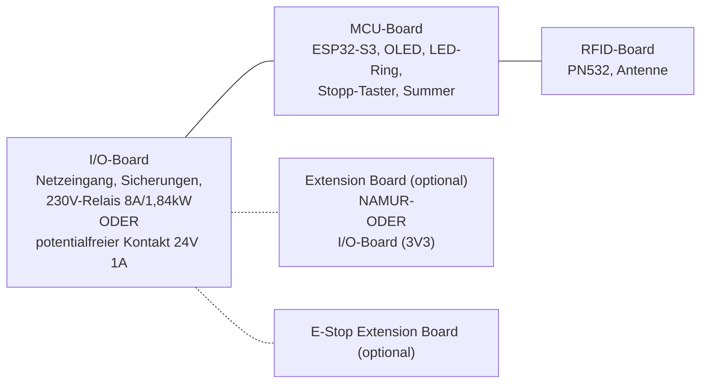
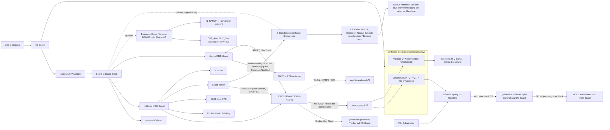

# Machine Node / RFID_BOX

**Dokumentrevision: 1.1**

Arbeitsplanung für den kompakten Machine Node. Dieses Dokument ist die
technische Ausgangsbasis für Schaltplan, PCB-Stack, Gehäuse und erste
Bestellung. Teilenummern sind für die aktuelle Auslegung gedacht und müssen
vor Netzspannungsbetrieb gegen Datenblatt, Verfügbarkeit und die geforderte
Zulassung geprüft werden.

## Changelog

- **1.1** – Boards auf MCU/I/O/RFID umbenannt, UI-Peripherie (OLED, LED-Ring,
  Summer, Stopp-Taster) vom RFID- auf das MCU-Board verlagert; I/O-Board in
  zwei exklusive Bestückvarianten (230V-Direktschaltung / potentialfrei 24V
  für externes Schütz) aufgeteilt; NAMUR-I/O als Bestückvariante eines neuen,
  generischen Extension Boards ausgelagert; Sicherungen auf gesockelte,
  werkzeuglos tauschbare Bauform umgestellt. Neues, eigenständiges **E-Stop
  Extension Board** (optional) ergänzt: einfaches Relais zur Bremsversorgung
  für Maschinen, deren Bremse dauerhaft Strom zum Lösen braucht
  (power-to-release, fail-safe stromlos = Bremse aktiv); trotz des Namens
  kein zertifiziertes Not-Aus-/Not-Halt-Bauteil und unabhängig vom
  generischen Extension Board (NAMUR/Digital-I/O). Q1 (Bestückvariante 230V)
  als elektromechanisches **Relais** festgelegt statt SMD-Schalter. Neues
  Übersichts-Blockdiagramm am Anfang von "Anforderungen aus Blackbox-Sicht"
  ergänzt (Boards mit groben Inhalten, gestrichelte Linien zu den optionalen
  Erweiterungsboards). Zielschutzart von IP34 auf **IP64** angehoben: Gehäuse
  muss staubdicht sein (nicht nur Schutz gegen Fremdkörper ab 2,5 mm), da der
  Einsatzort eine Holzwerkstatt mit Sägemehl ist; U6 präzisiert, dass der
  Kartenkanal mechanisch vom staubdichten Innenraum getrennt ist (RFID-
  Erkennung ist berührungslos) und eindringender Staub nach unten ausgeführt
  statt in den Elektronikraum geleitet wird. Ausserdem "beide FKS" auf "FKS"
  korrigiert, da nur eine Maschine dieses Typs vorhanden ist. **Sicherheits-
  relevante Korrektur der Stopp-Reihenfolge:** Das E-Stop Extension Board
  (K3) unterbricht bei Stopp/Kartenentzug immer sofort die Notaus-/
  Interlock-Schleife der Maschine, unabhängig vom Nachlaufprofil — die
  Hauptversorgung (Q1/K2 auf dem I/O-Board) wird dagegen **nie** hart und
  sofort getrennt, sondern immer erst nach Ablauf der konfigurierten
  Nachlaufzeit abgeschaltet, auch nicht durch den Stopp-Taster. Die vorherige
  Fassung beschrieb das genau umgekehrt (harter Stopp-Taster öffnet die
  Versorgung sofort); dieses Verhalten hat in der Praxis bereits zu einem
  Maschinenschaden geführt, weil der Maschine dann die Energie für ihre
  eigene kontrollierte Bremsung fehlte. E6, B3, B7, Nachlaufprofile, BR2/BR3,
  Blockdiagramm, Teileliste, Layout-Regeln, Schnittstellentabelle und
  Abnahmetests (T3, T20, T21) entsprechend korrigiert. K3-Relais des E-Stop
  Extension Boards mit **24 V DC / 1 A** Kontaktbelastung spezifiziert.
  Programmierweg präzisiert: laufende Firmware-Updates primär per OTA über
  WLAN, der interne USB-C-Anschluss J4 dient nur der Erstprogrammierung und
  dem Debug/Service.
- **1.0** – Erste Fassung: kompakter Machine Node mit PCB-A (Controller),
  PCB-B (Power, inkl. 230V-Ausgang, potentialfreiem Kontakt und NAMUR-I/O)
  und PCB-C (RFID/UI) als gemeinsamem Stack.

## Ziel

Eine kompakte Box aus einem bis drei direkt übereinander montierten PCBs
(plus optionalen Erweiterungsboards), die eine Maschine per RFID freischaltet
und den Zustand der Last an die easyVerwaltung meldet.

- RFID-Anmeldung am PN532
- WLAN-Kommunikation; Firmware-Programmierung primär per OTA über WLAN, nur
  die Erstprogrammierung erfolgt über den internen USB-C-Anschluss (J4)
- sichere Freigabe einer 230-V-Last oder eines potentialfreien 24-V-Signals
  für ein externes Schütz
- Erkennung, ob die Maschine tatsächlich läuft
- definierter Aus-Zustand bei Reset oder Firmware-Fehler; Verhalten bei
  Kommunikationsverlust ist pro Maschinenprofil festgelegt
- durchgehend SMD-bestückte Funktionsboards
- keine interne Handverkabelung und keine handverlöteten Module
- einheitliche Board-to-Board-Stecker zwischen den Boards
- gemeinsamer Grundaufbau (I/O-Board) für zwei exklusive Schaltvarianten
  sowie ein optionales, generisches Extension Board für zusätzliche I/O

## Anforderungen aus Blackbox-Sicht

Die folgenden Anforderungen beschreiben das Verhalten und die Eigenschaften
des fertigen Geräts. Interne PCB-Aufteilung und konkrete Bauteile sind keine
Anforderungen, sondern daraus abgeleitete Designentscheidungen. Zur groben
Orientierung vorab die Boards, auf die sich die Anforderungen unten beziehen:



### 1. Energie und Schalten

Das I/O-Board wird in **zwei exklusiven Bestückvarianten** gefertigt: pro
Gerät wird entweder die Variante **230V** oder die Variante **24V
potentialfrei** bestückt, nie beide gleichzeitig. Beide Varianten teilen sich
dasselbe PCB-Layout und dieselben Basisbauteile (Versorgung, Sicherungen,
Feldterminals); nur der eigentliche Schaltpfad unterscheidet sich.

| ID | Muss-Anforderung | Abnahmekriterium |
|---|---|---|
| E1 | Das Gerät wird mit 230 V AC versorgt. | Das Gerät hat einen eindeutig beschrifteten Netz-Eingang und startet nach dem Einschalten definiert. Gilt für beide Bestückvarianten, auch wenn nur die Variante 230V die Netzspannung weiterschaltet. |
| E2 | **Variante 230V:** Das Gerät schaltet einen 230-V-Ausgang aus derselben Versorgung. | Nach Start, Reset und Fehlerzustand ist der Ausgang AUS. Bei Kommunikationsverlust gilt das konfigurierte Maschinenprofil. |
| E3 | **Variante 230V:** Der 230-V-Ausgang ist für eine definierte Last abgesichert. | Die aktuelle Auslegung zielt auf 8 A Dauerlast; Sicherung, Lastrelais, Leiterbahnen, Klemmen und Thermik werden gemeinsam am Prototyp geprüft. |
| E4 | **Variante 24V potentialfrei:** Das Gerät besitzt einen potentialfreien Schaltausgang **C / NO / NC** für **24 V DC / 1 A**. | Ein extern eingespeistes 24-V-Signal kann mit maximal 1 A geschaltet werden, ohne elektrische Verbindung zum Netz oder zur internen Kleinspannung. Der Kontakt erzeugt selbst keine 24-V-Versorgung. |
| E5 | Es gibt keinen Not-Aus- oder Not-Halt-Schalter am Machine Node. | Der vorhandene Stopp-Taster wird in UI, Firmware und Dokumentation eindeutig als normaler Stopp bezeichnet. |
| E6 | Ein normaler Stopp beendet die Arbeitsfreigabe und startet bei Bedarf eine Nachlaufsequenz. | Der Stopp wird sofort als `STOPPED` angezeigt und löst, falls ein E-Stop Extension Board bestückt ist, sofort dessen Notaus-Kontakt aus. Die eigentliche Versorgung (Schaltausgang des I/O-Boards) wird **nicht** hart und sofort getrennt, sondern erst nach Ablauf der je Maschinenprofil konfigurierten Nachlaufzeit abgeschaltet — auch nicht durch den Stopp-Taster. Beispiele: Laser-Abluft 60 Sekunden, Bremse 10 Sekunden für FKS. Ein vorzeitiges hartes Abschalten der Versorgung kann die Maschine an einer eigenen kontrollierten Bremsung hindern und zu Schäden führen. |
| E7 | Kommunikationsverlust hat ein definiertes, konfigurierbares Verhalten. | Eine laufende Freigabe darf je nach Maschinenprofil und Timeout weiterlaufen; eine neue Freigabe ohne Serverbestätigung ist nie möglich. |

Die früheren NAMUR-Ausgänge (vormals E8) sind kein Bestandteil des I/O-Boards
mehr; sie sind eine Bestückvariante des optionalen **Extension Board**, siehe
Abschnitt "Extension Board (optional)".

### Lastklasse der Variante 230V

Für den direkten 230-V-Ausgang wird **8 A Dauerlast bei 230 V AC** als
Auslegungsziel festgelegt. Das entspricht ungefähr 1,84 kW. 16 A ist die
übliche Nennklasse einer Schuko-Versorgung, wird für diesen kompakten Node aber
nicht als direkte Dauerlast zugesagt: Motoren können beim Einschalten ein
Mehrfaches ihres Nennstroms ziehen.

| Beispiel-Last | Typischer Betriebsbereich | Bewertung der aktuellen Auslegung |
|---|---:|---|
| 3D-Drucker | ca. 0,5-2 A | Direkt geeignet |
| Desktop-CNC | ca. 2-6 A | Direkt geeignet, Anlaufstrom prüfen |
| Standfräse, ca. 800 W | ca. 3,5 A Nennstrom, höherer Anlaufstrom | Zielanwendung, Anlaufstrom und Dauerbetrieb prüfen |
| Kleine Drehmaschine, ca. 800 W | ca. 3,5 A Nennstrom, höherer Anlaufstrom | Zielanwendung, Anlaufstrom und Dauerbetrieb prüfen |
| Kleine Bandsäge | ca. 4-8 A Nennstrom, deutlich höherer Anlaufstrom | Nur nach Prüfung, besser externes Schütz (Variante 24V potentialfrei) |
| Kleine Kreissäge | ca. 6-10 A Nennstrom, hoher Anlaufstrom | Nicht direkt zusagen, Variante 24V potentialfrei mit externem Schütz bevorzugt |

Die konkrete Lastklasse muss mit Typenschild, Einschaltstrom und thermischer
Prüfung des fertigen I/O-Boards bestätigt werden. Standfräsen und kleine
Drehmaschinen bis etwa 800 W sind ausdrücklich als direkte Zielanwendungen
der Variante 230V vorgesehen, sofern ihr Anlaufstrom innerhalb der geprüften
Schaltgrenze liegt. Für Lasten bis 16 A oder für Motoren mit höherem
Anlaufstrom wird die Variante 24V potentialfrei bestückt: der Node schaltet
dann nur das Steuersignal eines externen, passend dimensionierten Schützes.

### 2. Authentifizierung und Bedienung

| ID | Muss-Anforderung | Abnahmekriterium |
|---|---|---|
| B1 | Nutzer können sich per RFID authentifizieren. | Eine gültige Karte kann lokal gelesen und eine ungültige Karte abgewiesen werden. |
| B2 | Die Freigabe wird gegen ein konfiguriertes Backend bestätigt. | Während der Übergangsphase darf das Gerät gegen easyVerwaltung oder das Legacy-System validieren. Ohne gültige Antwort des konfigurierten Systems wird keine Lastfreigabe erteilt. |
| B3 | Der Stopp-Taster ist von aussen erreichbar. | Der Taster kann ohne Gehäuseöffnung betätigt werden, beendet die Arbeitsfreigabe sofort (inkl. sofortigem Notaus-Kontakt, falls E-Stop Extension Board bestückt) und löst die konfigurierte Nachlaufsequenz aus, bevor die Versorgung tatsächlich getrennt wird. |
| B4 | Das Gerät reagiert lokal auch bei Netzwerklast. | RFID, Stopp und lokale Rückmeldung bleiben bedienbar; der Stopp hat Vorrang vor Netzwerkverarbeitung. |
| B5 | Während der Freigabe wird der Name des verantwortlichen Nutzers angezeigt. | Nach erfolgreicher Authentifizierung erscheint der Klarname, zum Beispiel „Max Mustermann“, auf dem OLED und bleibt bis zum Ende der Freigabe beziehungsweise des Nachlaufs sichtbar. |
| B6 | Das Gerät besitzt einen Always-on-Modus für eingesteckte RFID-Karten. | In diesem Modus bleibt die Maschine freigegeben, solange die autorisierte Karte im geschützten Kartenfach erkannt wird. |
| B7 | Die Kartenpräsenz wird ohne mechanischen Präsenzschalter verifiziert. | Das Gerät prüft die Karte zyklisch über den RFID-Leser; eine entfernte oder nicht mehr gültige Karte beendet die Freigabe nach der definierten Reaktionszeit und folgt derselben Sequenz wie ein Stopp (sofortiger Notaus-Kontakt, Versorgungstrennung erst nach Nachlaufzeit). |

### 3. Anzeige und Rückmeldung

| ID | Muss-Anforderung | Abnahmekriterium |
|---|---|---|
| A1 | Das Gerät besitzt einen LED-Ring mit 12 adressierbaren RGB-LEDs. | Betriebs-, Authentifizierungs-, Freigabe-, Fehler- und Stoppzustände sind am Ring unterscheidbar. |
| A2 | Das Gerät besitzt ein OLED. | Versorgung, Netzwerk, Authentifizierung, Freigabe, Stopp und Fehler können lokal angezeigt werden; die Darstellung bleibt für die montierte Orientierung lesbar. |
| A3 | Das Gerät besitzt einen Summer. | Erfolg, Warnung, Fehler und Stopp erzeugen unterscheidbare akustische Rückmeldungen. |
| A4 | Die lokale Rückmeldung ist responsiv. | Anzeige und Summer reagieren innerhalb von 100 ms auf lokale Ereignisse. |
| A5 | Die Anzeige macht die Verantwortlichkeit sichtbar. | Im aktiven Freigabezustand ist der Klarname des verantwortlichen Nutzers eindeutig und lesbar dargestellt. |
| A6 | Der Always-on-Modus zeigt eine aktive Kartenprüfung. | Der LED-Ring zeigt ein dynamisches, wiederkehrendes Muster, solange die Karte zyklisch gelesen und akzeptiert wird; ein statisches Freigabe-Licht allein ist nicht ausreichend. Das OLED zeigt zusätzlich den Always-on-Zustand und den verantwortlichen Klarnamen. |

### Nachlaufprofile

Nach dem Stopp darf ein Gerät nur dann weiterlaufen, wenn dies als Nachlauf
für das Maschinenprofil vorgesehen ist. Die eigentliche Arbeitsfreigabe ist
bereits beendet.

| Anwendung | Nachlauf | Systemanforderung |
|---|---:|---|
| Laser-Abluft | 60 Sekunden | Abluft muss unabhängig von der Laserfreigabe geschaltet werden können. |
| Bremse, FKS | 10 Sekunden | Bremsfunktion muss über den vorgesehenen Schaltkanal kontrolliert nachlaufen. |

Bei nur einem gemeinsamen Schaltausgang (230V oder potentialfrei) bleiben
alle daran angeschlossenen Verbraucher während des Nachlaufs gemeinsam
eingeschaltet. Unabhängiger Nachlauf von Abluft, Bremse und Maschine
erfordert zusätzliche Schaltkanäle oder ein externes Nachlaufrelais.

> **Wichtig, Reihenfolge bei Stopp/Kartenentzug (z.B. FKS):** Erst wird —
> falls ein E-Stop Extension Board bestückt ist — sofort und hardwareseitig
> dessen Notaus-Kontakt geöffnet, der in die Notaus-/Interlock-Schleife der
> Maschine eingeschleift ist. Die Maschine leitet dadurch ihre eigene
> kontrollierte Bremsung ein. Die eigentliche Versorgung (Schaltausgang des
> I/O-Boards, z.B. der potentialfreie Kontakt zum externen 400-V-Schütz bei
> der FKS) bleibt dabei bestehen und wird erst **nach Ablauf der
> Nachlaufzeit** abgeschaltet. Diese Reihenfolge gilt sowohl bei Betätigung
> des Stopp-Tasters als auch bei Kartenentzug im Always-on-Modus. Ein zu
> frühes, hartes Trennen der Versorgung hat in der Vergangenheit zu einem
> Maschinenschaden geführt, weil der Maschine dann die Energie für ihre
> eigene kontrollierte Bremsung fehlte.

### 4. Anschlüsse und optionale Lastmessung

| ID | Muss-Anforderung | Abnahmekriterium |
|---|---|---|
| I1 | Netz-Eingang und der jeweils bestückte Schaltausgang (230-V-Ausgang oder potentialfreier Kontakt) besitzen definierte Kabeldurchführungen. | Kabel können durch die geschützten Durchführungen in das Gehäuse geführt werden; die eigentlichen Terminals sind erst nach dem Öffnen erreichbar. |
| I2 | Federklemmen sind der bevorzugte Feldanschluss. | Betätigbare Push-in-Klemmen können mit vorgesehenen Leitern ohne Spezialwerkzeug angeschlossen werden. |
| I3 | Schraubklemmen sind als zweite Anschlussvariante möglich. | Die Alternative passt in dasselbe Anschluss- und Gehäusekonzept. |
| I4 | Eine einfache Lastmessung ist optional vorgesehen. | Ein galvanisch getrennter Sensor erkennt `LAST_AKTIV` und `LAST_AUS`, ohne Energieabrechnung zu versprechen. Nur relevant für die Variante 230V. |

Die früheren NAMUR-Anforderungen (vormals I5/I6) sind Teil des Extension
Boards, siehe folgender Abschnitt.

### Extension Board (optional)

Zusätzliche galvanisch getrennte I/O wird nicht auf jedem Node vorgehalten,
sondern über ein **generisches, optionales Extension Board** nachgerüstet,
das per Board-to-Board-Stecker auf das I/O-Board gesteckt wird. Ein Node
trägt höchstens ein Extension Board. I/O-Board und Extension Board sind
unabhängig voneinander bestellbar und bestückbar.

| ID | Muss-Anforderung | Abnahmekriterium |
|---|---|---|
| X1 | Das Extension Board ist ein steckbares Zusatzboard mit mehreren möglichen Bestückvarianten. | Mechanisch identischer Formfaktor und Board-to-Board-Stecker für alle Varianten; ein unbestücktes I/O-Board funktioniert ohne Extension Board vollständig gemäß Abschnitt 1-4. |
| X2 | **Bestückvariante NAMUR:** Das Extension Board besitzt zwei zusätzliche galvanisch optoisolierte NAMUR-Ausgänge und einen galvanisch getrennten NAMUR-Eingang. | Jeder Ausgang arbeitet als 24-V-DC-/4-mA-Schnittstelle für sonstige Zwecke; beide Ausgänge sind voneinander und von der Gerätesteuerung galvanisch getrennt. `OUT_A+/-` und `OUT_B+/-` liefern die 24-V-DC-/4-mA-Schnittstelle; `IN_NAMUR+/-` verarbeitet ein potentialfreies externes Signal als 24-V-NAMUR-kompatible Schnittstelle. |
| X3 | **Bestückvariante Digital-I/O:** Das Extension Board kann alternativ mit einfachen digitalen Ein-/Ausgängen ohne NAMUR-Anforderung bestückt werden. | Konkrete Beschaltung, Kanalzahl und Pegel werden vor dem Schaltplan dieser Variante festgelegt; hier zunächst nur als benannte, noch nicht spezifizierte zweite Bestückoption geführt. |

Die NAMUR-Variante wird für schätzungsweise 2 von 20 Nodes benötigt und ist
deshalb bewusst nicht Teil des Standard-I/O-Boards.

### E-Stop Extension Board (optional)

Manche Maschinen (z.B. FKS) haben eine eigene Notaus-/Interlock-Schleife,
die sofort unterbrochen werden muss, damit die Maschine ihre eigene
kontrollierte Bremsung einleitet — sowie oft eine elektromagnetisch gelöste
Bremse, die dauerhaft Strom braucht, um gelöst zu bleiben ("power-to-release
Bremse"): fällt die Spannung weg, fällt die Bremse fail-safe ein. Dafür gibt
es ein **eigenständiges, optionales E-Stop Extension Board** mit einem
einfachen Relais, dessen Kontakt in die Notaus-/Interlock-Schleife der
Maschine eingeschleift wird. Es steckt unabhängig vom generischen Extension
Board (NAMUR/Digital-I/O) über einen eigenen Board-to-Board-Stecker auf den
Stack.

**Wichtig:** Das E-Stop Extension Board unterbricht bei Stopp oder
Kartenentzug immer **sofort** die Notaus-Schleife — unabhängig vom
Nachlaufprofil. Die eigentliche Versorgung der Maschine (Schaltausgang des
I/O-Boards) ist davon getrennt zu betrachten und wird immer erst **nach**
Ablauf der Nachlaufzeit abgeschaltet, siehe Warnhinweis unter
"Nachlaufprofile". Diese Trennung ist zentral: nur so hat die Maschine
während ihrer eigenen kontrollierten Bremsung noch Energie zur Verfügung.

> **Hinweis zur Namensgebung:** Trotz des Namens "E-Stop" ist dieses Modul
> **kein** zertifiziertes Not-Aus- oder Not-Halt-Bauteil im Sinne von E5. Es
> unterbricht ausschliesslich die Notaus-/Interlock-Schleife bzw. die
> Bremsversorgung der externen Maschine, nicht die Hauptversorgung selbst.

| ID | Muss-Anforderung | Abnahmekriterium |
|---|---|---|
| BR1 | Das E-Stop Extension Board schaltet ein einfaches Relais mit **24 V DC / 1 A** Kontaktbelastung, dessen Kontakt in die Notaus-/Interlock-Schleife bzw. Bremsversorgung der externen Maschine eingeschleift wird. | Ein extern eingespeister 24-V-DC-Stromkreis kann mit maximal 1 A über das Relais durchgeschaltet werden, galvanisch getrennt von Netz und Gerätesteuerung. |
| BR2 | Die Schaltlogik ist fail-safe: stromlos = Notaus-Schleife unterbrochen / Bremse aktiv. | Das Relais ist im Ruhezustand (Coil stromlos) offen; die Notaus-Schleife ist dann unterbrochen bzw. die Bremse fällt ein. Erst ein aktives Freigabesignal der Steuerung schliesst das Relais. |
| BR3 | Das Relais öffnet bei Stopp oder Kartenentzug immer sofort, unabhängig vom Nachlaufprofil. | Bei Stopp-Taster **und** bei Kartenentzug im Always-on-Modus öffnet das Relais hardwareseitig sofort (<100 ms), unabhängig von der konfigurierten Nachlaufzeit. Die Versorgung der Maschine (I/O-Board-Ausgang) folgt **nicht** diesem sofortigen Öffnen, sondern bleibt bis zum Ende der Nachlaufzeit bestehen. |
| BR4 | Das Modul ist klar als Nicht-Not-Aus-Bauteil gekennzeichnet. | Beschriftung und Dokumentation verweisen eindeutig darauf, dass dieses Relais kein Personenschutz- oder Not-Halt-Bauteil ist. |

### 5. Umwelt und Montage

| ID | Muss-Anforderung | Abnahmekriterium |
|---|---|---|
| U1 | Das Gerät ist staubdicht und bietet Schutz gegen Berührung und Spritzwasser. | Zielgehäuse IP64: vollständig staubdicht (kein Eindringen von Staub, relevant für den Einsatz in der Holzwerkstatt) und Schutz gegen Spritzwasser aus allen Richtungen. Das Gehäuse ist nicht für Strahlwasser ausgelegt. |
| U2 | Das Gerät kann aufrecht, liegend oder in einem beliebigen Winkel dazwischen montiert werden. | Die Elektronik arbeitet in jeder vorgesehenen Einbaulage; die OLED-Anzeige wird über das Montageprofil so ausgerichtet, dass Texte lesbar bleiben. |
| U3 | Das Gerät ist kompakt und besteht aus einem bis vier PCBs (I/O-Board, MCU-Board, RFID-Board, optional Extension Board). | Die Standardbauweise bleibt als Stack realisierbar; MCU und RFID dürfen für eine kompakte Variante zu einem Board zusammengelegt werden. |
| U4 | Die interne Montage ist weitgehend schraubenlos. | Ausser den äusseren Gehäuseschrauben werden PCBs, Frontfenster und Führungen gesteckt oder geklipst. |
| U5 | Das Gehäuse trägt eindeutige Sicherheitshinweise und elektrische Kennwerte. | Die Hinweise sind dauerhaft lesbar, von aussen sichtbar und ohne Gehäuseöffnung verständlich. |
| U6 | Der Kartenkanal für eingesteckte RFID-Karten ist mechanisch vom staubdichten Geräteinnenraum getrennt. | Da die RFID-Erkennung berührungslos erfolgt, muss der Kartenkanal nicht selbst staubdicht sein: Staub/Sägemehl darf in den Kanal eindringen, wird aber nach unten ausgeführt (Drainage) statt sich anzusammeln oder in den Elektronikraum vorzudringen. Die Karte kann eingeführt und entnommen werden, ohne einen offenen Taster oder eine Öffnung in den staubdichten Innenraum zu benötigen. |
| U7 | Das Gehäuse muss von allen Seiten ausser der Display-Front befestigbar sein. | Je nach Einbausituation ist eine Verschraubung von hinten, seitlich, unten oder oben möglich, ohne den PCB-Stack zu verändern oder die Display-Front zu verdecken. |

### 6. Service und Fertigung

| ID | Muss-Anforderung | Abnahmekriterium |
|---|---|---|
| S1 | Die Feldterminals sind nach dem Öffnen mit normalem Werkzeug erreichbar. | Nach dem Lösen der äusseren Gehäuseschrauben sind die Terminals sichtbar und bedienbar, ohne den Stack zu zerlegen. |
| S2 | Die interne Verdrahtung ist minimal. | Keine losen Litzen, keine Handverkabelung und keine handverlöteten Module im Serienaufbau. |
| S3 | Die Schaltfunktion des I/O-Boards ist wartbar. | Das I/O-Board kann ohne Löten getauscht werden; alternativ ist sein kompletter Austausch wirtschaftlich vorgesehen. |
| S4 | Die Baugruppe ist für SMD-Fertigung geeignet. | Bestückung, elektrische Prüfung und Service sind mit geringem Handarbeitsanteil möglich. |
| S5 | Die Sicherungen sind gesockelt und ohne Löten tauschbar. | F1, F2 und F3 stecken in Sicherungshaltern statt fest verlötet zu sein; nach dem Öffnen des Gehäuses lässt sich jede Sicherung mit normalem Werkzeug aus dem Sockel entnehmen und ersetzen. |

### Verbindliche Gehäusebeschriftung

Die Beschriftung muss dauerhaft, kontrastreich und abriebfest ausgeführt werden.
Sie darf nicht nur auf einem abnehmbaren Deckel stehen, wenn dadurch die
elektrischen Grenzwerte am Gerät fehlen. Die Beschriftung richtet sich nach
der tatsächlich bestückten I/O-Board-Variante und danach, ob ein Extension
Board bestückt ist.

Mindestens erforderlich:

- **„Bedienung nur nach Einweisung“**
- **„Achtung: 230 V AC“**
- **Variante 230V:** „Direkter 230-V-Ausgang: max. 8 A Dauerlast / ca. 1,84 kW“
  und „Motoren und hohe Einschaltströme nur nach Prüfung oder über externes
  Schütz“
- **Variante 24V potentialfrei:** „Potentialfreier Kontakt: max. 24 V DC / 1 A“
- **Nur wenn Extension Board Variante NAMUR bestückt ist:**
  „OUT_A+/- / OUT_B+/-: je 24 V DC / 4 mA, optoisolierte NAMUR-Ausgänge“ und
  „IN_NAMUR+/-: galvanisch getrennter 24-V-NAMUR-Eingang“
- **Nur wenn E-Stop Extension Board bestückt ist:** „J18: max. 24 V DC / 1 A,
  kein Not-Aus/Not-Halt-Bauteil, unterbricht sofort die Notaus-/Interlock-
  Schleife bzw. Bremsversorgung der Maschine; die Hauptversorgung trennt
  erst nach der konfigurierten Nachlaufzeit“
- eindeutige Kennzeichnung von **Netz-Eingang** und der tatsächlich bestückten
  Anschlüsse (**230-V-Ausgang** oder **C / NO / NC**, ggf. **OUT_A**, **OUT_B**,
  **IN_NAMUR** und/oder **J18 Bremsrelais** bei bestückten Erweiterungsboards)
- Hinweis, dass der Stopp-Taster **kein Not-Aus und kein Not-Halt** ist

Die Kennzeichnung wird zusätzlich in der Montage- und Bedienungsdokumentation
übernommen. Angaben zu Spannung, Leistung und Stromstärke müssen auch bei
montiertem Gerät lesbar bleiben.

Es gibt am Machine Node ausdrücklich **keinen Not-Aus- oder Not-Halt-Schalter**.
Der Stopp-Taster ist eine normale Bedienfunktion zum Beenden der Freigabe und
kein Personenschutz. Anforderungen an einen Not-Halt der angeschlossenen
Maschine liegen ausserhalb dieses Geräts und müssen separat gelöst werden.

> **Sicherheit:** Netzspannung darf nur von qualifizierten Personen geplant,
> aufgebaut, gemessen und in Betrieb genommen werden. Für Motoren,
> Frequenzumrichter oder Drehstrom ist eine externe Schütz-/Sensorlösung
> vorzusehen (Variante 24V potentialfrei). Das Lastrelais auf der Platine
> ist kein universeller Motorschalter und keine Personenschutzfunktion.

## Aktuelle Architekturentscheidung

Die erste Version wird als kompakter 230-V-Einphasen-Node geplant. Die
Funktionen werden nach Sicherheits- und Fertigungsgrenzen aufgeteilt:

- **Unteres I/O-Board:** ausschliesslich 230-V-Netzseite, gesockelte
  Sicherungen und zugängliche Feldterminals. Zwei exklusive
  Bestückvarianten: **Variante 230V** (Lastrelais Q1, Ausgangssicherung F2,
  230-V-Ausgangsterminal J5) oder **Variante 24V potentialfrei**
  (potentialfreier Kontakt K2, Terminal J9). Pro Board wird nur eine Variante
  bestückt.
- **Mittleres MCU-Board:** ESP32-S3, Spannungsaufbereitung, Logik,
  Service-USB — **plus** die komplette lokale UI-Peripherie: LED-Ring, OLED,
  Stopp-Taster und Summer. Diese Bauteile sitzen bewusst auf dem MCU-Board und
  nicht auf dem RFID-Board, da das RFID-Board fast vollständig von der
  Antennenfläche eingenommen wird.
- **Oberes RFID-Board:** PN532, PCB-Antenne und Kartenfach-Mechanik — sonst
  keine weiteren Funktionsbaugruppen. Für eine kompaktere Variante dürfen
  MCU-Board und RFID-Board zu einer gemeinsamen Platine zusammengelegt
  werden; die kompakte Variante trägt dann Controller, UI-Peripherie und
  RFID-Frontend auf einem Board.
- **Extension Board (optional):** steckt über einen Board-to-Board-Stecker
  (gleiche Hirose-DF40-Familie und Aussenkontur wie MCU-/RFID-Board) auf den
  Stack. Wird nur für Nodes bestellt und bestückt, die zusätzliche
  galvanisch getrennte I/O benötigen. Aktuell benannte Bestückvarianten:
  **NAMUR** (zwei optoisolierte 24-V-/4-mA-Ausgänge, ein NAMUR-Eingang) und
  **Digital-I/O** (Platzhalter für einfache digitale Kanäle, noch nicht im
  Detail spezifiziert). Ein Node trägt höchstens eine der beiden Varianten.
- **E-Stop Extension Board (optional, eigenständig):** separates Board mit
  eigenem Board-to-Board-Stecker, unabhängig vom generischen Extension Board.
  Trägt ein einfaches, fail-safe verdrahtetes Relais (stromlos = Notaus-
  Schleife unterbrochen / Bremse aktiv), dessen Kontakt in die Notaus-/
  Interlock-Schleife bzw. die power-to-release-Bremsversorgung der externen
  Maschine eingeschleift wird; wird nur für Nodes bestellt/bestückt, deren
  Maschine das braucht (z.B. FKS). Das Relais öffnet bei Stopp oder
  Kartenentzug immer sofort — unabhängig von der Nachlaufzeit der
  Hauptversorgung (siehe Warnhinweis unter "Nachlaufprofile"). Trotz des
  Namens kein zertifiziertes Not-Aus-/Not-Halt-Bauteil.
- **Always-on-Gehäusevariante:** Kartenfach für eine eingesteckte RFID-Karte,
  mechanisch vom staubdichten Innenraum getrennt (RFID-Erkennung ist
  berührungslos, daher muss der Kartenkanal selbst nicht staubdicht sein);
  eindringender Staub wird nach unten ausgeführt. Die Kartenpräsenz wird
  ausschließlich über den RFID-Leser erkannt; es gibt dafür keinen
  mechanischen Taster und keine offene Gehäuseöffnung in den Innenraum.
- **Lastmessung optional:** CT-Eingang auf dem I/O-Board, nur für die
  Variante 230V relevant; die Signalaufbereitung liegt auf der SELV-Seite des
  I/O-Boards, das ADC-Signal wird über den Stack an das MCU-Board geführt.

Alle Boards haben dieselbe Aussenkontur und werden mit integrierten Führungen,
Rastnasen und Board-to-Board-Steckern als Stack gesteckt und geklipst. Die
Standardausführung besteht aus I/O-Board unten, MCU-Board in der Mitte und
RFID-Board oben, mit optionalem Extension Board zusätzlich im Stack. Für die
kompakte Variante werden MCU- und RFID-Board zu einer Platine zusammengelegt.
Die finale Baugruppe wird SMD-bestückt und elektrisch getestet; übrig bleiben
nur Verschrauben, Gehäusemontage und das Anschliessen der Maschine.

Die Strommessung ist optional und wird als einfache Last-Präsenzerkennung
ausgeführt. Ein externer Split-Core-Stromwandler wird um genau einen Leiter
des geschalteten 230-V-Ausgangs gelegt. Die Messung ist galvanisch von Netz
und ESP32 getrennt und liefert nur `LAST_AKTIV` beziehungsweise `LAST_AUS`;
keinen geeichten Energieverbrauch.

## Blockdiagramm



## Teileliste der aktuellen Auslegung

### Mittleres MCU-Board: Controller und UI-Peripherie

| Ref. | Bauteil | Exakte Auswahl | Menge | Hinweis |
|---|---|---|---:|---|
| U1 | Mikrocontroller-Modul | Espressif **ESP32-S3-WROOM-1-N16R8** | 1 | 16 MB Flash, 8 MB PSRAM, PCB-Antenne |
| J2 | Board-to-Board | Hirose **DF40C-40DP-0.4V(51)** | 2 | MCU-Board zu I/O-Board/RFID-Board |
| U2 | 3.3-V-Regler | Texas Instruments **TPS62162DSG** | 1 | 3 A Step-down, ausreichend Reserve |
| J4 | USB-Service | Würth **629105150521** USB-C Receptacle | 1 | Intern, nur für Erstprogrammierung/Debug/Flash; laufende Firmware-Updates erfolgen primär per OTA über WLAN; ESD beachten |
| SW1 | Reset | Omron **B3U-1000P** | 1 | Taster nach GND |
| SW2 | Boot | Omron **B3U-1000P** | 1 | GPIO0 nach GND |
| D1-D12 | LED-Ring | Worldsemi **WS2812B-2020-V1** | 12 | SMD, rund um das OLED, 5-V-Versorgung |
| DS1 | OLED | Newhaven **NHD-2.7-12864UCW3** | 1 | SPI, Frontseite, FPC-Anschluss |
| J8 | OLED-FPC | Hirose **FH12-24S-0.5SH(55)** | 1 | Keine lose Display-Verkabelung |
| SW3 | Stopp-Taster | C&K **PTS645SM43SMTR92 LFS** | 1 | Frontseitig erreichbar, Hardware-Enable zum I/O-Board |
| BZ1 | Summer | TDK **PS1240P02BT** | 1 | 5-V-SMD-Piezo, PWM-Ansteuerung |
| Q2 | LED-Treiber | Diodes Inc. **PCA9306DCTR** | 1 | Pegelanpassung für 3.3-V-Logik zu 5-V-Daten |

### Unteres I/O-Board: Versorgung, Lastschaltung und Feldanschlüsse

| Ref. | Bauteil | Exakte Auswahl | Menge | Hinweis |
|---|---|---|---:|---|
| PS1 | AC/DC-Wandler | RECOM **RAC05E-K/277** | 1 | Kompakter isolierter 5-V-Wandler, 5 W |
| F1 | Sicherung Steuerzweig | Littelfuse **0218002.MXP**, 2 A träge | 1 | Nur für den isolierten AC/DC-Steuerzweig, nicht für den 8-A-Lastpfad; gesockelt, siehe FH1 |
| FH1 | Sicherungshalter F1 | Passend zum 5x20mm-Format von F1 | 1 | Werkzeuglos tauschbar nach Öffnen des Gehäuses |
| F2 | Ausgangssicherung | Littelfuse **0218008.MXP**, 8 A träge | 1 | **Nur Variante 230V.** Eigener abgesicherter 230-V-Lastpfad; final nach Einschaltstrom prüfen; gesockelt, siehe FH2 |
| FH2 | Sicherungshalter F2 | Passend zum 5x20mm-Format von F2 | 1 | Nur bestückt bei Variante 230V; werkzeuglos tauschbar |
| F3 | Sekundärsicherung | Littelfuse **0451003.MRL**, 3 A | 1 | Schutz der 5-V-Schiene; gesockelt, siehe FH3 |
| FH3 | Sicherungshalter F3 | Passend zum Format von F3 | 1 | Werkzeuglos tauschbar nach Öffnen des Gehäuses |
| MOV1 | Überspannungsschutz | EPCOS **B72214S0271K101**, 275 VAC | 1 | Abstand und Sicherungskonzept prüfen |
| NTC1 | Einschaltstrombegrenzung | TDK **B57236S0100M000**, 10 Ohm | 1 | Nur falls Last/Netzteil dies erfordert |
| U6 | Optotriac | Vishay **VOM1271** | 1 | Galvanisch getrenntes Enable-Signal |
| Q1 | Lastrelais | Elektromechanisches Relais für mindestens 8 A Dauerlast | 1 | **Bestückvariante 230V.** Konkretes Bauteil erst nach Last-/Thermikprüfung festlegen; Motoren über externes Schütz (Variante 24V potentialfrei) |
| J1 | Netz-Eingang | WAGO **2604-1103**, 3-polig, Hebel | 1 | L/N/PE, nur im geöffneten Gehäuse erreichbar; gemeinsam für beide Bestückvarianten |
| J5 | 230-V-Ausgang | WAGO **2604-1103**, 3-polig, Hebel | 1 | **Bestückvariante 230V.** Geschaltete Phase, und geschaltetes N und PE durchverbunden, Terminal nur im geöffneten Gehäuse erreichbar |
| K2 | Potentialfreier Kontakt | Omron **G6K-2F-Y-TR DC5** | 1 | **Bestückvariante 24V potentialfrei.** C/NO/NC, galvanisch getrennt, für externe 24-V-DC-Signale bis 1 A |
| J9 | Kontaktanschluss | WAGO **2060-Serie**, 3-polig, Push-in-Federklemme | 1 | **Bestückvariante 24V potentialfrei.** C/NO/NC, Terminal nur im geöffneten Gehäuse erreichbar, keine interne Verbindung zu Netz |
| J12 | Schraubklemmen-Alternative | Phönix Contact **1935161**, 3-polig | 1 | Nur verwenden, wenn Federklemmen mechanisch nicht passen |
| U7 | Hardware-Interlock | TI **SN74LVC1G08DBVR** | 1 | Stopp-Taster (MCU-Board) sperrt neue Arbeitsfreigabe unabhängig von Firmware; Nachlauf bleibt profilgesteuert; nicht sicherheitszertifiziert |
| J10 | Board-to-Board | Hirose **DF40HC(3.0)-40DS-0.4V(51)** | 1 | Stop-/Enable-Signal von/zu MCU-Board |
| J11 | Board-to-Board | Hirose **DF40HC(3.0)-40DS-0.4V(51)** | 1 | Gegenstück zu RFID-Board |
| J15 | Board-to-Board (optional) | Hirose **DF40HC(3.0)-40DS-0.4V(51)** | 1 | Für optionales Extension Board, nur bestückt wenn Extension Board bestellt ist |
| CT1 | Externer Stromwandler | YHDC **SCT-013-030**, 30 A : 1 V | 1 | **Optional, nur Variante 230V.** Split-Core, integrierter Burden, nur um einen Leiter legen |
| R20/R21 | ADC-Mittelpunkt | je 100 kOhm, 1 %, SMD | 2 | Erzeugt 1.65 V Bias auf der Kleinspannungsseite |
| R22 | ADC-Eingangsschutz | 1 kOhm, 1 %, SMD | 1 | Begrenzung des Eingangsstroms |
| D5 | ADC-Klemmschutz | Nexperia **BAT54S** | 1 | Schutz gegen positive/negative Spitzen |
| C10 | AC-Kopplung | 1 uF, 16 V, X7R, SMD | 1 | CT-Signal auf ADC-Mittelpunkt legen |
| J6 | CT-Anschluss | Würth **691137710002** | 1 | Einziger externer Kleinspannungsanschluss der optionalen CT-Messung |

Die CT-Sensorik sitzt auf dem I/O-Board, weil der Stromwandler unmittelbar um
den 230-V-Ausgangsleiter gelegt wird, der ebenfalls auf diesem Board endet.
Es gibt keine galvanische Verbindung zwischen CT, Netzleiter und ESP32; das
aufbereitete ADC-Signal wird als SELV-Signal über den Stack an das MCU-Board
geführt. Der CT darf nur um einen einzelnen Leiter gelegt werden, niemals um
L und N gemeinsam. Die Messung wird vor Auslieferung mit einer definierten
Last kalibriert und als Schwellwert `LAST_AKTIV` ausgewertet.

Das I/O-Board wird als preiswerte, komplett tauschbare Einheit ausgelegt. Das
Lastrelais Q1 wird nicht im eingebauten Gehäuse von Hand repariert; bei einem
Defekt wird das I/O-Board nach dem Lösen der Standard-Schrauben und der
Federklemmen komplett gewechselt.

### Oberes RFID-Board

| Ref. | Bauteil | Auswahl | Menge | Hinweis |
|---|---|---|---:|---|
| U3 | RFID-Controller | NXP **PN5321A3HN/C100** | 1 | Direkt auf dem RFID-Board, SPI |
| A1 | RFID-Antenne | PCB-Spule, 13.56 MHz, nach PN532-Referenzdesign | 1 | Nimmt den grössten Teil der Boardfläche ein |
| ME1 | Kartenfach | Integrierter Kartenkanal vor der RFID-Antenne | 1 | Mechanisch vom staubdichten Innenraum getrennt, Staubaustritt nach unten; keine mechanische Präsenzabfrage |
| J7 | Board-to-Board | Hirose **DF40HC(3.0)-40DS-0.4V(51)** | 1 | SPI/IRQ und Versorgung zum MCU-Board |

Das RFID-Board enthält bewusst keine weitere Funktionselektronik mehr: OLED,
LED-Ring, Stopp-Taster, Summer und Strommessung sind auf das MCU-Board bzw.
I/O-Board verlagert, damit die knappe Fläche des RFID-Boards vollständig der
Antenne zur Verfügung steht.

### Extension Board – Bestückvariante NAMUR (optional)

| Ref. | Bauteil | Exakte Auswahl | Menge | Hinweis |
|---|---|---|---:|---|
| U8/U9 | Optoisolierte NAMUR-Ausgänge | Je eine galvanisch getrennte 24-V-/4-mA-Ausgangsstufe | 2 | `OUT_A` und `OUT_B`, NAMUR-kompatible Schnittstelle, galvanisch getrennt |
| J13 | Zusatz-Ausgänge | WAGO **2060-Serie**, 4-polig, Push-in-Federklemme | 1 | `OUT_A+/-` und `OUT_B+/-`, jeweils eigenes galvanisch getrenntes Ausgangspaar |
| U10 | Optoisolierter Eingang | 24-V-Eingangsstufe mit definierter NAMUR-Auswertung | 1 | Potentialfreier Eingang für sonstige Zwecke, galvanisch von der Steuerung getrennt |
| J14 | Zusatzeingang | WAGO **2060-Serie**, 2-polig, Push-in-Federklemme | 1 | `IN_NAMUR+/-`, nur im geöffneten Gehäuse erreichbar |
| J16 | Board-to-Board | Hirose **DF40HC(3.0)-40DS-0.4V(51)** | 1 | Gegenstück zu J15 auf dem I/O-Board |

### Extension Board – Bestückvariante Digital-I/O (Platzhalter)

Noch nicht spezifiziert. Teilt sich Formfaktor und Board-to-Board-Stecker
(J16-Position) mit der NAMUR-Variante; Kanalzahl, Beschaltung und
Feldterminals werden vor dem zugehörigen Schaltplan festgelegt.

### E-Stop Extension Board (optional, eigenständig)

| Ref. | Bauteil | Exakte Auswahl | Menge | Hinweis |
|---|---|---|---:|---|
| K3 | Notaus-/Bremsrelais | Einfaches Schaltrelais, Kontakt ausgelegt für 24 V DC / 1 A (extern eingespeist) | 1 | Fail-safe: Coil stromlos → Kontakt offen → Notaus-Schleife unterbrochen / Bremse aktiv; Coil bestromt → Kontakt geschlossen. Öffnet bei Stopp/Kartenentzug immer sofort, unabhängig von der Nachlaufzeit der Hauptversorgung |
| U11 | Optotreiber Relaisansteuerung | Vishay **VOM1271** (wie U6 auf I/O-Board) | 1 | Galvanisch getrenntes Enable-Signal von MCU-Board |
| J17 | Board-to-Board | Hirose **DF40HC(3.0)-40DS-0.4V(51)** | 1 | Eigener Steckplatz im Stack, unabhängig vom generischen Extension Board |
| J18 | Notaus-/Brems-Feldanschluss | WAGO **2060-Serie**, 2-polig, Push-in-Federklemme | 1 | Durchschleifen der externen Notaus-/Interlock-Schleife bzw. Bremsversorgung über K3; nur im geöffneten Gehäuse erreichbar |

Dieses Board ist bewusst von den übrigen Extension-Board-Varianten getrennt,
da es eine eigene, sicherheitsrelevante Fail-safe-Logik (stromlos = Notaus-
Schleife unterbrochen / Bremse aktiv) hat und nicht mit NAMUR/Digital-I/O
kombiniert werden soll. Anders als die Hauptversorgung (I/O-Board-Ausgang)
öffnet K3 immer sofort bei Stopp/Kartenentzug, siehe Warnhinweis unter
"Nachlaufprofile".

### Mechanik und Montage

| Teil | Auswahl | Menge | Hinweis |
|---|---|---:|---|
| Gehäuse | 3D-gedrucktes, zweiteiliges Gehäuse aus geeignetem Kunststoff | 1 | Ziel IP64 (staubdicht), Aussenkontur nach PCB-Stack |
| Gehäuseschrauben | Standard **M3 x 12**, Edelstahl, Kreuzschlitz oder Torx | 4 | Mit normalem Schraubendreher erreichbar, keine Sonderwerkzeuge |
| Befestigungspunkte | Integrierte M3-Gewindeeinsätze oder Durchgangsbohrungen auf Rück-, Seiten-, Unter- und Oberseite | 1 Satz | Von allen Seiten ausser der Display-Front verschraubbar |
| Abstandshalter | Integrierte Snap-Fit-Abstandshalter, M2.5-Führungszapfen | 4-8 | Keine separaten Schrauben für den PCB-Stack |
| Platinenhalter | Steck-/Klippschienen im Gehäuse | 1 Satz | I/O-Board kann nach dem Öffnen werkzeugarm entnommen werden |
| Frontfenster | Geklipstes, dicht eingepasstes Polycarbonat | 1 | OLED, LED-Ring und Stopp-Taster sichtbar/bedienbar |
| Kartenfach | Einschubkanal mit RFID-Lesebereich, mechanisch vom Elektronikraum getrennt und nach unten entwässert | 1 | Karte einsteckbar; Kanal selbst nicht staubdicht (Staub darf eindringen und läuft nach unten ab), aber getrennt vom staubdichten Innenraum; Kartenpräsenz ausschließlich per RFID prüfen |
| Typenschild | Lasergravur, UV-Druck oder dauerhaftes Industrieetikett | 1 | Sicherheitshinweise, 230 V, sowie je nach Bestückung 8 A/1,84 kW oder 24 V/1 A und Anschlussbezeichnungen |
| Dichtung | Umlaufende Dichtlippe, staubdicht ausgeführt | 1 | Unterstützt IP64, keine IP65-Abdichtung (Strahlwasser) behaupten |
| Kabeldurchführung | Zugentlastete Durchführung mit Spritzwasserschutz | 3 | Netz, Ausgang (230V oder potentialfrei) und optionale Extension-Board-I/O; von unten/seitlich zugänglich |

### Servicezugang

1. Vier äussere Standard-Gehäuseschrauben mit Kreuzschlitz- oder Torx-
  Schraubendreher lösen.
2. Gehäusedeckel aus den Führungen heben; keine weiteren Schrauben lösen.
3. J1 und den bestückten Ausgangs-/Kontaktanschluss (J5 oder J9) auf dem
  unteren I/O-Board direkt erreichen und Kabel durch die vorgesehenen
  gedichteten Durchführungen einführen.
4. Sicherungen F1, F2 (nur Variante 230V) und F3 sind in ihren Sockeln FH1,
  FH2, FH3 direkt zugänglich und können ohne Löten entnommen und ersetzt
  werden.
5. Für den PCB-Tausch Board-to-Board-Stecker entriegeln und die PCB aus den
  Snap-Fit-Führungen ziehen; keine Litzen ablöten.

Die Kabeleinführungen müssen Zugentlastung bieten und auch bei geöffnetem
Deckel den Zugang zu den Terminals erlauben. Die bevorzugte Klemme ist eine
betätigbare Push-in-Federklemme; die Schraubklemmen-Alternative wird nur bei
unzureichendem Platz oder unpassendem Leiterqürschnitt bestückt. Der
Montageablauf besteht aus Stecken, Klipsen und dem Anziehen der äusseren
Gehäuseschrauben.

## Elektrische Schnittstellen

| Schnittstelle | Signale | Verhalten |
|---|---|---|
| RFID | SPI, optional IRQ | Karte lesen, keine Freigabe ohne gültige API-Antwort |
| Netzwerk | 2.4-GHz-WLAN | API, Heartbeat, primärer Weg für Firmware-Updates (OTA) |
| 230-V-Ausgang | J1 -> F2 -> Q1 -> J5 | **Nur Variante 230V.** Eingang und Ausgang gleiche Netzquelle; Default AUS |
| Potentialfreier Ausgang | K2: C / NO / NC an J9 | **Nur Variante 24V potentialfrei.** Für extern eingespeiste 24 V DC bis 1 A; keine interne 24-V-Quelle |
| Extension Board (Variante NAMUR) | `OUT_A+/-`, `OUT_B+/-`, `IN_NAMUR+/-` | Je optoisoliert, 24 V DC / 4 mA (Ausgänge) bzw. galvanisch getrennt (Eingang); nur vorhanden wenn Extension Board mit dieser Variante bestückt ist |
| Stromsensor | Split-Core CT -> Bias/Filter auf I/O-Board -> ADC auf MCU-Board über Stack | `LAST_AKTIV`/`LAST_AUS`, galvanisch getrennt, keine Energieabrechnung; nur Variante 230V |
| E-Stop Extension Board | K3-Relais (24 V DC / 1 A) an J18, angesteuert über U11 vom MCU-Board | Fail-safe: stromlos = Notaus-Schleife unterbrochen / Bremse aktiv; öffnet bei Stopp-Taster und bei Kartenentzug hardwareseitig immer sofort, unabhängig von der Nachlaufzeit der Hauptversorgung; nur vorhanden wenn dieses Board bestückt ist; kein Not-Aus/Not-Halt |
| Bedienung | SW3 Stopp, OLED, LED-Ring, BZ1 (alle MCU-Board) | Stopp hardwareseitig wirksam, Anzeige lokal aktüll |
| Service | USB-C, BOOT, RESET (MCU-Board) | Intern, nur für Erstprogrammierung und Wartung/Debug; USB-Anschluss im geschlossenen Betrieb abgedeckt. Laufende Firmware-Updates erfolgen über WLAN (OTA), nicht über diesen Anschluss |

## Layout-Regeln

- Netzspannung, SELV und RFID strikt in getrennten PCB-Zonen führen.
- Das untere I/O-Board ist die einzige Platine mit Netzspannung und externen
  Netz-/Lastleitern. MCU- und RFID-Board bleiben vollständig auf SELV-Seite.
- Zwischen Netz- und Kleinspannungsseite mindestens 8 mm Creepage als
  Planungswert vorsehen; konkrete Norm- und Verschmutzungsgradprüfung folgt.
- Keine Kupferfläche, Vias oder Signalleitungen unter der Isolationsbarriere.
- ESP32-Antenne an die Gehäusekante legen; kein Kupfer und kein Metall vor der
  Antenne. Gleiches gilt für die RFID-Antenne auf dem RFID-Board.
- Kartenkanal mechanisch vom staubdichten Elektronikraum trennen (keine
  offene Verbindung, da RFID-Erkennung berührungslos funktioniert); den Kanal
  nach unten offen bzw. entwässernd auslegen, damit eindringender Staub/
  Sägemehl nicht liegen bleibt.
- PE durchgehend und mechanisch zürst anschliessbar ausführen.
- Netzanschluss, Sicherung und Lastrelais nach dem erwarteten Einschaltstrom der
  jeweiligen Maschine dimensionieren.
- 230-V-Eingang und 230-V-Ausgang mit getrennten Klemmen und klarer
  Leiterkennzeichnung ausführen; N und PE niemals schalten.
- Die zwei Bestückvarianten des I/O-Boards (230V-Pfad Q1/F2/J5 und
  potentialfreier Pfad K2/J9) schliessen sich gegenseitig aus: keine
  gemeinsame Kupferfläche und keine gemeinsame Schutzbeschaltung zwischen
  beiden Pfaden, auch wenn nur einer bestückt wird.
- C/NO/NC des potentialfreien Kontakts komplett von Netz und SELV trennen.
- Das Extension Board (jede Bestückvariante) vollständig auf SELV-Seite
  führen, galvanisch getrennt von Netz und von der übrigen Gerätesteuerung;
  keine gemeinsame Kupferfläche zwischen den galvanisch getrennten Kanälen
  einer Variante.
- CT1 nur um einen einzelnen Leiter des 230-V-Ausgangs führen; L und N
  gemeinsam würden die Messung aufheben. CT-Signale bleiben auf SELV-Seite.
- Das E-Stop Extension Board eigenständig und galvanisch getrennt von Netz
  und Gerätesteuerung ausführen; K3 fail-safe verdrahten (stromlos =
  Notaus-Schleife unterbrochen / Bremse aktiv) und den Hardware-Stopp-Pfad
  (BTN) direkt, ohne Firmware-Umweg, zum Öffnen des Relais führen.
- Die Hauptversorgung (Q1/K2 auf dem I/O-Board) **nicht** direkt und
  hardwareseitig vom Stopp-Taster abschalten lassen; sie wird ausschliesslich
  vom MCU nach Ablauf der konfigurierten Nachlaufzeit abgeschaltet. Nur das
  E-Stop Extension Board (falls bestückt) öffnet hardwareseitig sofort.
- Sicherungssockel FH1-FH3 so platzieren, dass sie nach dem Lösen der
  äusseren Gehäuseschrauben ohne Ausbau des PCB-Stacks erreichbar sind, analog
  zu den Feldterminals.
- Gehäuse rundum dicht ausführen, keine nach unten gerichtete offene
  Belüftung vorsehen; Wärme über Gehäuse und Kupferflächen abführen.
- Taster, OLED und LED-Ring so anordnen, dass das Gehäuse aufrecht, liegend
  oder in einem Winkel dazwischen montiert werden kann. Die OLED-Drehung muss
  über ein Montageprofil konfigurierbar sein; Beschriftung darf nicht nur eine
  einzige Einbaulage voraussetzen.
- Befestigungspunkte auf Rück-, Seiten-, Unter- und Oberseite vorsehen. Die
  Display-Front bleibt frei von Befestigungspunkten und wird nicht verdeckt.
  Die jeweils benutzte Befestigungsrichtung darf keine Leiterplatte, Dichtung,
  Kabeldurchführung oder Bedienfläche beschädigen.
- Alle Signale zwischen Boards ausschliesslich über Board-to-Board-Stecker
  führen; keine Kabelbrücken, Stiftleisten oder manüll gelöteten Jumper.
- PCB-Stack, Frontfenster und Gehäuseführungen mit definierten Rastnasen und
  Anschlägen auslegen; keine versteckten Befestigungsschrauben vorsehen.
- Feldterminals J1 sowie J5 oder J9 (je nach Bestückvariante) ausschliesslich
  auf dem I/O-Board platzieren und vom geöffneten Gehäuse aus mit normalem
  Werkzeug erreichen.
- Bestückungsseite und Steckrichtung auf allen Boards identisch definieren,
  damit I/O-Board, RFID-Board und Extension Board austauschbar bleiben.
- Testpads für Versorgung, Reset, SPI, Enable und ADC vorsehen; Prüfung per
  Nadeladapter statt manueller Messdrähte.

## Firmware-Zustände

```text
BOOT -> SELF_TEST -> WIFI_CONNECT -> IDLE_LOCKED
                              ^          |
                              |          v
                         ERROR_LOCKED <- AUTH_PENDING
                                             |
                                             v
                                       MACHINE_ENABLED
```

Grundregel: Jeder unklare Zustand führt zu `MACHINE_DISABLED`. Die API-
Antwort, der Watchdog und ein lokaler Reset dürfen niemals zu einer
unbeabsichtigten Freigabe führen. Kommunikationsverlust ist kein pauschaler
AUS-Befehl: Das Maschinenprofil definiert Grace-Period, Timeout und Verhalten
der bereits laufenden Freigabe. Eine neue Freigabe bleibt ohne Serverantwort
gesperrt.

## Abnahmetests

| Test | Prüfung | Bestanden wenn |
|---|---|---|
| T1 | 230-V-Eingang anlegen und Ausgang messen | Ausgang bleibt nach Boot, Reset und Watchdog AUS; bei Kommunikationsverlust greift das konfigurierte Maschinenprofil. |
| T2 | RFID-Karte vorhalten | LED-Ring, OLED und Summer reagieren lokal; Freigabe erst nach gültiger Serverantwort. |
| T3 | SW3 bei aktivem Ausgang drücken | Firmware meldet innerhalb von 100 ms `STOPPED`; die Arbeitsfreigabe endet sofort, aber die Versorgung (Q1/K2) bleibt bis zum Ablauf der konfigurierten Nachlaufzeit bestehen und wird erst danach abgeschaltet — kein hartes Sofort-Abschalten der Versorgung durch den Taster. |
| T4 | Je nach Bestückvariante: 230-V-Ausgang unter Last prüfen (Variante 230V) oder J9 mit externer 24-V-Steuerspannung prüfen (Variante 24V potentialfrei) | Variante 230V: Ausgang schaltet Last korrekt. Variante 24V potentialfrei: C/NO/NC schaltet ohne galvanische Verbindung zu Netz oder ESP32. |
| T5 | Montageorientierung prüfen | In aufrechter, liegender und mindestens einer schrägen Einbaulage funktionieren Boot, RFID, OLED, LED-Ring, Summer und Schaltausgänge; das OLED bleibt lesbar. |
| T6 | Gehäuse auf IP64 prüfen | Keine berührbaren gefährlichen Teile und kein Eindringen von Staub (Staubkammertest); Spritzwasserprüfung aus allen Richtungen bestanden. |
| T7 | UI und Stop unter Netzwerklast | Stopp bleibt hardwareseitig schnell; lokale Rückmeldung bleibt unter 100 ms. |
| T8 | Serienfertigungsprüfung am Nadeladapter | Versorgung, Isolation, Stop und der bestückte Schaltausgang (230-V oder C/NO/NC) automatisch prüfbar. |
| T9 | Last mit bekanntem Strom einschalten (nur Variante 230V) | `LAST_AKTIV` wird reproduzierbar erkannt; bei ausgeschalteter Last wird `LAST_AUS` gemeldet. |
| T10 | Servicezugang prüfen | Mit Standard-Schraubendreher sind J1 und der bestückte Ausgangsanschluss erreichbar; Kabel können eingeführt und das I/O-Board ohne Löten getauscht werden. |
| T11 | Montage ohne interne Schrauben | PCB-Stack, Frontfenster und Führungen halten durch Stecken/Klipsen; nur die äusseren Gehäuseschrauben werden benötigt. |
| T12 | Gehäusebeschriftung prüfen | Einweisungshinweis, Spannungs-/Leistungsgrenzen sowie die Anschlüsse der tatsächlich bestückten Varianten sind dauerhaft und bei montiertem Gerät lesbar. |
| T13 | Nutzeranzeige prüfen | Nach erfolgreicher RFID-Freigabe wird der Klarname, zum Beispiel „Max Mustermann“, auf dem OLED angezeigt und bei Stopp/Freigabeende entfernt oder als beendet markiert. |
| T14 | Always-on-Karte prüfen | Eingesteckte autorisierte Karte hält die Maschine freigegeben; das dynamische LED-Muster zeigt wiederholte erfolgreiche Lesungen. Beim Entfernen endet das Muster und der RFID-Leser beendet die Freigabe ohne mechanischen Präsenzschalter. |
| T15 | Extension Board Variante NAMUR – Ausgänge prüfen (nur wenn bestückt) | `OUT_A+/-` und `OUT_B+/-` liefern jeweils 24 V DC / 4 mA gemäß definierter NAMUR-Auslegung; Steuerung und beide Ausgangspaare bleiben galvanisch getrennt. |
| T16 | Extension Board Variante NAMUR – Eingang prüfen (nur wenn bestückt) | `IN_NAMUR+/-` erkennt das definierte potentialfreie 24-V-NAMUR-Signal und bleibt galvanisch von Netz, Ausgängen und Steuerung getrennt. |
| T17 | Befestigungsrichtungen prüfen | Das Gehäuse kann mit Standardbefestigern von hinten, seitlich, unten und oben montiert werden; die Display-Front bleibt frei und keine Richtung beeinträchtigt PCB-Stack, Dichtungen, Kabel oder Bedienung. |
| T18 | OLED-Ausrichtung prüfen | Für jede vorgesehene Einbaulage wird das passende Montageprofil aktiviert und der Klartext auf dem OLED ist ohne Kopf-Drehen lesbar. |
| T19 | Sicherungstausch prüfen | F1, F2 (nur Variante 230V) und F3 lassen sich nach Öffnen des Gehäuses ohne Löten aus FH1/FH2/FH3 entnehmen und wieder einsetzen; Kontakt und korrekter Sitz werden geprüft. |
| T20 | E-Stop Extension Board Fail-safe prüfen (nur wenn bestückt) | Bei stromlosem Coil ist K3 offen (Notaus-Schleife unterbrochen / Bremse aktiv); erst ein aktives Freigabesignal schliesst den Kontakt; Relais und Notaus-/Bremskreis bleiben galvanisch von Netz und Steuerung getrennt. |
| T21 | E-Stop Extension Board Sofortauslösung prüfen (nur wenn bestückt) | Bei Stopp-Taster **und** bei Kartenentzug (Always-on) öffnet K3 hardwareseitig sofort (<100 ms), unabhängig vom Nachlaufprofil. Gleichzeitig bleibt die Hauptversorgung (Q1 bzw. K2 auf dem I/O-Board) bestehen und wird erst nach Ablauf der konfigurierten Nachlaufzeit abgeschaltet — K3 öffnet also deutlich früher als die Hauptversorgung, nie umgekehrt. |

## TBDs:
leistungsmessung hinzufügen.
entweder einfacher ACS37800 oder günstigere(?) Schaltung mit MCP39F51A; Kostenaufstellung für beide machen inkl. isolierter supply, ziel Korridor 5€↓ bis 7€ pro board bei 30stück

oled beispiel: EA W096016-XBLW (mouser)

## Nächste Artefakte

1. `pcb/io-board.kicad_sch` mit den zwei exklusiven Bestückvarianten (230V /
  24V potentialfrei) des I/O-Boards.
2. `pcb/mcu-board.kicad_sch` mit ESP32-S3 und der lokalen UI-Peripherie
  (LED-Ring, OLED, Stopp-Taster, Summer).
3. `pcb/rfid-board.kicad_sch` mit PN532, Antenne und Kartenfach.
4. `pcb/extension-board.kicad_sch` als eigenes, generisches Projekt mit der
  NAMUR-Bestückung als erste Variante; Digital-I/O-Variante folgt später.
5. `pcb/estop-extension-board.kicad_sch` als eigenständiges Projekt mit dem
  fail-safe Bremsrelais K3, unabhängig vom generischen Extension Board.
6. Netz-/SELV-Trennkonzept und Prüfpunkte vor dem ersten Layout festlegen.
7. MCU-Board als Kleinspannungs-Controller-Board mit ESP32-S3 und
  UI-Peripherie aufbauen.
8. I/O-Board als getrenntes Power-/Schaltboard mit Dummy-Last für beide
  Bestückvarianten prüfen.
9. RFID-Board mit reduzierter Bestückung aufbauen und die
  CT-Signalaufbereitung auf dem I/O-Board mit Oszilloskop und definierter
  Last kalibrieren.
10. Schwellwert für `LAST_AKTIV` mit kleinster und grösster erwarteter Last
  festlegen.
11. Fail-safe-Verhalten und Timing des E-Stop Extension Boards verifizieren:
  K3 öffnet sofort bei Stopp/Kartenentzug, während die Hauptversorgung
  (Q1/K2) erst nach der Nachlaufzeit abschaltet (mit Dummy-Last).
12. `bom/machine-node.csv` mit Distributor, MPN, Alternative,
  Bestückvariante und Bestückungsstatus erzeugen.
13. Erst nach Review von Schaltplan, Stack-Höhen und Sicherheitsabständen ein
  PCB fertigen.
